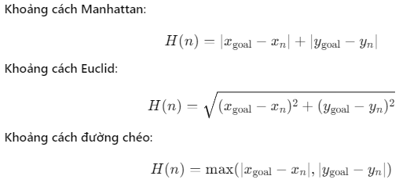
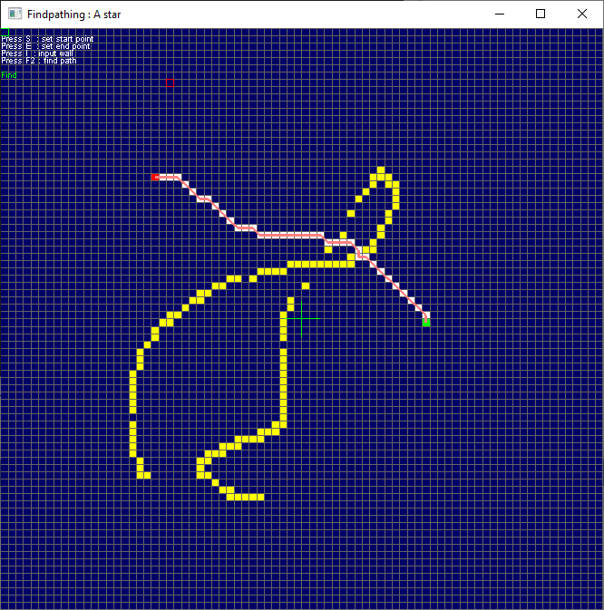

#  A* (A-star)
---
<p style="text-align: right; font-size:12px;">
<b>Create date</b>: 2024.09.08 by <a href="#">thuong.nv</a>
</p>

## Giới thiệu
---

A* (Astar) là thuật toán tìm đường đi ngắn nhất. A* kết hợp các ưu điểm của thuật toán Dijkstra và thuật toán tìm kiếm theo chiều sâu (Best-First Search)

Nguyên lý hoạt động
A* hoạt động bằng cách sử dụng hai hàm để đánh giá từng nút trong quá trình tìm kiếm:

- 𝐺(𝑛): Chi phí từ điểm bắt đầu đến nút hiện tại (n).
- 𝐻(𝑛): Hàm ước lượng chi phí còn lại từ nút hiện tại (n) đến điểm đích. Thường dùng phương pháp Heuristic (đoán) như khoảng cách Manhattan hoặc khoảng cách Euclidean.

Tổng chi phí được tính bởi hàm 𝐹(𝑛): 𝐹(𝑛)=𝐺(𝑛)+𝐻(𝑛)

A* sẽ luôn mở rộng các nút có giá trị 𝐹(𝑛) nhỏ nhất trước, tức là nút có tiềm năng dẫn đến giải pháp tối ưu nhanh nhất.

**Đặc điểm**

- Tối ưu và hoàn chỉnh: Nếu có đường đi từ điểm bắt đầu đến đích, A* sẽ tìm ra đường ngắn nhất (nếu hàm H(n) không đánh giá quá cao).

- Tính khả thi: Thuật toán có thể áp dụng với nhiều loại bài toán khác nhau như tìm đường đi trong ma trận, tối ưu hóa các bài toán logistic, hay AI trong trò chơi điện tử.

**Hàm ước lượng**

Vậy làm sao để ta có thể chọn được hàm 𝐻(𝑛) cho hợp lý vì nó ảnh hưởng đến hiệu suất và tính đúng đắn của nó.
Sau đây sẽ giới thiệu một số hàm 𝐻(𝑛) hay sử dụng :

- Khoảng cách Manhattan: Dùng khi di chuyển bị giới hạn theo các hướng ngang và dọc (như trên lưới có 4 hướng lân cận).
- Khoảng cách Euclid: Dùng khi di chuyển theo đường chéo được phép, đại diện cho khoảng cách đường thẳng.
- Khoảng cách đường chéo: Dùng trong các lưới di chuyển 8 hướng, nơi có thể di chuyển theo đường chéo.

<p class="img-post-left">
	
</p>

## Triển khai
---

Trong triển khai này chúng ta sẽ sử dụng hàm 𝐻(𝑛) = Euclid. Nó có hiệu suất thấp hơn nhưng có tính đúng đắn khá cao.

Một số tính năng hỗ trợ :

- Cho phép đi chéo (8 way)
- Không cho phép đi đường chéo qua đoạn gấp khúc

Một số lại dữ liệu được sử dụng trong triển khai này:
- [Grid pathfinding](../Algorithm_GridPF/grid_pf.html)


**Dữ liệu triển khai :**

- Sử dụng hàng đợi ưu tiên `std::priority_queue` để lưu trữ điếm cần duyệt. Trong đó custom thuật toán so sánh.
- Sử dụng `std::set` lưu trữ các điểm đã duyệt.
- Đánh index cho từng cell đã được duyệt. Nó phục vụ cho việc sắp xếp thứ tự ưu tiên.


**Giải thích :** 
- Cell của Grid sẽ được liên kết với một cell dữ liệu của Astar. Để đảm bảo ứng với một cell sẽ có một cell star tương ứng.
- Hàm `UpdateWayPriority` sẽ tính toán độ ưu tiên của hướng đi của cell hiện tại với cell đích.

Hình ảnh :

<p class="img-post">
	
</p>

---

```cpp
////////////////////////////////////////////////////////////////////////////////////
/*!*********************************************************************************
*         Copyright (C) 2023-2024 thuong.nv <thuong.nv.mta@gmail.com>               
*                   MIT software Licencs, see the accompanying                      
************************************************************************************
* @brief : a star pathfinding
* @file  : xastar.h
* @create: Aug 20, 2024
* @note  : For conditions of distribution and use, see copyright notice in readme.txt
***********************************************************************************/
#ifndef XASTAR_H
#define XASTAR_H

#include <set>
#include <unordered_map>
#include <queue>
#include <algorithm> 
#include <Windows.h>
#include "xpathfinder.h"

typedef void (*pFunAstarPerform)(std::set<stGridCellPF*>&, stGridCellPF*);

class AStar : public PathFinding
{
	typedef struct tagWayDirectionalMove
	{
		int x{ 0 };
		int y{ 0 };

		float w{ 0.f };
	} WayDirectionalMove;

	typedef struct _stAStarGridCellPF
	{
		int			nIdx{ 0 };
		float		fDistanceSrc{ 0 };
		float		fDistanceDst{ 0 };
		_stAStarGridCellPF* pPrev{ nullptr };

		stGridCellPF* pGrid{ nullptr };
	} stAStarGridCell;

	typedef struct _ptrAStarGridCellCompare
	{
		bool operator()(const stAStarGridCell* pC1, const stAStarGridCell* pC2) const
		{
			float fV1 = pC1->fDistanceSrc + pC1->fDistanceDst;
			float fV2 = pC2->fDistanceSrc + pC2->fDistanceDst;

			if (fabs(fV1 - fV2) < 0.001f)
				return (pC1->nIdx < pC2->nIdx);

			return fV1 > fV2;
		}
	}ptrAStarDataCompare;

	typedef std::set<stGridCellPF*> GridPFUniqueManager;
	typedef std::set<stAStarGridCell*> AstarUniqueManager;
	typedef std::unordered_map<stGridCellPF*, stAStarGridCell> AstarMappingData;
	typedef std::priority_queue<stAStarGridCell*, std::vector<stAStarGridCell*>,
		_ptrAStarGridCellCompare> AstarCellPriorityQueue;

	static const int m_nWayDirection = 8;

public:
	enum WayDirectionMode {
		Four,
		Eight,
	};

	WayDirectionalMove m_arWayDirection[m_nWayDirection];
	WayDirectionalMove m_arOriWayDirection[m_nWayDirection];
	const WayDirectionalMove m_arInitWayDirection[m_nWayDirection]
	{
		{-1, -1, 0.f}, // 0	: LeftUp
		{ 0, -1, 0.f}, // 1	: Up
		{ 1, -1, 0.f}, // 2	: RightUp
		{-1,  0, 0.f}, // 3	: Left
		{ 1,  0, 0.f}, // 4	: Right
		{-1,  1, 0.f}, // 5	: LeftDown
		{ 0,  1, 0.f}, // 6	: Down
		{ 1,  1, 0.f}, // 7	: RightDown
	};

	virtual void SetFuncPerform(pFunAstarPerform fun) noexcept
	{
		m_pFunPerform = fun;
	}

protected:

	/*Normal vector {xDir, yDir}*/
	void UpdateWayPriority(stCellIdxPF& stStart, stCellIdxPF& stEnd)
	{
		std::memcpy(m_arWayDirection, m_arOriWayDirection, m_nWayDirection * sizeof(WayDirectionalMove));

		float fUnix = float(stEnd.nX - stStart.nX);
		float fUniy = float(stEnd.nY - stStart.nY);

		float fLength = sqrtf(fUnix * fUnix + fUniy * fUniy);

		if (fLength >= 0.001f)
		{
			fUnix = fUnix / fLength;
			fUniy = fUniy / fLength;
		}
		else
		{
			fUnix = 0.f;
			fUniy = 0.f;
		}

		for (int i = 0; i < m_nWayDirection; i++)
		{
			if (m_arWayDirection[i].w >= 0.001f)
			{
				m_arWayDirection[i].w =
					(m_arWayDirection[i].w + m_arWayDirection[i].x * fUnix +
					 m_arWayDirection[i].w + m_arWayDirection[i].y * fUniy);
			}
		}

		SortWayDirection();
	}

	void SortWayDirection()
	{
		std::sort(m_arWayDirection, m_arWayDirection + m_nWayDirection,
		[](WayDirectionalMove & a, WayDirectionalMove& b)
		{
			return a.w > b.w;
		});
	}

	void InitWayDirection(WayDirectionMode mode)
	{
		std::memcpy(m_arWayDirection, m_arInitWayDirection, m_nWayDirection * sizeof(WayDirectionalMove));

		if (mode == WayDirectionMode::Four)
		{
			m_arWayDirection[1].w = 1.f;
			m_arWayDirection[3].w = 1.f;
			m_arWayDirection[4].w = 1.f;
			m_arWayDirection[6].w = 1.f;
		}
		else if (mode == WayDirectionMode::Eight)
		{
			for (int i = 0; i < m_nWayDirection; i++)
			{
				m_arWayDirection[i].w = 1.f;
			}
		}

		std::memcpy(m_arOriWayDirection, m_arWayDirection, m_nWayDirection * sizeof(WayDirectionalMove));
	}

protected:
	virtual _stAStarGridCellPF* GetCellPriorityQuery()
	{
		if (m_CellPriorityQueue.empty())
			return nullptr;

		stAStarGridCell* pAstarCellCur = m_CellPriorityQueue.top();
		if (pAstarCellCur->pGrid == nullptr)
			return nullptr;

		m_CellPriorityQueue.pop();

		if (m_pFunPerform)
			m_GridCellUniqueManager.erase(pAstarCellCur->pGrid);

		return pAstarCellCur;
	}

	virtual bool PushToPriorityQuery(_stAStarGridCellPF* pCell, float fDisSrcToCell, float fDisCell2Dest, _stAStarGridCellPF* pParent)
	{
		if (fDisSrcToCell < 0 || fDisCell2Dest < 0)
			return false;

		if (pCell == nullptr)
			return false;

		auto itFond = m_CellUniqueManager.find(pCell);

		if (itFond == m_CellUniqueManager.end())
		{
			pCell->fDistanceSrc = fDisSrcToCell;
			pCell->fDistanceDst = fDisCell2Dest;
			pCell->pPrev = pParent;
			m_CellPriorityQueue.push(pCell);
			m_CellUniqueManager.insert(pCell);

			if (m_pFunPerform)
				m_GridCellUniqueManager.insert(pCell->pGrid);

			return true;
		}
		else
		{
			if (pCell->fDistanceSrc >= fDisSrcToCell)
			{
				pCell->fDistanceSrc = fDisSrcToCell;
				pCell->fDistanceDst = fDisCell2Dest;

				pCell->pPrev = pParent;
				return true;
			}
		}

		return false;
	};

	virtual std::vector<stGridCellPF*> GetPath(_stAStarGridCellPF* pCell)
	{
		std::vector<stGridCellPF*> path;
		path.reserve(100);

		size_t szMaxPath = m_GridDataMapping.size();

		if (pCell == nullptr)
			return path;

		stAStarGridCell* pAstarGridCellCur = pCell;

		int nStep = 0;

		do {
			path.push_back(pAstarGridCellCur->pGrid);
			pAstarGridCellCur = pAstarGridCellCur->pPrev;

		} while (pAstarGridCellCur != nullptr && nStep++ < szMaxPath);

		std::reverse(path.begin(), path.end());

		return path;
	}

	virtual float GetDistance(_stAStarGridCellPF* pC1, _stAStarGridCellPF* pC2)
	{
		if (!pC1 || !pC2) return -1;

		float delY = float(pC2->pGrid->stIdx.nY - pC1->pGrid->stIdx.nY);
		float delX = float(pC2->pGrid->stIdx.nX - pC1->pGrid->stIdx.nX);
		return sqrtf(delX * delX + delY * delY);
	}

	virtual bool IsCrossCell(stCellIdxPF& stCur, stCellIdxPF& stNext)
	{
		return (stCur.nX != stNext.nX) && (stCur.nY != stNext.nY);
	}

	virtual bool IsMoveable(GridPF* pGridBoard, _stAStarGridCellPF* _pCellCur, _stAStarGridCellPF* _pCellNext)
	{
		if (!_pCellNext) return false;
		if (_pCellNext->pGrid->stCellData.fWeight > 0)
			return false;

		auto funIsCross = [](stCellIdxPF& stCur, stCellIdxPF& stNext) -> bool
		{
			return (stCur.nX != stNext.nX) && (stCur.nY != stNext.nY);
		};

		if (funIsCross(_pCellCur->pGrid->stIdx, _pCellNext->pGrid->stIdx))
		{
			int delX = _pCellNext->pGrid->stIdx.nX - _pCellCur->pGrid->stIdx.nX;
			int delY = _pCellNext->pGrid->stIdx.nY - _pCellCur->pGrid->stIdx.nY;

			_stAStarGridCellPF* pCellCrs1 = GetAStarGridCell(_pCellCur->pGrid->stIdx.nX + delX, _pCellCur->pGrid->stIdx.nY);
			_stAStarGridCellPF* pCellCrs2 = GetAStarGridCell(_pCellCur->pGrid->stIdx.nX, _pCellCur->pGrid->stIdx.nY + delY);

			if (pRefOption->m_bDontCrossCorners)
			{
				if (pCellCrs1 != nullptr && pCellCrs2 != nullptr &&
					pCellCrs1->pGrid->stCellData.fWeight <= 0 &&
					pCellCrs2->pGrid->stCellData.fWeight <= 0)
					return true;

				return false;
			}
			else
			{
				if (pCellCrs1 == nullptr || pCellCrs2 == nullptr)
					return (_pCellNext->pGrid->stCellData.fWeight > 0);

				return(
					pCellCrs1->pGrid->stCellData.fWeight <= 0 ||
					pCellCrs2->pGrid->stCellData.fWeight <= 0);
			}
		}
		else
		{
			return !(_pCellNext->pGrid->stCellData.fWeight > 0);
		}
	}

	virtual stAStarGridCell* GetAStarGridCell(const int nX, const int nY) noexcept
	{
		return GetAStarGridCell({ nX, nY });
	}

	virtual stAStarGridCell* GetAStarGridCell(const stCellIdxPF& stIdx) noexcept
	{
		if (m_pGridBoard == nullptr)
			return nullptr;

		auto pCell = m_pGridBoard->Get(stIdx);

		if (pCell == nullptr)
			return nullptr;

		stAStarGridCell* pAstarData = &m_GridDataMapping[pCell];
		if (!pAstarData->pGrid)
		{
			pAstarData->pGrid = pCell;
			pAstarData->nIdx = m_nIdxPriority++;
		}

		return pAstarData;
	}

private:
	virtual bool Prepar(GridPF* pGridBoard)
	{
		m_pGridBoard = pGridBoard;

		if (m_pGridBoard == nullptr)
			return false;

		m_GridDataMapping.reserve(m_pGridBoard->Size());

		Reset();

		return true;
	}

	virtual void Reset()
	{
		m_CellPriorityQueue = AstarCellPriorityQueue();
		m_GridCellUniqueManager.clear();
		m_CellUniqueManager.clear();
		m_GridDataMapping.clear();
		m_nIdxPriority = 0;
	}

	virtual std::vector<stGridCellPF*> Execute(GridPF* pGridBoard, stCellIdxPF start, stCellIdxPF target)
	{
		_stAStarGridCellPF* pCellCur, *pNextCell, *pCellStart, *pCellTarget;
		float fDisNext2Dest, fDisTraveled = 0.f;
		std::vector<stGridCellPF*> path;

		stCellIdxPF stIdx;

		if (!Prepar(pGridBoard))
			return path;

		pCellCur = pCellStart = GetAStarGridCell(start);
		pCellTarget = GetAStarGridCell(target);

		InitWayDirection(pRefOption->m_bAllowCross ? WayDirectionMode::Eight : WayDirectionMode::Four);

		UpdateWayPriority(start, target);

		PushToPriorityQuery(pCellStart, 0.f, 0.f, nullptr);

		size_t nLoop = 0, nMaxStep = pGridBoard->Length();

		while (pCellCur && nLoop++ <= nMaxStep)
		{
			if (pCellCur == pCellTarget)
				break;

			for (int i = 0; i < m_nWayDirection; i++)
			{
				if (m_arWayDirection[i].w > 0.0001)
				{
					stIdx.nX = pCellCur->pGrid->stIdx.nX + m_arWayDirection[i].x;
					stIdx.nY = pCellCur->pGrid->stIdx.nY + m_arWayDirection[i].y;

					pNextCell = GetAStarGridCell(stIdx);

					if (pNextCell == nullptr)
						continue;

					fDisTraveled = pCellCur->fDistanceSrc +
						(IsCrossCell(pCellCur->pGrid->stIdx, stIdx) ? 1.412f : 1.f);

					fDisNext2Dest = IsMoveable(pGridBoard, pCellCur, pNextCell) && (pCellCur->pPrev != pNextCell) ?
						GetDistance(pNextCell, pCellTarget) : -1.f;

					if (fDisNext2Dest >= 0)
						PushToPriorityQuery(pNextCell, fDisTraveled, fDisNext2Dest, pCellCur);
				}
			}

			pCellCur = GetCellPriorityQuery();

			if (m_pFunPerform)
			{
				m_pFunPerform(m_GridCellUniqueManager, pCellCur->pGrid);
			}

			UpdateWayPriority(pCellCur->pGrid->stIdx, target);
		}

		// get path if exist
		if (pCellCur == pCellTarget)
		{
			path = GetPath(pCellTarget);
		}

		return path;
	}

private:// internal
	AstarCellPriorityQueue		m_CellPriorityQueue;
	AstarUniqueManager			m_CellUniqueManager;
	AstarMappingData			m_GridDataMapping;
	int							m_nIdxPriority = 0;

protected:// setup
	GridPFUniqueManager			m_GridCellUniqueManager;
	pFunAstarPerform			m_pFunPerform{nullptr};
	GridPF*						m_pGridBoard{nullptr};
};


#endif // XASTAR_H


```

## Tham khảo
* [https://www.khronos.org/opengl/wiki/OpenGL_Context](https://www.khronos.org/opengl/wiki/OpenGL_Context)
* [https://www.khronos.org/opengl/wiki/Creating_an_OpenGL_Context_(WGL)](https://www.khronos.org/opengl/wiki/Creating_an_OpenGL_Context_(WGL))

##### Cập nhật

- 2024.08.18 : Create
