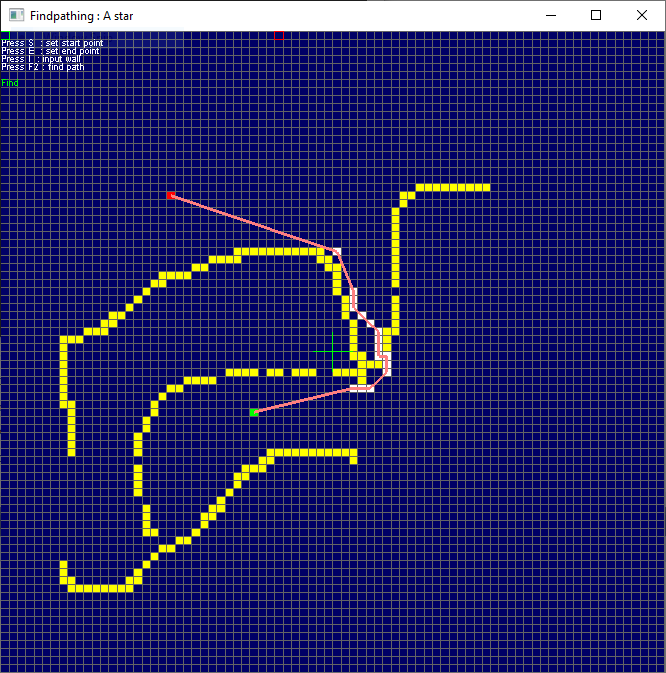

#  Theta* (Theta-star)
---
<p style="text-align: right; font-size:12px;">
<b>Create date</b>: 2024.10.10 by <a href="#">thuong.nv</a>
</p>

## Giới thiệu
---

Thuật toán Theta* (Theta Star) là một biến thể của thuật toán A*, dùng để tìm đường trong các môi trường có không gian liên tục làm cho đường đi mượt mà hơn. Theta* cải thiện A* bằng cách cho phép tìm đường trực tiếp hơn, tránh các bước đi "hình zic-zac" mà A* thường gặp do nó giới hạn đường đi theo các cạnh của lưới (grid). 

**Khác biệt chính giữa A* và Theta**

* A* : Tìm đường đi bằng cách di chuyển qua các ô lưới kề nhau. Đường đi chỉ được giới hạn bởi các cạnh của lưới, dẫn đến các bước đi zic-zac hoặc không tối ưu.

* Theta* : Thay vì giới hạn đường đi theo cạnh của lưới, Theta* cho phép "rút ngắn" đường đi bằng cách trực tiếp nối các đỉnh (nút) với nhau. Điều này giúp tạo ra đường đi ngắn hơn và trơn tru hơn.

**Cách hoạt động của Theta**

* Khởi tạo: Giống như A*, Theta* khởi tạo từ một điểm đầu (start node) và một điểm đích (goal node). Mỗi nút sẽ được đánh giá dựa trên tổng chi phí (cost), bao gồm chi phí từ nút bắt đầu đến nút hiện tại và ước lượng chi phí từ nút hiện tại đến đích (heuristic).

* Kiểm tra tầm nhìn (line of sight): Khác với A*, khi di chuyển từ một nút cha đến một nút con, Theta* kiểm tra xem có thể di chuyển trực tiếp từ nút cha tới nút con tiếp theo mà không bị vật cản nào không. Nếu có thể, nó bỏ qua các bước trung gian và cập nhật đường đi.

* Cập nhật nút: Nếu có thể di chuyển trực tiếp, Theta* cập nhật chi phí của nút hiện tại từ nút cha (thay vì nút liền kề). Nếu không thể, thuật toán sẽ sử dụng phương pháp tìm kiếm giống như A*.


## Triển khai

---

Lớp `ThetaStar` là lớp kế của của [Astar](../Algorithm_Astar/a_star.html).
Sau khi một cell được thêm vào hàng đợi ưu tiên tương tự A* -> thì nó sẽ được kiểm tra xem có thể đi được từ cell trước đó mà không gặp vặt cản hay không. Bằng việc kiểm tra 3 cell liên tiếp nhau (Có thể vẽ được đường thẳng giữa điểm đầu và điểm cuối) đồng thời 3 cell không có chứa vật cản.

Thuật toán vẽ đường thẳng ở đây sử dụng là `Bresenham`

<p class="img-post">
	
</p>
---


```cpp
////////////////////////////////////////////////////////////////////////////////////
/*!*********************************************************************************
*         Copyright (C) 2023-2024 thuong.nv <thuong.nv.mta@gmail.com>               
*                   MIT software Licencs, see the accompanying                      
************************************************************************************
* @brief : theta-star pathfinding
* @file  : xthetastar.h
* @create: Sep 15, 2024
* @note  : For conditions of distribution and use, see copyright notice in readme.txt
***********************************************************************************/
#ifndef XTHETASTAR_H
#define XTHETASTAR_H

#include "xastar.h"
#include "xpathfinder.h"

#define SGN(_x) ((_x) < 0 ? -1 : ((_x) > 0 ? 1 : 0))

class ThetaStar : public AStar
{
	/*
	* Bresenham’s Line Generation
	*/
	virtual bool IsDrawLine(stAStarCellPF* pS, stAStarCellPF* pE)
	{
		int x0 = pS->pGrid->stIdx.nX;
		int x1 = pE->pGrid->stIdx.nX;
		int y0 = pS->pGrid->stIdx.nY;
		int y1 = pE->pGrid->stIdx.nY;

		int dx = x1 - x0;
		int dy = y1 - y0;
		int incX = SGN(dx);
		int incY = SGN(dy);
		dx = abs(dx);
		dy = abs(dy);

		auto funIsMoveable = [this](int x, int y)
		{
			stAStarCellPF* pCellCur = GetCell(x, y);
			return IsCellMoveable(pCellCur);
		};

		if (dy == 0)
		{
			// horizontal line
			for (int x = x0; x != x1 + incX; x += incX)
			{
				if (!funIsMoveable(x, y0))
					return false;
			}
		}
		else if (dx == 0)
		{
			// vertical line
			for (int y = y0; y != y1 + incY; y += incY)
			{
				if (!funIsMoveable(x0, y))
					return false;
			}
		}
		else if (dx >= dy)
		{
			// more horizontal than vertical
			int slope = 2 * dy;
			int error = -dx;
			int errorInc = -2 * dx;
			int y = y0;

			for (int x = x0; x != x1 + incX; x += incX)
			{
				if (!funIsMoveable(x, y))
					return false;

				error += slope;

				if (error >= 0)
				{
					y += incY;
					error += errorInc;
				}
			}
		}
		else
		{
			// more vertical than horizontal
			int slope = 2 * dx;
			int error = -dy;
			int errorInc = -2 * dy;
			int x = x0;

			for (int y = y0; y != y1 + incY; y += incY)
			{
				if (!funIsMoveable(x, y))
					return false;

				error += slope;

				if (error >= 0)
				{
					x += incX;
					error += errorInc;
				}
			}
		}

		return true;
	}

	/*
	* Optimize three last step
	*/
	virtual void OptimizePriorityQuery(stCellIdxPF stIdxCur)
	{
		stAStarCellPF* pCurCell, * pPrev1Cell, * pPrev2Cell;

		pCurCell = GetCell(stIdxCur);

		pPrev1Cell = pCurCell ? pCurCell->pPrev : nullptr;

		pPrev2Cell = pPrev1Cell ? pPrev1Cell->pPrev : nullptr;

		if (!pCurCell || !pPrev1Cell || !pPrev2Cell)
			return;

		if (IsCellMoveableArround(pCurCell, WayDirectionMode::Four)   &&
			IsCellMoveableArround(pPrev1Cell, WayDirectionMode::Four) &&
			IsCellMoveableArround(pPrev2Cell, WayDirectionMode::Four) &&
			IsDrawLine(pPrev2Cell, pCurCell))
		{
			pCurCell->pPrev = pPrev2Cell;
		}
	}

	virtual std::vector<stCellPF*> Execute(GridPF* pGridBoard, stCellIdxPF start, stCellIdxPF target)
	{
		stAStarCellPF* pCellCur, * pNextCell, * pCellStart, * pCellTarget;
		float fDisNext2Dest, fDisTraveled = 0.f;
		std::vector<stCellPF*> path;

		stCellIdxPF stIdx;

		if (!Prepar(pGridBoard))
			return path;

		pCellCur = pCellStart = GetCell(start);
		pCellTarget = GetCell(target);

		UpdateWayPriority(start, target);

		PushToPriorityQuery(pCellStart, 0.f, 0.f, nullptr);

		size_t nLoop = 0, nMaxStep = pGridBoard->Length();

		while (pCellCur && nLoop++ <= nMaxStep)
		{
			if (pCellCur == pCellTarget)
				break;

			for (int i = 0; i < m_nWayDirection; i++)
			{
				if (m_arWayDirection[i].w > 0.0001)
				{
					stIdx.nX = pCellCur->pGrid->stIdx.nX + m_arWayDirection[i].x;
					stIdx.nY = pCellCur->pGrid->stIdx.nY + m_arWayDirection[i].y;

					pNextCell = GetCell(stIdx);

					if (pNextCell == nullptr)
						continue;

					fDisTraveled = pCellCur->fDistanceSrc +
						(IsCrossCell(pCellCur->pGrid->stIdx, stIdx) ? 1.412f : 1.f);

					fDisNext2Dest = IsCellMoveableTo(pCellCur, pNextCell) && (pCellCur->pPrev != pNextCell) ?
						GetDistance(pNextCell, pCellTarget) : -1.f;

					if (fDisNext2Dest >= 0)
					{
						if (PushToPriorityQuery(pNextCell, fDisTraveled, fDisNext2Dest, pCellCur))
						{
							OptimizePriorityQuery(pNextCell->pGrid->stIdx);
						}
					}
				}
			}

			pCellCur = PopCellPriorityQuery();

			if (m_pFunPerform)
			{
				m_pFunPerform(m_GridCellUniqueManager, pCellCur->pGrid);
			}

			UpdateWayPriority(pCellCur->pGrid->stIdx, target);
		}

		// get path if exist
		if (pCellCur == pCellTarget)
		{
			path = GetPath(pCellTarget);
		}

		return path;
	}
};

#endif // XTHETASTAR_H

```

## Tham khảo
*

##### Cập nhật

- 2024.10.10 : Create
