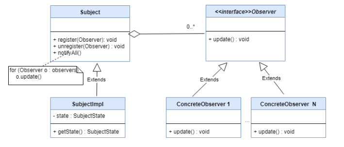
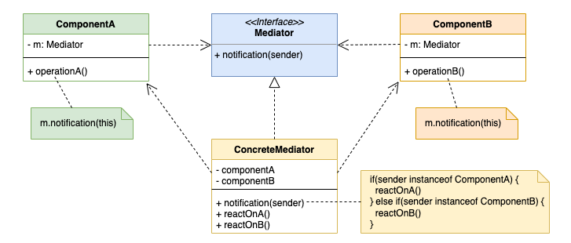
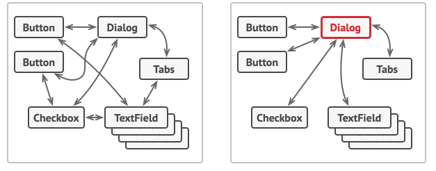
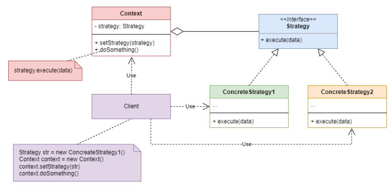

#  Behavioral Design Patterns
---
<p style="text-align: right; font-size:12px;">
<b>Create date</b>: 2024.01.13 by <a href="#">thuong.nv</a>
</p>

## Giới thiệu

Trình bày khái niệm và một số các design pattern tiêu biểu trong nhóm Behaviral Pattern.

## Tham khảo

+ [https://refactoring.guru/design-patterns](https://refactoring.guru/design-patterns)

## Nội dung

##### Khái niệm Behavioral Patterns
---

Là một nhóm mẫu thiết kế phần mềm (software design pattern) tập chung vào giao tiếp và tương tác giữa các đối tượng trong một hệ thống. Nhằm tăng tính linh hoạt giữa các đối tượng, hay rộng hơn là giữa các mô hình. Ngoài ra còn giúp hệ thống dễ bảo trì.

_Tại sao nó được sinh ra ?_ 

Vì trong hệ thống sẽ có các đối tượng khác nhau và có thể chúng chẳng liên quan đến nhau. Và ta cần tính tương tác giữa chúng. Kiểu design này cũng định nghĩa dữ liệu sẽ được truyền vào và trách nhiệm của các đối tượng trong chúng.

Dưới đây là một vài mẫu design pattern thuộc nhóm này sẽ được trình bày:
* [Observer](#Observer)
* [Mediator](#Mediator)
* [Memento](#Memento)
* [Command](#Command)
* [Iterator](#Iterator)
* [State](#State)

<p class="img-post">
    
</p>

Việc trình bày sẽ dự trên việc đọc tài liệu và kiến thức cá nhân thu thập được, miêu tả theo hướng dễ hiểu nhất.


Ta sẽ đi vào từng lại design pattern cụ thể cùng ví dụ liên quan. Thứ tự sẽ được trình bày theo độ phổ biến giảm dần.

##### Một số mẫu design patterns
---

1. <b>Observer</b><a id="Observer"></a>

    > Defines a one-to-many dependency between objects so that when one object changes state, all its dependents are notified and updated automatically.

    > Lets you define a subscription mechanism to notify multiple objects about any events that happen to the object they're observing.


    Giả sử ta có một sự kiện và muốn một vài đối tượng cùng xử lý cho sự kiện này. Ta sẽ cho chúng vào đối tượng quản lý thông báo và khi kích hoạt sự kiện thì đối tượng quản lý sẽ ```notify``` đến cho các đối tượng khác về sự kiện này.

    Các đối tượng tạo ra cần được đăng ký hoặc bỏ đăng ký với đối tượng quản lý.

    Để đối tượng quản lý thông báo ở trong các đối tượng tạo ra. Việc sử dụng con trỏ hoặc tham chiếu là phù hợp. Cần kiểm soát đối tượng quản lý thông báo một cách lý: thời gian tạo và hủy vùng nhớ khởi tạo so với các đối tượng hướng tới.

    Ngoài ra chúng ta có thể kiểm soát các message được điều phối giữa các đối tượng.

    <p class="img-post">
        
    </p>

    Dưới đây là một ví dụ sử dụng C++. 

    Link tham khảo :
    * https://refactoring.guru/design-patterns/observer/cpp/example#lang-features

    <br/>

    ```cpp
    class IObserver {
        public:
        virtual ~IObserver(){};
        virtual void Update(const std::string &message_from_subject) = 0;
    };

    /* Notify có thể thêm tham số để phù hợp với bài toán */
    class ISubject {
    public:
        virtual ~ISubject(){};
        virtual void Attach(IObserver *observer) = 0;
        virtual void Detach(IObserver *observer) = 0;
        virtual void Notify() = 0;
    };

    class ISubject {
    public:
        virtual ~ISubject(){};
        virtual void Attach(IObserver *observer) = 0;
        virtual void Detach(IObserver *observer) = 0;
        virtual void Notify() = 0;
    };

    /**
    * The Subject owns some important state and notifies observers when the state
    * changes.
    */
    class Subject : public ISubject {
    public:
        virtual ~Subject() {
            std::cout << "Goodbye, I was the Subject.\n";
        }

    /**
    * The subscription management methods.
    */
    void Attach(IObserver *observer) override {
        list_observer_.push_back(observer);
    }
    void Detach(IObserver *observer) override {
        list_observer_.remove(observer);
    }
    void Notify() override {
        std::list<IObserver *>::iterator iterator = list_observer_.begin();
        HowManyObserver();
        while (iterator != list_observer_.end()) {
        (*iterator)->Update(message_);
        ++iterator;
        }
    }

    void CreateMessage(std::string message = "Empty") {
        this->message_ = message;
        Notify();
    }
    void HowManyObserver() {
        std::cout << "There are " << list_observer_.size() << " observers in the list.\n";
    }

    /**
    * Usually, the subscription logic is only a fraction of what a Subject can
    * really do. Subjects commonly hold some important business logic, that
    * triggers a notification method whenever something important is about to
    * happen (or after it).
    */
    void SomeBusinessLogic() {
        this->message_ = "change message message";
        Notify();
        std::cout << "I'm about to do some thing important\n";
    }

    private:
        std::list<IObserver *> list_observer_;
        std::string message_;
    };

    /* Các đối tượng trong Observer sẽ chứa Subject */
    class Observer : public IObserver {
    public:
        Observer(Subject &subject) : subject_(subject) {
            this->subject_.Attach(this);
            std::cout << "Hi, I'm the Observer \"" << ++Observer::static_number_ << "\".\n";
            this->number_ = Observer::static_number_;
        }
        virtual ~Observer() {
            std::cout << "Goodbye, I was the Observer \"" << this->number_ << "\".\n";
        }

        void Update(const std::string &message_from_subject) override {
            message_from_subject_ = message_from_subject;
            PrintInfo();
        }
        void RemoveMeFromTheList() {
            subject_.Detach(this);
            std::cout << "Observer \"" << number_ << "\" removed from the list.\n";
        }
        void PrintInfo() {
            std::cout << "Observer \"" << this->number_ 
            << "\": a new message is available --> " << this->message_from_subject_ << "\n";
        }
        void Active() {
             std::cout << "Observer \"" << this->number_ 
             << " call active function " << std::endl;
            subject_.Notify();
        }

    private:
        std::string message_from_subject_;
        Subject &subject_;
        static int static_number_;
        int number_;
    };

    int Observer::static_number_ = 0;

    int main() {
        Subject *subject = new Subject;
        Observer *observer1 = new Observer(*subject);
        Observer *observer2 = new Observer(*subject);
        Observer *observer3 = new Observer(*subject);
        Observer *observer4;
        Observer *observer5;

        subject->CreateMessage("Hello World! :D");
        observer3->RemoveMeFromTheList();

        subject->CreateMessage("The weather is hot today! :p");
        observer4 = new Observer(*subject);

        observer2->RemoveMeFromTheList();
        observer5 = new Observer(*subject);

        subject->CreateMessage("My new car is great! ;)");
        observer5->RemoveMeFromTheList();

        observer4->RemoveMeFromTheList();
        observer1->RemoveMeFromTheList();

        delete observer5;
        delete observer4;
        delete observer3;
        delete observer2;
        delete observer1;
        delete subject;

        return 1;
    }
    ```

1. <b>Mediator</b><a id="Mediator"></a>

    > Mediator is a behavioral design pattern that reduces coupling between components of a program by making them communicate indirectly, through a special mediator object

    Đưa thông tin đi qua một nơi chung chuyển xử lý logic nó. Mọi đối tượng hành động của đối tượng sẽ tương tác với các đối tượng khác thông qua đối tượng trung gian.

    Nó tương tự Controller trong mô hình MVC. Rất hữu ích trong giao tiếp giữ các thành phần GUI của app.
    
    <p class="img-post">
        
    </p>

    Dưới đây là ví dụ bài toán liên quan đến các component trong một dialog.

    <p class="img-post">
        
    </p>

    _Vậy nó khác với Observer ở điểm gì ?_

    > Observer và Mediator khá giống nhau vì các đối tượng đều có notify. Điểm khác ở đây là bản chất của Observer không xử lý mà chỉ có tác dụng gửi thông điệp đến các đối tượng khác các đối tượng ngang bằng nhau, bên Mediator thì nó là thành phần xử lý.

    ```cpp
    #include <iostream>
    #include <string>
    /**
    * The Mediator interface declares a method used by components to notify the
    * mediator about various events. The Mediator may react to these events and
    * pass the execution to other components.
    */
    class BaseComponent;
    class Mediator {
    public:
        virtual void Notify(BaseComponent *sender, std::string event) const = 0;
    };

    /**
    * The Base Component provides the basic functionality of storing a mediator's
    * instance inside component objects.
    */
    class BaseComponent {
    protected:
        Mediator *mediator_;

    public:
        BaseComponent(Mediator *mediator = nullptr) : mediator_(mediator) {
        }
        void set_mediator(Mediator *mediator) {
            this->mediator_ = mediator;
        }
    };

    /**
    * Concrete Components implement various functionality. They don't depend on
    * other components. They also don't depend on any concrete mediator classes.
    */
    class Component1 : public BaseComponent {
    public:
        void DoA() {
            std::cout << "Component 1 does A.\n";
            this->mediator_->Notify(this, "A");
        }
        void DoB() {
            std::cout << "Component 1 does B.\n";
            this->mediator_->Notify(this, "B");
        }
    };

    class Component2 : public BaseComponent {
    public:
        void DoC() {
            std::cout << "Component 2 does C.\n";
            this->mediator_->Notify(this, "C");
        }
        void DoD() {
            std::cout << "Component 2 does D.\n";
            this->mediator_->Notify(this, "D");
        }
    };

    /**
    * Concrete Mediators implement cooperative behavior by coordinating several
    * components.
    */
    class ConcreteMediator : public Mediator {
    private:
        Component1 *component1_;
        Component2 *component2_;

    public:
        ConcreteMediator(Component1 *c1, Component2 *c2) : component1_(c1), component2_(c2) {
            this->component1_->set_mediator(this);
            this->component2_->set_mediator(this);
        }
        void Notify(BaseComponent *sender, std::string event) const override {
            if (event == "A") {
            std::cout << "Mediator reacts on A and triggers following operations:\n";
            this->component2_->DoC();
            }
            if (event == "D") {
            std::cout << "Mediator reacts on D and triggers following operations:\n";
            this->component1_->DoB();
            this->component2_->DoC();
            }
        }
    };

    /**
    * The client code.
    */

    void ClientCode() {
        Component1 *c1 = new Component1;
        Component2 *c2 = new Component2;
        ConcreteMediator *mediator = new ConcreteMediator(c1, c2);
        std::cout << "Client triggers operation A.\n";
        c1->DoA();
        std::cout << "\n";
        std::cout << "Client triggers operation D.\n";
        c2->DoD();

        delete c1;
        delete c2;
        delete mediator;
    }

    int main() {
        ClientCode();
        return 0;
    }
    
    ```

1. <b>Strategy</b><a id="Strategy"></a>

    > Strategy is a behavioral design pattern that lets you define a family of algorithms, put each of them into a separate class, and make their objects interchangeable.

    Giả sử ta có một đối tượng thực hiện một thuật toán nào đó, nhưng khi bạn tách thuật toán thành một thành phần riêng biệt. Và muốn với mỗi đối tượng có đặc điểm nào đó thì thuật toán tương ứng sẽ được áp dụng.

    Ví dụ thực tế chút. Khi bạn muốn khoan thì bạn dùng mũi khoan, nhưng nếu muốn đục thì bạn chỉ cần thay mũi khoan thanh mũi đục là được.

    <p class="img-post">
        
    </p>

    Không chỉ là thuật toán, ta có thể thay đổi cả đối tượng tương ứng.

    ```cpp
    /**
    * The Strategy interface declares operations common to all supported versions
    * of some algorithm.
    *
    * The Context uses this interface to call the algorithm defined by Concrete
    * Strategies.
    */
    class Strategy
    {
    public:
        virtual ~Strategy() = default;
        virtual std::string doAlgorithm(std::string_view data) const = 0;
    };

    /**
    * The Context defines the interface of interest to clients.
    */

    class Context
    {
        /**
        * @var Strategy The Context maintains a reference to one of the Strategy
        * objects. The Context does not know the concrete class of a strategy. It
        * should work with all strategies via the Strategy interface.
        */
    private:
        std::unique_ptr<Strategy> strategy_;
        /**
        * Usually, the Context accepts a strategy through the constructor, but also
        * provides a setter to change it at runtime.
        */
    public:
        explicit Context(std::unique_ptr<Strategy> &&strategy = {}) : strategy_(std::move(strategy))
        {
        }
        /**
        * Usually, the Context allows replacing a Strategy object at runtime.
        */
        void set_strategy(std::unique_ptr<Strategy> &&strategy)
        {
            strategy_ = std::move(strategy);
        }
        /**
        * The Context delegates some work to the Strategy object instead of
        * implementing +multiple versions of the algorithm on its own.
        */
        void doSomeBusinessLogic() const
        {
            if (strategy_) {
                std::cout << "Context: Sorting data using the strategy (not sure how it'll do it)\n";
                std::string result = strategy_->doAlgorithm("aecbd");
                std::cout << result << "\n";
            } else {
                std::cout << "Context: Strategy isn't set\n";
            }
        }
    };

    /**
    * Concrete Strategies implement the algorithm while following the base Strategy
    * interface. The interface makes them interchangeable in the Context.
    */
    class ConcreteStrategyA : public Strategy
    {
    public:
        std::string doAlgorithm(std::string_view data) const override
        {
            std::string result(data);
            std::sort(std::begin(result), std::end(result));

            return result;
        }
    };
    class ConcreteStrategyB : public Strategy
    {
        std::string doAlgorithm(std::string_view data) const override
        {
            std::string result(data);
            std::sort(std::begin(result), std::end(result), std::greater<>());

            return result;
        }
    };
    /**
    * The client code picks a concrete strategy and passes it to the context. The
    * client should be aware of the differences between strategies in order to make
    * the right choice.
    */

    void clientCode()
    {
        Context context(std::make_unique<ConcreteStrategyA>());
        std::cout << "Client: Strategy is set to normal sorting.\n";
        context.doSomeBusinessLogic();
        std::cout << "\n";
        std::cout << "Client: Strategy is set to reverse sorting.\n";
        context.set_strategy(std::make_unique<ConcreteStrategyB>());
        context.doSomeBusinessLogic();
    }

    int main()
    {
        clientCode();
        return 0;
    }

    ```

1. <b>Command</b><a id="Command"></a>

    > Command is behavioral design pattern that converts requests or simple operations into objects.

    > Usage examples: The Command pattern is pretty common in C++ code. Most often it’s used as an alternative for callbacks to parameterizing UI elements with actions. It’s also used for queueing tasks, tracking operations history, etc.

</br><!--Section-->

##### Cập nhật

- 2024.01.13 : Add Observer Design pattern
