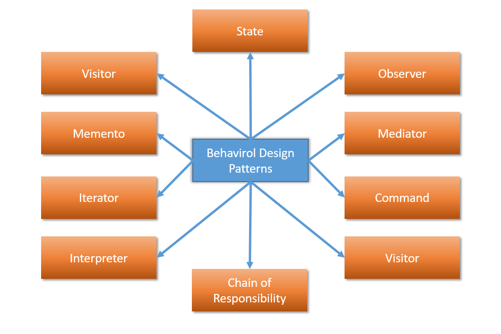

#  Behavioral Design Patterns
---
<p style="text-align: right; font-size:12px;">
<b>Create date</b>: 2024.01.13 by <a href="#">thuong.nv</a>
</p>

## Tổng quan

Trình bày khái niệm và một số các design pattern tiêu biểu trong nhóm Behaviral Pattern.

</br><!--Section-->

## Nội dung

##### <b>Khái niệm Behavioral Patterns</b>

Là một nhóm mẫu thiết kế phần mềm (software design pattern) tập chung vào giao tiếp và tương tác giữa các đối tượng trong một hệ thống. Nhằm tăng tính linh hoạt giữa các đối tượng, hay rộng hơn là giữa các mô hình. Ngoài ra còn giúp hệ thống dễ bảo trì.

_Tại sao nó được sinh ra ?_ 

Vì trong hệ thống sẽ có các đối tượng khác nhau và có thể chúng chẳng liên quan đến nhau. Và ta cần tính tương tác giữa chúng. Kiểu design này cũng định nghĩa dữ liệu sẽ được truyền vào và trách nhiệm của các đối tượng trong chúng.

Dưới đây là một vài mẫu design pattern thuộc nhóm này sẽ được trình bày:
* [Observer](#Observer)
* [Mediator](#Mediator)
* [Memento](#Memento)
* [Command](#Command)
* [Iterator](#Iterator)
* [State](#State)

<p align="center">
    
</p>

Việc trình bày sẽ dự trên việc đọc tài liệu và kiến thức cá nhân thu thập được, miêu tả theo hướng dễ hiểu nhất.


Ta sẽ đi vào từng lại design pattern cụ thể cùng ví dụ liên quan. Thứ tự sẽ được trình bày theo độ phổ biến giảm dần.

##### </br><b>Một số mẫu design patterns</b>

1. <b>Observer</b><a id="Observer"></a>

    > Defines a one-to-many dependency between objects so that when one object changes state, all its dependents are notified and updated automatically.

    > Lets you define a subscription mechanism to notify multiple objects about any events that happen to the object they're observing.


    Giả sử ta có một sự kiện và muốn một vài đối tượng cùng xử lý cho sự kiện này. Ta sẽ cho chúng vào đối tượng quản lý thông báo và khi kích hoạt sự kiện thì đối tượng quản lý sẽ ```notify``` đến cho các đối tượng khác về sự kiện này.

    Các đối tượng tạo ra cần được đăng ký hoặc bỏ đăng ký với đối tượng quản lý.

    Để đối tượng quản lý thông báo ở trong các đối tượng tạo ra. Việc sử dụng con trỏ hoặc tham chiếu là phù hợp. Cần kiểm soát đối tượng quản lý thông báo một cách lý: thời gian tạo và hủy vùng nhớ khởi tạo so với các đối tượng hướng tới.

    Ngoài ra chúng ta có thể kiểm soát các message được điều phối giữa các đối tượng.

    <p align="center">
        
    </p>

    Dưới đây là một ví dụ sử dụng C++. 

    Link tham khảo :
    * https://refactoring.guru/design-patterns/observer/cpp/example#lang-features

    <br/>

    ```cpp
    class IObserver {
        public:
        virtual ~IObserver(){};
        virtual void Update(const std::string &message_from_subject) = 0;
    };

    /* Notify có thể thêm tham số để phù hợp với bài toán */
    class ISubject {
    public:
        virtual ~ISubject(){};
        virtual void Attach(IObserver *observer) = 0;
        virtual void Detach(IObserver *observer) = 0;
        virtual void Notify() = 0;
    };

    class ISubject {
    public:
        virtual ~ISubject(){};
        virtual void Attach(IObserver *observer) = 0;
        virtual void Detach(IObserver *observer) = 0;
        virtual void Notify() = 0;
    };

    /**
    * The Subject owns some important state and notifies observers when the state
    * changes.
    */
    class Subject : public ISubject {
    public:
        virtual ~Subject() {
            std::cout << "Goodbye, I was the Subject.\n";
        }

    /**
    * The subscription management methods.
    */
    void Attach(IObserver *observer) override {
        list_observer_.push_back(observer);
    }
    void Detach(IObserver *observer) override {
        list_observer_.remove(observer);
    }
    void Notify() override {
        std::list<IObserver *>::iterator iterator = list_observer_.begin();
        HowManyObserver();
        while (iterator != list_observer_.end()) {
        (*iterator)->Update(message_);
        ++iterator;
        }
    }

    void CreateMessage(std::string message = "Empty") {
        this->message_ = message;
        Notify();
    }
    void HowManyObserver() {
        std::cout << "There are " << list_observer_.size() << " observers in the list.\n";
    }

    /**
    * Usually, the subscription logic is only a fraction of what a Subject can
    * really do. Subjects commonly hold some important business logic, that
    * triggers a notification method whenever something important is about to
    * happen (or after it).
    */
    void SomeBusinessLogic() {
        this->message_ = "change message message";
        Notify();
        std::cout << "I'm about to do some thing important\n";
    }

    private:
        std::list<IObserver *> list_observer_;
        std::string message_;
    };

    /* Các đối tượng trong Observer sẽ chứa Subject */
    class Observer : public IObserver {
    public:
        Observer(Subject &subject) : subject_(subject) {
            this->subject_.Attach(this);
            std::cout << "Hi, I'm the Observer \"" << ++Observer::static_number_ << "\".\n";
            this->number_ = Observer::static_number_;
        }
        virtual ~Observer() {
            std::cout << "Goodbye, I was the Observer \"" << this->number_ << "\".\n";
        }

        void Update(const std::string &message_from_subject) override {
            message_from_subject_ = message_from_subject;
            PrintInfo();
        }
        void RemoveMeFromTheList() {
            subject_.Detach(this);
            std::cout << "Observer \"" << number_ << "\" removed from the list.\n";
        }
        void PrintInfo() {
            std::cout << "Observer \"" << this->number_ 
            << "\": a new message is available --> " << this->message_from_subject_ << "\n";
        }
        void Active() {
             std::cout << "Observer \"" << this->number_ 
             << " call active function " << std::endl;
            subject_.Notify();
        }

    private:
        std::string message_from_subject_;
        Subject &subject_;
        static int static_number_;
        int number_;
    };

    int Observer::static_number_ = 0;

    int main() {
        Subject *subject = new Subject;
        Observer *observer1 = new Observer(*subject);
        Observer *observer2 = new Observer(*subject);
        Observer *observer3 = new Observer(*subject);
        Observer *observer4;
        Observer *observer5;

        subject->CreateMessage("Hello World! :D");
        observer3->RemoveMeFromTheList();

        subject->CreateMessage("The weather is hot today! :p");
        observer4 = new Observer(*subject);

        observer2->RemoveMeFromTheList();
        observer5 = new Observer(*subject);

        subject->CreateMessage("My new car is great! ;)");
        observer5->RemoveMeFromTheList();

        observer4->RemoveMeFromTheList();
        observer1->RemoveMeFromTheList();

        delete observer5;
        delete observer4;
        delete observer3;
        delete observer2;
        delete observer1;
        delete subject;

        return 1;
    }
    ```

1. <b>Mediator</b><a id="Mediator"></a>

    > Defines a one-to-many dependency between objects so that when one object changes state, all its dependents are notified and updated automatically.


    
    <p align="center">
        
    </p>


## Tham khảo

+ [https://refactoring.guru/design-patterns](https://refactoring.guru/design-patterns)

</br><!--Section-->

##### Cập nhật

- 2024.01.13 : Add Observer Design pattern
