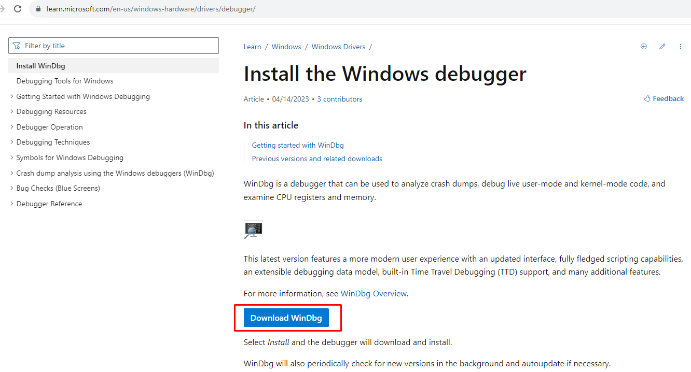
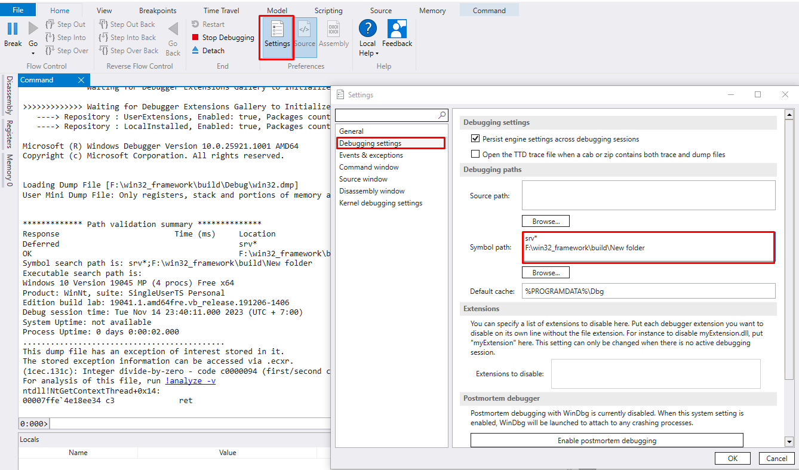
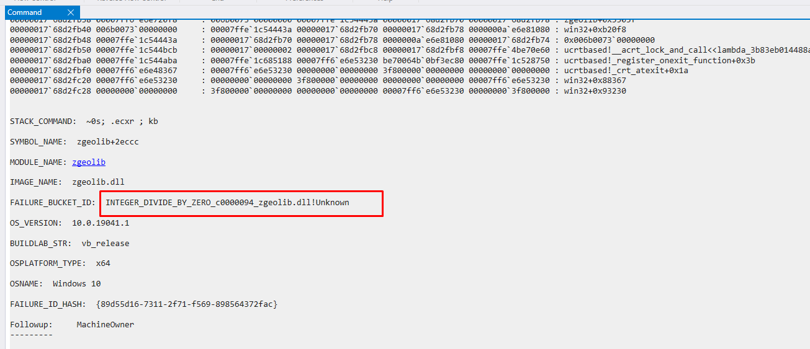

#  Xử lý dump file trên Window sử dụng C++
---
<p style="text-align: right; font-size:12px;">
<b>Create date</b>: 2023.11.23 by <a href="#">thuong.nv</a>
</p>

## Tổng quan

Giới thiệu cách thứ tạo dump file và xử lý khi có được dump file.

- Xử lý lấy dump file
- Phân tích dump file và tìm lỗi

</br><!--Section-->

## Tham khảo

+ [https://stackoverflow.com/questions/9020353/create-a-dump-file-for-an-application-whenever-it-crashes](https://stackoverflow.com/questions/9020353/create-a-dump-file-for-an-application-whenever-it-crashes)
+ [https://learn.microsoft.com/en-us/windows-hardware/drivers/debugger/](https://learn.microsoft.com/en-us/windows-hardware/drivers/debugger/)

</br><!--Section-->

## Nội dung

Trong quá trình sử dụng ứng dụng đôi lúc ta có thể bắt gặp các trường hợp chương trình bị crash bất thường mà không biết nguyên nhân do đâu.

Nhằm mục đích thu thập thông tin phục vụ cho quá trình fix bug. Window hỗ trợ xử lý khi chương trình xảy ra crash bất thường.
Dưới đây sẽ trình bày cách lấy dump file từ chương trình. Từ đó có thể truy tìm nguyên nhân dễ dàng hơn.

##### </br><b>Thiết lập chương trình</b>

Khi chương trình bị crash sẽ có một sự kiện được bắn ra từ window thông qua hàm ```SetUnhandledExceptionFilter``` gửi đến chương trình.

Đầu vào hàm trên là hàm xử lý do người dùng tự định nghĩa với thông tin crash được chứ trong ```_EXCEPTION_POINTERS```. Mục đích chính là lấy được dump file từ chương trình.

[Note]

- Ta nên đặt nó trước khi chương trình được chạy
- Không phải lúc nào chương trình crash cũng sẽ xuất được dump file vì có thể có những crash window chưa được xử lý.

Dưới đây là ví dụ về function xử lý crash trong C++


Header file yêu cầu
```cpp
#include <Dbghelp.h>
```

Function xuất ra dump file
```cpp
/***********************************************************************************
*! @brief  : function create dump file when app crashed [WINDOW]
*! @return : bool : true : success | false : failed
*! @author : thuong.nv - [CreateDate] : 18/02/2023
*! @note   :+ Setup application : Windpb preview
*           + Run program to crash ->*.dmp
*           + Click Analysis and export file *.txt
************************************************************************************/
bool create_dump_file(IN const std::wstring& path, IN struct _EXCEPTION_POINTERS* apExceptionInfo)
{
    typedef BOOL(WINAPI* MINIDUMPWRITEDUMP)( HANDLE        hProcess,
                                             DWORD         dwPid,
                                             HANDLE        hFile,
                                             MINIDUMP_TYPE DumpType,
                                             CONST PMINIDUMP_EXCEPTION_INFORMATION ExceptionParam, 
                                             CONST PMINIDUMP_USER_STREAM_INFORMATION UserStreamParam, 
                                             CONST PMINIDUMP_CALLBACK_INFORMATION CallbackParam);

    HMODULE mhLib = ::LoadLibrary(_T("dbghelp.dll"));
    if (!mhLib)
        return false;
    auto pDump = (MINIDUMPWRITEDUMP)(::GetProcAddress(mhLib, "MiniDumpWriteDump"));

    HANDLE  hFile = ::CreateFile(path.c_str(), GENERIC_WRITE, FILE_SHARE_WRITE, NULL, CREATE_ALWAYS,
        FILE_ATTRIBUTE_NORMAL, NULL);

    if (hFile && hFile != INVALID_HANDLE_VALUE)
    {
        _MINIDUMP_EXCEPTION_INFORMATION ExInfo;
        ExInfo.ThreadId = ::GetCurrentThreadId();
        ExInfo.ExceptionPointers = apExceptionInfo;
        ExInfo.ClientPointers = FALSE;

        MINIDUMP_TYPE mdt = (MINIDUMP_TYPE)(MiniDumpWithIndirectlyReferencedMemory | MiniDumpScanMemory);

        pDump(GetCurrentProcess(), GetCurrentProcessId(), hFile, mdt, &ExInfo, NULL, NULL);
        ::CloseHandle(hFile);

        return true;
    }
    return false;
}
```

Function đầu vào của ```SetUnhandledExceptionFilter```
```cpp

/***********************************************************************************
*! @brief  : function handle crash program  [WINDOW]
*! @return : LONG : flag crash
*! @author : thuong.nv - [CreateDate] : 18/02/2023
*! @note   :+ Please use if hanlde crash: SetUnhandledExceptionFilter(handle_crash)
************************************************************************************/
LONG WINAPI handle_crash(IN struct _EXCEPTION_POINTERS* apExceptionInfo)
{
    wchar_t szAppFullPath[MAX_PATH] = L"";
    ::GetModuleFileName(NULL, szAppFullPath, MAX_PATH);

    std::wstring dumpfileFolder = get_folder_path<std::wstring>(szAppFullPath);
    std::wstring dumpfileName   = get_filename_path<std::wstring>(szAppFullPath);
    MessageBox(NULL, L"The program terminates abnormally, please restart !", L"Crash", MB_ICONHAND | MB_OK);

    if (dumpfileName.empty() || dumpfileFolder.empty())
        return EXCEPTION_CONTINUE_EXECUTION;
    dumpfileFolder.append(L"DumpLoger\\");

    if (!create_directory_recursive(dumpfileFolder))
        return EXCEPTION_CONTINUE_EXECUTION;

    create_dump_file(dumpfileFolder.append(dumpfileName.append(L".dmp")), apExceptionInfo);
    return EXCEPTION_CONTINUE_SEARCH;
}

```


##### </br><b>Xử lý dump file</b>

1. Cài đặt WinDbg <a id="SetupWinDbg"></a>

    Download WinDbg truy cập đường link : [https://learn.microsoft.com/en-us/windows-hardware/drivers/debugger/](https://learn.microsoft.com/en-us/windows-hardware/drivers/debugger/) 

    <p align="center">
        
    </p>

    Tiến hành cài đặt WinDbg như thông thường.

1. Phân tích dump file sử dụng WinDbg <a id="RunWinDbgDump"></a>

    Tiến hành mở dump file thu được sử dụng WinDbg.

    <p align="center">
        
    </p>

    Try cập :
    > Setting -> Debugging settings -> Symbol path

    <p align="center">
        
    </p>

    Cần thiết lập đúng đường dẫn của ```Symbol path```
    Đây là nơi ta chỉ định thư mục chứa các file ```.pdb```, ```.dll``` của chương trình crash.

    <b> Chú ý </b> : File dll và pdb phải cùng version với dll của chương trình crash. Trong trường hợp không giống ta sẽ không thể nhìn stack một cách chính xác nhất.

    Ví dụ: ``` SRV*<thư mục chứa>*<Thư mục tìm kiếm> ```

    ```
    SRV*D:\symbols\web*https://msdl.microsoft.com/download/symbols
    SRV*D:\symbols\app*F:\win32_framework\build\Debug
    ```

    Sau đó chạy lệnh ```!analyze -v```. Đợi một thời gian xử lý dump file và ta sẽ thu được kết quả.

    * Stack khi crash
    * Lỗi code

    </br>

    <p align="center">
        
    </p>

</br><!--Section-->

## Chú ý


