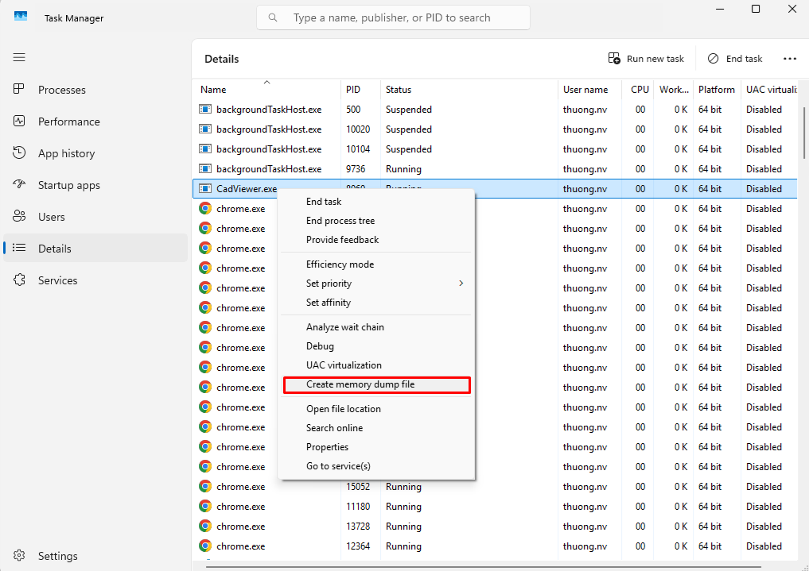
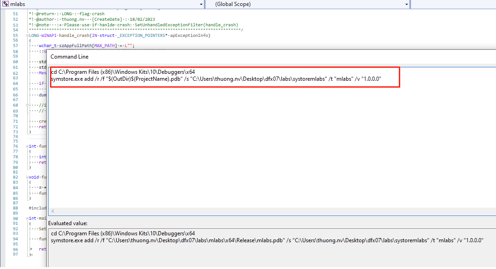

#  Tạo Dump
---
<p style="text-align: right; font-size:12px;">
<b>Create date</b>: 2023.11.23 by <a href="#">thuong.nv</a>
</p>

Trong bài viết này sẽ trình bày các vấn đề sau :
- Giới thiệu về dump.
- Cách tạo dump.
- Lưu trữ symbols.

</br>

#### <b>Dump file</b>
---
1. Khái niệm

    Trong quá trình sử dụng ứng dụng, hệ điều hành đôi khi ta có thể bắt gặp các trường hợp chương trình bị crash bất thường mà không biết nguyên nhân do đâu.

    Dump file là file ghi lại trạng thái bộ nhớ và thông tin của chương trình/hệ điều hành tại một thời điểm ta chỉ định.
    Nhằm thu thập thông tin phục vụ cho việc debug.

2. Cấu trúc và phân loại

    Có 2 loại Dump file `Mini Dump` và `Full Dump`. Tùy loại dump, file có thể chứa những thông tin bao gồm:
    - Call stack (chuỗi hàm đang chạy)
    - Danh sách thread
    - Thanh ghi CPU
    - Thông tin module/DLL (Nó bao gồm cả thông tin mapping giữa module và pdb, đường dẫn pdb)
    - Dữ liệu bộ nhớ tại thời điểm lỗi
    - Exception code (access violation, divide by zero, …)

    Mini dump cho crash rõ ràng – Full dump cho lỗi phức tạp, memory, hang, không reproduce được

    Ta có thể so sánh 2 loại này như sau:

    <div align="center">

    |Thành phần|Mini Dump|Full Dump|
    |---|---|---|
    |Thread list|✔|✔|
    |Call Stack|✔|✔|
    |Heap|❌|✔|
    |Biến / Object|❌|✔|
    |Deadlock|✔|✔|
    |Memory leak|❌|✔|
    |Kích thước|Nhỏ|Rất lớn|

    </div>

3. Mục đích của dump file

    - Phân tích nguyên nhân crash sau khi chương trình đã đóng hoặc crash
    - Debug lỗi khó tái hiện
    - Điều tra lỗi xảy ra trên máy khách (production)
    - Phân tích deadlock, hang, access violation, heap corruption…

</br>

#### <b>Tạo Dump file</b>
---

Trong bài viết này sẽ trình bày cách tạo Dump file trên Window.

##### Full Dump

Full dump được tạo khi ta cần nhiều thông tin chi tiết. Gần như nó sẽ bao gồm toàn bộ memory và trạng thái của ứng dụng tại thời điểm đó.

1. Tạo bằng Task Manager.

    Chúng ta có thể tạo full dump bằng `Task Manager`. Thao tác bằng cách sau.

    <p class="img-post">
        
    </p>

    Hệ điều hành sẽ tạo cho chúng ta một dump file của ứng dụn tại thời điểm đó. Giờ ta có thể sử dụng Dump.


2. Tạo bằng công cụ procdump.

    Chúng ta có thể tải công cụ này ở đây : https://learn.microsoft.com/en-us/sysinternals/downloads/procdump

    Ngoài ra chúng ta có thể tìm hiểu thêm hướng dẫn về nó. Đây là một công cụ mạnh có thể bắt khi ứng dụng bị crash độ ngột hoặt treo.

    ```sh
    procdump.exe [-mm] [-ma] [-mt] [-mp] [-mc <Mask>] [-md <Callback_DLL>] [-mk]
            [-n <Count>]
            [-s <Seconds>]
            [-c|-cl <CPU_Usage> [-u]]
            [-m|-ml <Commit_Usage>]
            [-p|-pl <Counter> <Threshold>]
            [-h]
            [-e [1] [-g] [-b] [-ld] [-ud] [-ct] [-et]]
            [-l]
            [-t]
            [-f  <Include_Filter>, ...]
            [-fx <Exclude_Filter>, ...]
            [-dc <Comment>]
            [-o]
            [-r [1..5] [-a]]
            [-at <Timeout>]
            [-wer]
            [-64]
            {
                {{[-w] <Process_Name> | <Service_Name> | <PID>} [<Dump_File> | <Dump_Folder>]}
            |
                {-x <Dump_Folder> <Image_File> [Argument, ...]}
            }
    ```

    Ví dụ: Ghi mini dump của app tại thời điểm hiện tại:

    `procdump.exe app.exe`

    Ví dụ: Tạo mini dump khi app xảy ra exception:

    `procdump.exe -e -w app.exe C:\Dumps\app_mini_%t.dmp` 
    
    nếu muốn full dump
    
    `procdump.exe -ma -e -w app.exe C:\Dumps\app_full_%t.dmp`

    Ví dụ: Tạo mini dump khi app xảy ra exception hoặc hang:

    `procdump.exe -h -e -w app.exe C:\Dumps\app_full_%t.dmp`

    > Cấu lệnh này đợi cho app.exe chạy và bắt khi nó xảy ra exception hoặc hang

    Một điều lưu ý là việc sử dụng công cụ làm ứng dụng trở nên chậm chạm hơn đáng kể.


3. Tạo bằng code.

    Hay tham khảo tạo dump bằng code. Nó sẽ tương tự với các này chúng ta chỉ cần thay đổi tham số là được.

    `MiniDumpWithFullMemory`

    Nhược điểm : Điều này có nghĩa chúng ta cần build lại code và chạy lại, không phù hợp với môi trường khách hàng.

##### Mini Dump

1. Tạo bằng code.

    Khi chương trình bị crash sẽ có một sự kiện được bắn ra từ window thông qua hàm ```SetUnhandledExceptionFilter``` gửi đến chương trình.

    Đầu vào hàm trên là hàm xử lý do người dùng tự định nghĩa với thông tin crash được chứ trong ```_EXCEPTION_POINTERS```. Mục đích chính là lấy được dump file từ chương trình.

    [Note]

    - Ta nên đặt nó trước khi chương trình được chạy
    - Không phải lúc nào chương trình crash cũng sẽ xuất được dump file vì có thể có những crash window chưa được xử lý.

    Dưới đây là ví dụ về function xử lý crash trong C++


    Header file yêu cầu
    ```cpp
    #include <Dbghelp.h>
    ```

    Function xuất ra dump file
    ```cpp
    /***********************************************************************************
    *! @brief  : function create dump file when app crashed [WINDOW]
    *! @return : bool : true : success | false : failed
    *! @author : thuong.nv - [CreateDate] : 18/02/2023
    *! @note   :+ Setup application : Windpb preview
    *           + Run program to crash ->*.dmp
    *           + Click Analysis and export file *.txt
    ************************************************************************************/
    bool create_dump_file(IN const std::wstring& path, IN struct _EXCEPTION_POINTERS* apExceptionInfo)
    {
        typedef BOOL(WINAPI* MINIDUMPWRITEDUMP)( HANDLE        hProcess,
                                                DWORD         dwPid,
                                                HANDLE        hFile,
                                                MINIDUMP_TYPE DumpType,
                                                CONST PMINIDUMP_EXCEPTION_INFORMATION ExceptionParam, 
                                                CONST PMINIDUMP_USER_STREAM_INFORMATION UserStreamParam, 
                                                CONST PMINIDUMP_CALLBACK_INFORMATION CallbackParam);

        HMODULE mhLib = ::LoadLibrary(_T("dbghelp.dll"));
        if (!mhLib)
            return false;
        auto pDump = (MINIDUMPWRITEDUMP)(::GetProcAddress(mhLib, "MiniDumpWriteDump"));

        HANDLE  hFile = ::CreateFile(path.c_str(), GENERIC_WRITE, FILE_SHARE_WRITE, NULL, CREATE_ALWAYS,
            FILE_ATTRIBUTE_NORMAL, NULL);

        if (hFile && hFile != INVALID_HANDLE_VALUE)
        {
            _MINIDUMP_EXCEPTION_INFORMATION ExInfo;
            ExInfo.ThreadId = ::GetCurrentThreadId();
            ExInfo.ExceptionPointers = apExceptionInfo;
            ExInfo.ClientPointers = FALSE;

            MINIDUMP_TYPE mdt = (MINIDUMP_TYPE)(MiniDumpWithIndirectlyReferencedMemory | MiniDumpScanMemory);

            pDump(GetCurrentProcess(), GetCurrentProcessId(), hFile, mdt, &ExInfo, NULL, NULL);
            ::CloseHandle(hFile);

            return true;
        }
        return false;
    }
    ```

    Function đầu vào của ```SetUnhandledExceptionFilter```
    ```cpp

    /***********************************************************************************
    *! @brief  : function handle crash program  [WINDOW]
    *! @return : LONG : flag crash
    *! @author : thuong.nv - [CreateDate] : 18/02/2023
    *! @note   :+ Please use if hanlde crash: SetUnhandledExceptionFilter(handle_crash)
    ************************************************************************************/
    LONG WINAPI handle_crash(IN struct _EXCEPTION_POINTERS* apExceptionInfo)
    {
        wchar_t szAppFullPath[MAX_PATH] = L"";
        ::GetModuleFileName(NULL, szAppFullPath, MAX_PATH);

        std::wstring dumpfileFolder = get_folder_path<std::wstring>(szAppFullPath);
        std::wstring dumpfileName   = get_filename_path<std::wstring>(szAppFullPath);
        MessageBox(NULL, L"The program terminates abnormally, please restart !", L"Crash", MB_ICONHAND | MB_OK);

        if (dumpfileName.empty() || dumpfileFolder.empty())
            return EXCEPTION_CONTINUE_EXECUTION;
        dumpfileFolder.append(L"DumpLoger\\");

        if (!create_directory_recursive(dumpfileFolder))
            return EXCEPTION_CONTINUE_EXECUTION;

        create_dump_file(dumpfileFolder.append(dumpfileName.append(L".dmp")), apExceptionInfo);
        return EXCEPTION_CONTINUE_SEARCH;
    }

    ```

</br>

#### <b>Lưu trữ symbols</b>
---

##### Xây dựng Symbol Store

1. Sử dụng symstore của VS

    Việc sao chép các tệp *.pdb là rất mất thời gian và không phù hợp nếu ta có nhiều version cho dll. chưa kể đến việc khó quản lý.

    Chúng ta có thể sử dụng tính năng `index symbol` được hỗ trợ trong `Debugging Tools` cho Window.

    Đầu tiên chúng ta cần cài đặt `Debugging Tools` theo đường link : [tool](https://learn.microsoft.com/en-us/windows-hardware/drivers/debugger/debugger-download-tools)

    Sử dụng công cụ `symstore.exe` của tool, đường dẫn mặc định :

    `C:\Program Files (x86)\Windows Kits\10\Debuggers\x64\symstore.exe`.

    Sử dụng câu lệnh sau để tiến hành export pdb ra thư mục. Mỗi pdb sẽ có một guid riêng vì thế nếu ta sửa code và build lại thì nó sẽ cho ra một folder guid khác nhau `symstore.exe add /r /f <*.pdb> /s <folder-out> /t <tên-project>`.

    ```
    symstore.exe add /r /f "$(OutDir)$(ProjectName).pdb" /s "C:\Users\thuong.nv\Desktop\dfx07\labs\systoremlabs" /t "mlabs" /v "1.0.0.0"
    ```

    Xem thêm hướng dẫn ở : [đây](https://learn.microsoft.com/en-us/windows/win32/debug/using-symstore).

    Ngoài ra ta có thể thiết lập chúng vào dự án project của mình trong VS. Giống như bên dưới.
    Nó sẽ được cài đặt trong `Post build`.

    <p class="img-post">
        
    </p>

    Khi muốn sử dụng symstore này ta chỉ cần trỏ đường dẫn của vs/winpdb vào nó là được.

## Tham khảo

+ [https://stackoverflow.com/questions/9020353/create-a-dump-file-for-an-application-whenever-it-crashes](https://stackoverflow.com/questions/9020353/create-a-dump-file-for-an-application-whenever-it-crashes)
+ [https://learn.microsoft.com/en-us/windows-hardware/drivers/debugger/](https://learn.microsoft.com/en-us/windows-hardware/drivers/debugger/)
+ [https://learn.microsoft.com/en-us/windows/win32/debug/using-symstore](https://learn.microsoft.com/en-us/windows/win32/debug/using-symstore)

## Cập nhật
- 2024.05.30 : Update command WinDbg
- 2024.05.31 : Update symbol store
- 2026.01.10 : Refactor
