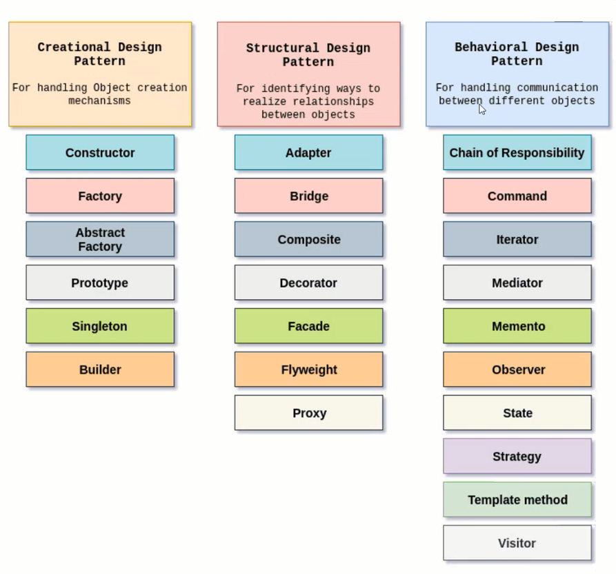
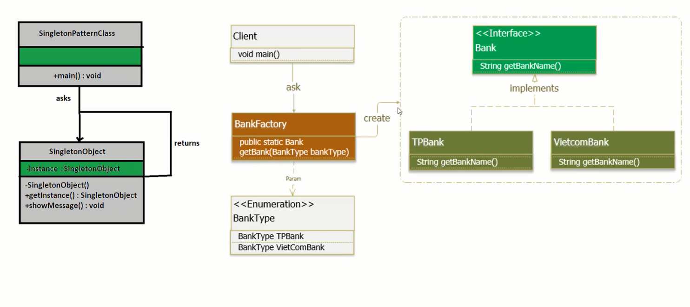
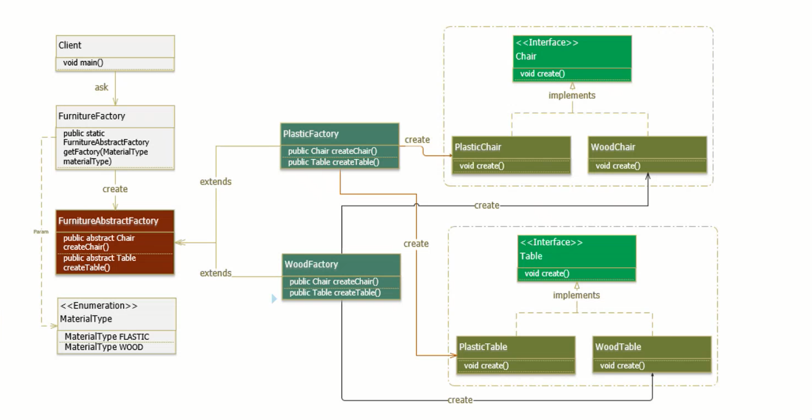
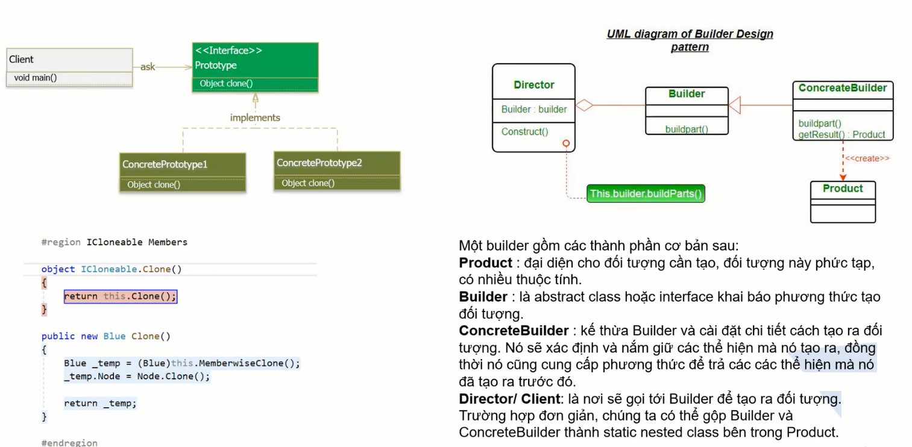
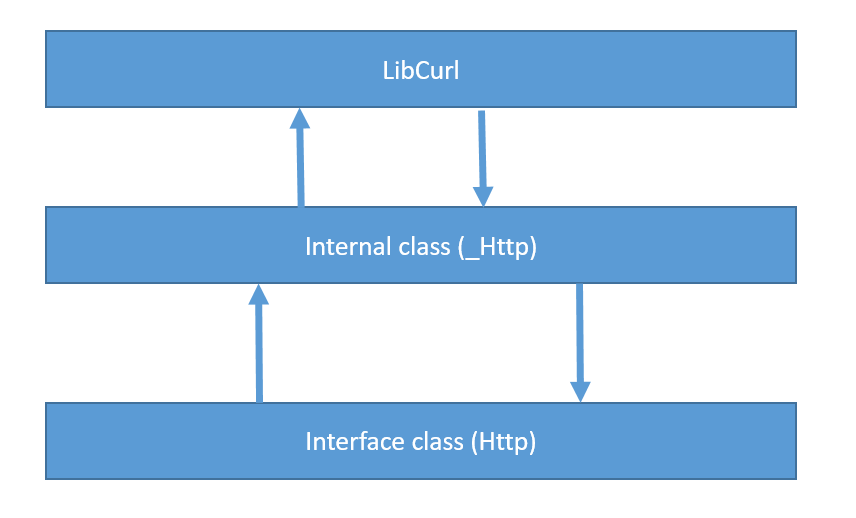
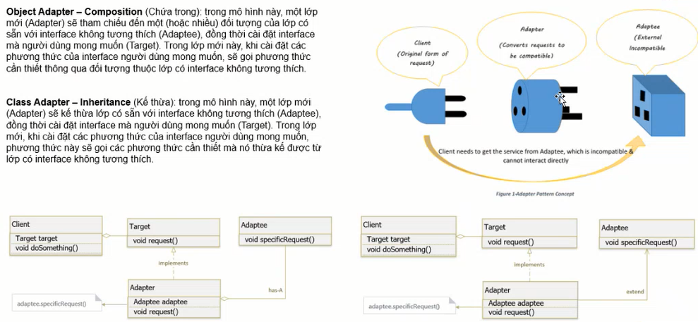

#  Git overview and commands
---
<p style="text-align: right; font-size:12px;">
<b>Create date</b>: 2024.01.07 by <a href="#">thuong.nv</a>
</p>

## Tổng quan

Trình bày về một vài loại mẫu desgin pattern hay sử dụng và các thiết kế, Lợi ích và nhược điểm của chúng trên một vài bài toán cụ thể:


</br><!--Section-->

## Tham khảo

+ [https://git-scm.com/docs/git#_git_commands](https://git-scm.com/docs/git#_git_commands)
+ [https://en.wikipedia.org/wiki/Git](https://en.wikipedia.org/wiki/Git)
+ [https://docs.gitlab.com/ee/topics/git/](https://docs.gitlab.com/ee/topics/git/)

</br><!--Section-->

## Nội dung

##### <b>Giới thiệu chung về Desgin Pattern </b>

Dựa trên mục đích ta có thể chia thành 3 nhóm Desgin Pattern.

- Creational design pattern.
- Structural design pattern.
- Behavioral design pattern.

<p align="center">
    
</p>
Ta sẽ đi vào từng lại design pattern cụ thể và ví dụ liên quan.

##### </br><b>Các loại Desgin Pattern phổ biến </b>

1. <b>Singleton và factory pattern </b> <a id="Singleton"></a>

    Tạo ra đối tượng duy nhất của chương trình, nó có thể tồn tại từ lúc được gọi đến khi chương trình kết thúc.

    Cần chú ý nếu sử dụng singleton với multiple thread.
    Có thể xem ví dụ trong hình ảnh bên dưới.

    <p align="center">
        
    </p>

    Factory là nơi tạo ra các object nhằm kiểm soát việc tạo đối tượng. Nếu ta không muốn tạo ra các đối tượng một cách tự do và kiểm soát chúng.

    Đầu ra của factory cũng có thể là các đối tượng ```Abstract``` thay vì một đối tượng cụ thể. Việc ép kiểu cũng có thể được sử dụng nếu ta muốn sử dụng tính năng riêng biệt của đối tượng đó.

    Ví dụ về một ```Abstract factory pattern```:

    <p align="center">
        
    </p>

1. <b>Prototy (Clone) and Builder Pattern</b> <a id="Prototy"></a>

    Copy memory thường sẽ nhanh hơn so với copy từng member. Vì thế nếu có thể hay sử dụng copy memory thay vì gán.

    Prototy (Clone) là một degsin pattern thay vì tạo và gắn giá trị cho đối tượng thì nó sẽ tạo ra design mà khi kết thừa nó và gọi Clone ta sẽ có một đối tượng mới.

    Thường thì Prototy sẽ đi với Copy function được overwrite

    <p align="center">
        
    </p>

1. <b>Service Locator Pattern</b> <a id="ServiceLocatorPattern"></a>

    Tạo đối tượng.

    Tham khảo hướng dẫn thiết kết bên dưới.

    <p align="center">
        
    </p>

1. <b>Adaptor Pattern</b> <a id="AdaptorPattern"></a>

    Adaptor Pattern là một trong những pattern thuộc nhóm cấu trúc. NÓ cho phép các interface không liên quan đến nhau có thể làm việc cùng nhau. Đối tượng giúp kết nối các interface gọi là Adapter.

    Adaptor Pattern giữ vai trò trung gian giữa hai lớp. chuyển dổi interface của một hay nhiều lớp có sẵn thành một interface khác, thích hợp cho lớp đang viết. Điều này cho phép các lớp có các interface khác nhau có thể dễ dàng giao tiếp tốt với nhau thông qua interface trung gian. không cần thay đổi code của lớp có sắn cũng như lớp đang viết.

    Cái này đã được triển khai khi tiến hành phát triển ```Kyhttp``` từ ```libcurl```.

    <p align="center">
        
    </p>

    Tham khảo thêm ví dụ bên dưới.

    <p align="center">
        
    </p>
