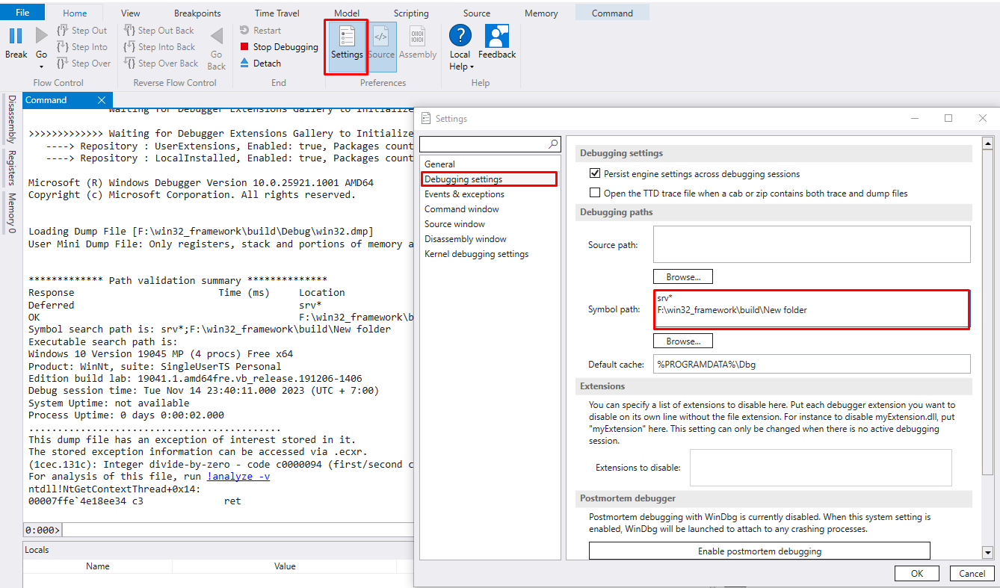
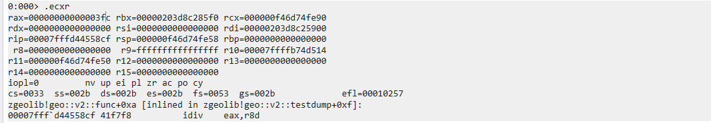
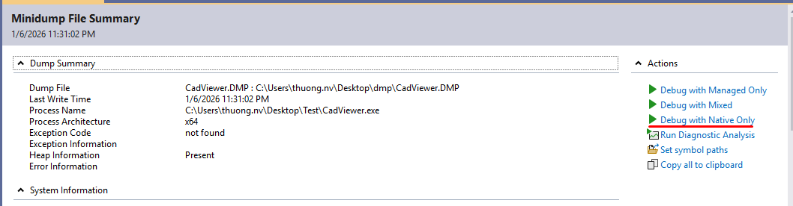
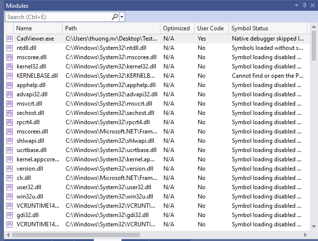
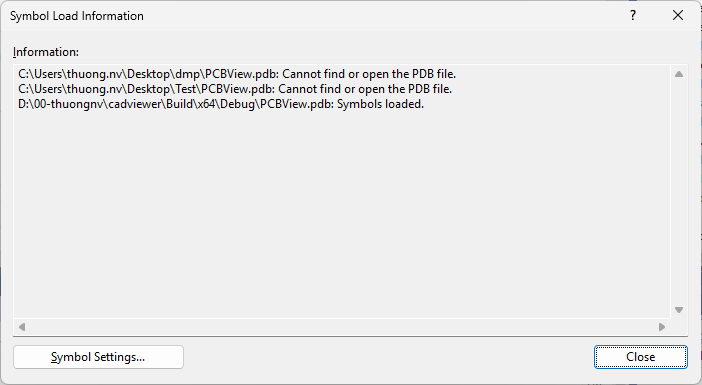

#  Phân tích Dump
---
<p style="text-align: right; font-size:12px;">
<b>Create date</b>: 2023.11.23 by <a href="#">thuong.nv</a>
</p>

Giới thiệu các phương pháp và công cụ phân tích dump file

- Xử lý lấy dump file
- Phân tích dump file và tìm lỗi

Các phương pháp phân tích dump được trình bày sau đây được chạy trên window. 

##### </br>Giới thiệu về Symbol data.
---

Symbol data là dữ liệu ánh xạ giữa. Trong vs thì symbol data là file pdb, còn trên linux là debug. Pdb nó là metadata dùng để debug.

Nội dụng của Symbol data
- Function symbols : tên hàm, namspace, class.
- Source mapping : tên file `.cpp`, số dòng code, 
- Variable symbols : biến local, member, Offset trong stack / object
- Type information
- Stack frame
- Build identity : Cái này rất quan trọng vì nó ảnh hưởng đến việc match đúng exe/dll

Thứ tự load symbol.
- Đường dẫn Symbols trong dump
- Symbols trong thư mục với dump
- Ở cấu hình Tools → Options → Debugging → Symbols
- Symbols server

Nếu như ta không biết Đường dẫn Symbols trong dump (khi build)
Cách tốt nhất là hãy copy pdb vào cùng folder với dmp để nó tìm cho nhanh hoặc nếu là Symbols server thì cần có thư mục guid cho mỗi pdb.


##### </br>Phân tích Dump bằng WinDbg
---

1. Cài đặt WinDbg <a id="SetupWinDbg"></a>

    Download WinDbg truy cập đường link : [https://learn.microsoft.com/en-us/windows-hardware/drivers/debugger/](https://learn.microsoft.com/en-us/windows-hardware/drivers/debugger/) 

    <p class="img-post">
        
    </p>

    Tiến hành cài đặt WinDbg như thông thường.

1. Phân tích dump <a id="RunWinDbgDump"></a>

    Tiến hành mở dump file thu được sử dụng WinDbg.

    <p >
        
    </p>

    Try cập : `Setting > Debugging settings > Symbol path`

    <p class="img-post">
        
    </p>

    Nếu chay trên máy thì không cần thiết thiết lập `Symbol path` nhưng trong hầu hết trường hợp ta cần set `Symbol path`.

    Cần thiết lập đúng đường dẫn của ```Symbol path```
    Đây là nơi ta chỉ định thư mục chứa các file ```.pdb```, ```.dll``` của chương trình crash.

    <b> Chú ý </b> : File dll và pdb phải cùng version với dll của chương trình crash. Trong trường hợp không giống ta sẽ không thể nhìn stack một cách chính xác nhất.

    Ví dụ: ``` SRV*<thư mục local chứa>*<Thư mục | đường dẫn tìm kiếm tải về> ```

    Trong trường hợp các `symbol` là local trên máy ta có thể thiết lập trực tiếp :

    Ví dụ: ``` <Thư mục | đường dẫn tìm kiếm tải về> ```

    ```
    SRV*D:\symbols\web*https://msdl.microsoft.com/download/symbols
    F:\win32_framework\build\Debug
    ```

    Sau đó chạy lệnh ```!analyze -v```. Đợi một thời gian xử lý dump file và ta sẽ thu được kết quả.

    * Stack khi crash
    * Lỗi code

    </br>

    <p class="img-post">
        
    </p>

1. Một số lệnh WinDbg sử dụng command<a id="SomeCommand"></a>

    * Phân tích dump file.
    ```cmd
    !analyze -v
    ```
    * Lưu trữ các lệnh chạy và output của nó ra file thông qua 2 lệnh theo các bước dưới đây.

    ```git
    .logopen "<đường-dẫn>"
     < Chạy các command cần xuất >
    .logclose
    ```

    Ví dụ:
    ```sh
    .logopen "C:\Users\thuong.nv\Desktop\TestDump\DumpLoger\analyze.txt"
    !analyze -v
    .logclose
    ```

    * Xem thông tin trạng thái trước khi crash của thanh ghi `.ecxr`
    Display Exception Context Record

    <p class="img-post">
        
    </p>

    * Xem trạng thái của stack và các thông số của nó `k`

    Tham khảo tham số của lệnh: [WinDbg: k command](https://learn.microsoft.com/en-us/windows-hardware/drivers/debuggercmds/k--kb--kc--kd--kp--kp--kv--display-stack-backtrace-)
    
    Thường thì ta sẽ chạy lệnh `.ecxr` trước để nó chuyển sang theard crash. Rồi mới chạy lệnh `kP L` này để nó có thể hiển thị một cách chính xác nhất.

    <p class="img-post">
        
    </p>

##### </br>Phân tích Dump bằng Visual Studio
---

Phương pháp tiếp cận này đơn giản hơn và trực quan hơn, giả sử ta có dump file và bạn có thể mở nó bằng VS.

<p class="img-post">
    
</p>

Tiếp đến chọn file dump mà ta muốn mở. Chú ý nên mở bằng VS cùng phiên bản là ok nhất.

Nếu ta chỉ muốn phân tích code c++ hay chọn :

<p class="img-post">
    
</p>

Trong trường hợp ta không map được symbol khi gọi call stack ta sẽ không có nhiều thông tin về hàm đang được gọi.
Ta có thể mở tab module ra và tra cứu các symbol cần thiết cho dump `Debug > Windows > Modules`

<p class="img-post">
    
</p>

Chúng ta có thể xem thông tin VS đã load pdb và nó đã tìm kiếm ở những đâu. `Symbol Load Information...`
Nếu bạn sử dụng symbol server nó sẽ thông báo cho bạn biết module có guid là bao nhiêu.

<p class="img-post">
    
</p>

## Tham khảo

+ [https://stackoverflow.com/questions/9020353/create-a-dump-file-for-an-application-whenever-it-crashes](https://stackoverflow.com/questions/9020353/create-a-dump-file-for-an-application-whenever-it-crashes)
+ [https://learn.microsoft.com/en-us/windows-hardware/drivers/debugger/](https://learn.microsoft.com/en-us/windows-hardware/drivers/debugger/)
+ [https://learn.microsoft.com/en-us/windows/win32/debug/using-symstore](https://learn.microsoft.com/en-us/windows/win32/debug/using-symstore)

## Cập nhật
- 2024.05.30 : Update command WinDbg
- 2026.01.10 : Use Visual studio


