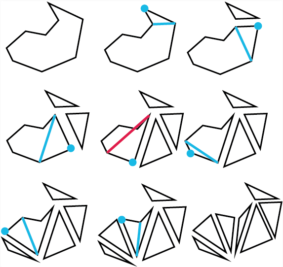
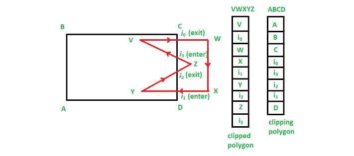
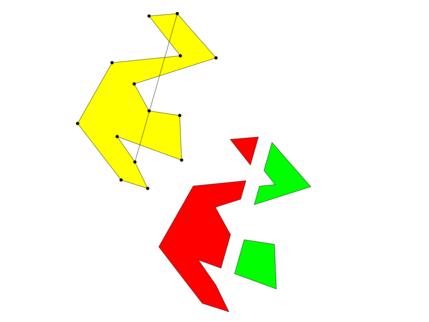

#  Algorithms 2D Geometry Advanced using C/C++
---
<p style="text-align: right; font-size:12px;">
<b>Create date</b>: 2023.10.11 by <a href="#">thuong.nv</a>
</p>

## Giới thiệu 

Bài post này sẽ trình bày một vài thuật toán hình học 2D hay được sử dụng. Nó là nâng cao hơn và kết hợp nhiều bài toán nhỏ.

</br><!--Section-->

## Yêu cầu

Cần nắm vũng kiến thức hình học 2D cơ bản.

Ngoài ra trong bài post này sẽ sử dụng các thuật toán, hàm đã được trình bày ở 2 bài viết này.
Vì thế cần tìm hiểu trước khi bắt đầu.
- [Vector2D cơ bản](/post/GeometryVector/vector-2d.html)
- [Thuật toán 2D cơ bản](/post/GeometryAlgorithm/geo-algorithm-2d.html)

</br><!--Section-->

## Nội dung


##### <b>Geometry 2D nâng cao</b>
---

1. Polygon to triangle <a id="poly2tri"></a>
    
    Chia một polygon thành một tập hợp các tam giác 3 đỉnh.

    a. Sử dụng kỹ thuật ear_clipping <a id="poly2trig_ear_clipping"></a>

    <p align="center">
        
    </p>

    [Thuật toán]
    - Xét 3 điểm liền kề nhau nếu không giao với các cạnh của polygon thì sẽ tạo thành 1 tam giác
    - Lặp đến khi nào hết điểm của polygon thì dừng lại

    <br>

    [Tham khảo]
    - https://www.gamedev.net/tutorials/programming/graphics/polygon-triangulation-r3334/

    <br>

    [Lưu ý]
    > * Đầu vào của polyon phải quay theo ngược chiều kim đồng hồ. <br>
    > * Thuật toán này không áp dụng cho polygon có lỗ (hold polygon)

    ```cpp
    Dllexport VecPoint2D poly2trig_ear_clipping(const VecPoint2D& poly)
    {
        VecPoint2D list_trig; VecPoint2D vecPolyTemp;

        int nPolyCnt = static_cast<int>(poly.size());
        if (nPolyCnt < 3)
        {
            //_ASSERT(0);

            return poly;
        }

        list_trig.reserve(nPolyCnt * 2);

        vecPolyTemp = poly;

        EnumOrien orien, orp12, orp23, orp31;
        auto funCheckPointInTrigIdx = [&](VecPoint2D& _poly, int idx1, int idx2, int idx3)
        {
            int _nPolyCnt = static_cast<int>(_poly.size());

            for (int i = 0; i < _nPolyCnt; i++)
            {
                // don't check index input
                if (i == idx1 || i == idx2 || i == idx3)
                    continue;

                orp12 = get_orientation_point_vector(_poly[idx1], _poly[idx2], _poly[i]);
                orp23 = get_orientation_point_vector(_poly[idx2], _poly[idx3], _poly[i]);
                orp31 = get_orientation_point_vector(_poly[idx3], _poly[idx1], _poly[i]);

                if (orp12 == orp23 && orp23 == orp31)
                    return true;
            }

            return false;
        };

        int i, nOldSize, nCur, nNex, nPre;

        while (vecPolyTemp.size() > 0)
        {
            //PS: prevent in case of infinite loops 
            nPolyCnt = nOldSize = static_cast<int>(vecPolyTemp.size());

            for (i = 0; i < nPolyCnt; i++)
            {
                nCur = i; nPre = ((i - 1) < 0) ? (nPolyCnt - 1) : (i - 1);
                nNex = ((i + 1) >= nPolyCnt) ? 0 : (i + 1);

                orien = get_orientation_point_vector(vecPolyTemp[nPre], vecPolyTemp[nCur], vecPolyTemp[nNex]);

                if ((orien == EnumOrien::LEFT || orien == EnumOrien::COLLINEAR)
                    && funCheckPointInTrigIdx(vecPolyTemp, nPre, nCur, nNex) == false)
                {
                    list_trig.push_back(vecPolyTemp[nPre]);
                    list_trig.push_back(vecPolyTemp[nCur]);
                    list_trig.push_back(vecPolyTemp[nNex]);
                    vecPolyTemp.erase(vecPolyTemp.begin() + nCur);
                }

                nPolyCnt = static_cast<int>(vecPolyTemp.size());
            }

            if (vecPolyTemp.size() == nOldSize)
                break;
        }
        return list_trig;
    }
    ```

1. Clip polygon <a id="Clip2Polygon"></a>

    Clip một polygon và trả về danh sách các polygon đã được clip. Hay nói ngắn gọn phần giao giữa 2 polygon.

    Dưới đây sẽ trình bày 2 thuật toán clip polygon mỗi thuật toán sẽ cho ưu, nhược điểm khác nhau phụ thuộc vào mục đích.

    a. Sử dụng thuật toán Weiler Atherton.<a id="Clip2PolygonUseWeilerAtherton"></a>

    <p align="center">
        
    </p>

    [Thuật toán]
    - Tìm các giao điểm giữa 2 polygon
    - Sắp xếp chúng theo quy tắc mark, đánh dấu điểm vào và điểm ra
    - Sử dụng thuật toán weiler atherton để tiến hành tìm các poly clip

    <br>

    [Tham khảo]
    - https://www.geeksforgeeks.org/weiler-atherton-polygon-clipping-algorithm/

    <br>

    [Lưu ý]
    > Chú ý đầu vào của polyon phải quay theo ngược chiều kim đồng hồ

    ```cpp
    VecPolyList Clip2Polygon(IN const VecPoint2D& _poly, IN const VecPoint2D& _clipPoly)
    {
        typedef struct stMarkPoint
        {
            int     nIndex = -1;     // Intersection index
            bool    bEnter = false;  //  true : enter | 1: leaving
            Point2D	pt;

        } MarkPoint;

        typedef std::vector<MarkPoint> VecMarkPoint;

        if (_poly.size() < 3 || _clipPoly.size() < 3)
        {
            ASSERT(0);
            return VecPolyList();
        }

        VecPoint2D poly		= _poly;
        VecPoint2D clipPoly = _clipPoly;

        // If polygon is not counterclockwise will recalculate
        if (IsCCW(poly) == FALSE)	  ReversePolygon(poly);
        if (IsCCW(clipPoly) == FALSE) ReversePolygon(clipPoly);

        // Polygon inside clip polygon
        if (IsInsidePolygon(poly, clipPoly))
        {
            return VecPolyList({ poly });
        }

        VecMarkPoint vecMarkPoly, vecMarkClipPoly;
        std::map<int, VecMarkPoint> mapInterPoly, mapInterClipPoly;
        std::set<int> setUsedIndex;
        Point2D ptMid, ptTemp;

        int nPolyCnt     = static_cast<int>(poly.size());
        int nClipPolyCnt = static_cast<int>(clipPoly.size());

        auto funPushInterectionMarKPoint = [&](VecMarkPoint& vecPush, const Point2D& ptInter,
                                               const Point2D& ptOri, int nIndex)-> void
        {
            float fDisInter = GetMagnitude(ptInter - ptOri);

            bool bPushBack = true;

            for (int nInter = 0; nInter < vecPush.size(); nInter++)
            {
                float fDisCur = GetMagnitude(vecPush[nInter].pt - ptOri);

                if (fDisInter < fDisCur)
                {
                    vecPush.insert(vecPush.begin() + nInter, MarkPoint{ nIndex, false, ptInter });

                    bPushBack = false;
                    break;
                }
            }

            if (bPushBack)
            {
                vecPush.push_back(MarkPoint{ nIndex, false, ptInter });
            }

            return;
        };

        Point2D ptInter;
        int nIndexInter = 1; int nNextIdx, nClipNextIdx;

        // 1. Found intersection point, and push map inter
        for (int nIdx = 0; nIdx < nPolyCnt; nIdx++)
        {
            nNextIdx = (nIdx + 1) % nPolyCnt;

            for (int nClipIdx = 0; nClipIdx < nClipPolyCnt; nClipIdx++)
            {
                nClipNextIdx = (nClipIdx + 1) % nClipPolyCnt; // next point index

                if (Intersect2Segment(poly[nIdx], poly[nNextIdx], clipPoly[nClipIdx], clipPoly[nClipNextIdx], &ptInter))
                {
                    // Push to map poly intersection
                    auto itClip = mapInterPoly.insert(std::make_pair(nIdx, VecMarkPoint{{ nIndexInter, false, ptInter}}));

                    if (itClip.second == false)
                    {
                        VecMarkPoint& vecInter = itClip.first->second;
                        funPushInterectionMarKPoint(vecInter, ptInter, poly[nIdx], nIndexInter);
                    }

                    // Push map clip poly intersection
                    auto it = mapInterClipPoly.insert(std::make_pair(nClipIdx, VecMarkPoint{{ nIndexInter, false, ptInter}}));

                    if (it.second == false)
                    {
                        VecMarkPoint& vecInter = it.first->second;
                        funPushInterectionMarKPoint(vecInter, ptInter, clipPoly[nClipIdx], nIndexInter);
                    }

                    nIndexInter++;
                }
            }
        }

        vecMarkPoly.reserve(poly.size() + static_cast<size_t>(nIndexInter) * 2);
        vecMarkClipPoly.reserve(clipPoly.size() + static_cast<size_t>(nIndexInter) * 2);

        // 2. Create two mark poly and clip poly data;
        MarkPoint markPoint;
        for (int i = 0; i < nPolyCnt; i++)
        {
            markPoint.pt = poly[i];
            markPoint.nIndex = -1;
            markPoint.bEnter = false;

            vecMarkPoly.push_back(markPoint);

            auto itFound = mapInterPoly.find(i);

            if (itFound != mapInterPoly.end())
            {
                int nInterCnt = static_cast<int>(itFound->second.size());
                VecMarkPoint& vecInters = itFound->second;

                for (int ii = 0; ii < nInterCnt; ii++)
                {
                    markPoint.pt = vecInters[ii].pt;
                    markPoint.nIndex = vecInters[ii].nIndex;
                    markPoint.bEnter = false;

                    int nNextIdx = ii + 1;

                    ptTemp = (nNextIdx < nInterCnt) ? vecInters[nNextIdx].pt : poly[(i + 1) % nPolyCnt];

                    ptMid = GetMidPoint(vecInters[ii].pt, ptTemp);

                    if (IsPointInPolygon(ptMid, clipPoly) == TRUE)
                    {
                        markPoint.bEnter = true;
                    }

                    vecMarkPoly.push_back(markPoint);
                }
            }
        }

        for (int i = 0; i < nClipPolyCnt; i++)
        {
            markPoint.pt = clipPoly[i];
            markPoint.nIndex = -1;
            markPoint.bEnter = false;

            vecMarkClipPoly.push_back(markPoint);

            auto itFound = mapInterClipPoly.find(i);

            if (itFound != mapInterClipPoly.end())
            {
                int nInterCnt = static_cast<int>(itFound->second.size());
                VecMarkPoint& vecInters = itFound->second;

                for (int ii = 0; ii < nInterCnt; ii++)
                {
                    markPoint.pt = vecInters[ii].pt;
                    markPoint.nIndex = vecInters[ii].nIndex;

                    markPoint.bEnter = false;

                    int nNextIdx = ii + 1;

                    ptTemp = (nNextIdx < nInterCnt) ? vecInters[nNextIdx].pt : clipPoly[(i + 1) % nClipPolyCnt];

                    ptMid = GetMidPoint(vecInters[ii].pt, ptTemp);

                    if (IsPointInPolygon(ptMid, poly) == TRUE)
                    {
                        markPoint.bEnter = true;
                    }

                    vecMarkClipPoly.push_back(markPoint);
                }
            }
        }

        auto funIsMarkPointEnter = [&](const MarkPoint& mark_point) -> bool
        {
            return (mark_point.nIndex >= 0 && mark_point.bEnter);
        };

        auto funIsMarkPointLeave = [&](const MarkPoint& mark_point) -> bool
        {
            return (mark_point.nIndex >= 0 && !mark_point.bEnter);
        };

        auto funFindVertexEnd = [&](VecPoint2D& _vecResultClip, int _nSIndex, int _nEIndex) -> bool
        {
            bool bRet = false, bContinue = false;
            int nStartIdx = _nSIndex, nEndIdx = _nEIndex;
            int nCurIdx = -1;

            bool bUseMarkList = false; // true (mark) | false (mark clip)

            VecMarkPoint* pVecMarkFind;

            while (true)
            {
                bContinue = false;

                nCurIdx = -1;

                if (bUseMarkList)	pVecMarkFind = &vecMarkPoly;
                else				pVecMarkFind = &vecMarkClipPoly;

                bUseMarkList = !bUseMarkList;

                int nMarkPoly = static_cast<int>(pVecMarkFind->size());

                for (int i = 0; i < nMarkPoly; i++)
                {
                    if ((*pVecMarkFind)[i].nIndex == nStartIdx &&
                        (*pVecMarkFind)[i].bEnter == true) //enter
                    {

                        nCurIdx = i;
                        break;
                    }
                }

                if (nCurIdx == -1)
                    return false;

                setUsedIndex.insert(nStartIdx);

                for (int i = 1; i < nMarkPoly; i++)
                {
                    MarkPoint& markPointClip = (*pVecMarkFind)[(nCurIdx + i) % nMarkPoly];

                    // found end point -> end
                    if (markPointClip.nIndex == nEndIdx)
                    {
                        bRet = true;
                        break;
                    }

                    _vecResultClip.push_back(markPointClip.pt);

                    // found leaving point
                    if (funIsMarkPointLeave(markPointClip))
                    {
                        nStartIdx = markPointClip.nIndex;
                        bContinue = true;
                        break;
                    }
                }

                if (bContinue) continue;

                return bRet;
            }

            return false;
        };

        // 3. emplement Weiler Atherton algorithm 
        VecPolyList vecClips; VecPoint2D vecClip;

        int nMarkPolyCnt = static_cast<int>(vecMarkPoly.size());

        for (int i = 0; i < nMarkPolyCnt; i++)
        {
            MarkPoint& markpt = vecMarkPoly[i];

            if (funIsMarkPointEnter(markpt) && setUsedIndex.find(markpt.nIndex) == setUsedIndex.end())
            {
                bool bClose = false;

                vecClip.push_back(markpt.pt);

                for (int nNext = 1; nNext < vecMarkPoly.size(); nNext++)
                {
                    MarkPoint& markNextpt = vecMarkPoly[(i + nNext) % vecMarkPoly.size()];

                    vecClip.push_back(markNextpt.pt);

                    if (funIsMarkPointLeave(markNextpt))
                    {
                        bClose = funFindVertexEnd(vecClip, markNextpt.nIndex, markpt.nIndex);
                        break;
                    }
                }

                if (bClose)
                {
                    vecClips.push_back(vecClip);
                }

                vecClip.clear();
            }
        }

        return vecClips;
    }

    ```
    <br>

    b. Sử dụng thuật toán Weiler Atherton.<a id="Clip2PolygonUseSutherlandHodgman"></a>

    <p align="center">
        
    </p>

    [Ưu nhược điểm]

    | Ưu điểm                   | Nhược điểm                            | 
    | :---                      | :----                                 |
    | - Dễ triển khai           | - Chỉ sử dụng với convex polygon      | 
    |                           | - Chỉ có 1 polygon được trả về        | 

    [Thuật toán]
    - Tìm các giao điểm giữa 2 polygon
    - Sắp xếp chúng theo quy tắc mark, đánh dấu điểm vào và điểm ra
    - Sử dụng thuật toán weiler atherton để tiến hành tìm các poly clip

    <br>

    [Tham khảo]
    - https://en.wikipedia.org/wiki/Sutherland–Hodgman_algorithm

    <br>

    ```cpp
    VecPoint2D Clip2Polygon(IN const VecPoint2D& poly, IN const Rect2D& clipRect)
    {
        // Allway right (ccw)
        VecPoint2D vecClipRect = ConvertRectF2Points(clipRect);

        if (vecClipRect.size() < 3 || poly.size() < 3)
        {
            ASSERT(0);
            return VecPoint2D();
        }

        VecPoint2D vecOutPoints = poly;

        // If polygon is not counterclockwise will recalculate
        if (IsCCW(vecOutPoints) == FALSE) ReversePolygon(vecOutPoints);

        int nClipCnt = static_cast<int>(vecClipRect.size());
        int nVertexCnt = 0;

        Point2D ptInter, ptSEdge, ptEEdge;

        for (int nEdge = 0; nEdge < nClipCnt; nEdge++)
        {
            ptSEdge = vecClipRect[nEdge];
            ptEEdge = vecClipRect[(nEdge + 1) % nClipCnt];

            VecPoint2D vecInputPoints = std::move(vecOutPoints);
            nVertexCnt = static_cast<int>(vecInputPoints.size());

            vecOutPoints.clear();

            for (int nVertex = 0; nVertex < nVertexCnt; nVertex++)
            {
                Point2D ptCur = vecInputPoints[nVertex];
                Point2D ptNext = vecInputPoints[(nVertex + 1) % nVertexCnt];

                EnumOrien eRetOriCur = GetOrientationPoint2Vector(ptCur, ptSEdge, ptEEdge);
                EnumOrien eRetOriNext = GetOrientationPoint2Vector(ptNext, ptSEdge, ptEEdge);

                if (eRetOriCur == EnumOrien::LEFT) // left
                {
                    vecOutPoints.push_back(ptCur);

                    if (eRetOriNext == EnumOrien::COLLINEAR ||
                        eRetOriNext == EnumOrien::RIGHT)
                    {
                        if (Intersect2Line(ptCur, ptNext, ptSEdge, ptEEdge, &ptInter))
                        {
                            vecOutPoints.push_back(ptInter);
                        }
                    }
                }
                else if (eRetOriNext == EnumOrien::LEFT)
                {
                    if (Intersect2Line(ptCur, ptNext, ptSEdge, ptEEdge, &ptInter))
                    {
                        vecOutPoints.push_back(ptInter);
                    }
                }
            }
        }

        return vecOutPoints;
    }
    
    ```

<!--Line cut polygon-->

1. Line cut polygon <a id="cut_line2poly"></a>
    
    Sử dụng đoạn thẳng cắt polygon. Chỉ áp dụng cho concave hoặc convex polygon

    <p align="center">
        
    </p>

    [Thuật toán]
    - Xét 2 điểm nối tiếp trên polygon.
    - Nếu 2 điểm đó có chứa điểm cắt. 
        - Đánh dấu điểm đầu đã duyệt. Thêm nó vào polygon cắt
        - Tìm điểm cắt tiếp theo bên trái gần nhất.
        - Xét điểm đầu và cuối của điểm cắt. Tiếp tục với điểm đó
    - Lặp đến khi nào hết điểm của polygon thì dừng lại

    <br>

    [Tham khảo]
    - https://stackoverflow.com/questions/3623703/how-can-i-split-a-polygon-by-a-line

    <br>

    [Lưu ý]
    > * Đầu vào của polyon phải quay theo ngược chiều kim đồng hồ. <br>
    > * Thuật toán này không áp dụng cho polygon có lỗ (hold polygon)

    ```cpp
    Dllexport VecPolyList cut_line2poly(const Point2D& pt1, const Point2D& pt2, const VecPoint2D& _poly)
    {
        VecPolyList vec_poly_split;
        VecPoint2D poly = _poly; // copy data

        if (_poly.size() < 3)
        {
            vec_poly_split.push_back(_poly);
            _ASSERT(0);
            return vec_poly_split;
        }

        struct MarkPointInterPoly
        {
            Point2D		pt;
            int			idx_start;
            int			idx_end;
        };

        typedef std::vector<MarkPointInterPoly> VecMarkPointInterPoly;

        GBool bExist; Point2D ptInter;
        VecMarkPointInterPoly vMarkInters;
        GFloat fDis = 0.f;

        // Polygon input is counterclockwise
        if (is_ccw(poly) == GFalse) reverse_polygon(poly);

        // seek all intersection point and index polygon between line and polygon
        int nPolyCnt = static_cast<int>(poly.size());

        for (int j = 0, i = nPolyCnt - 1; j < nPolyCnt; i = j++)
        {
            bExist = GFalse;
            if (intersect_2lsegment(poly[i], poly[j], pt1, pt2, &ptInter) == GTrue)
            {
                for (int ii = 0; ii < vMarkInters.size(); ii++)
                {
                    fDis = mag(ptInter - vMarkInters[ii].pt);

                    if (fDis < MATH_EPSILON)
                    {
                        bExist = GTrue;
                        break;
                    }
                }

                if (bExist == GFalse)
                {
                    vMarkInters.push_back({ ptInter, i,j });
                }
            }
        }

        bool* arMark = new bool[nPolyCnt];
        std::memset(arMark, 0, sizeof(bool)*nPolyCnt);

        // check existed intersection point in line segment of polygon
        auto funExistIntersect = [&](int& idx, int& idx_next)
        {
            for (int in = 0; in < vMarkInters.size(); in++)
            {
                if (idx == vMarkInters[in].idx_start && idx_next == vMarkInters[in].idx_end)
                {
                    return in;
                }
            }

            return -1;
        };

        // seek intersection point and near intersection point index
        // located on the left side of intersection point mark
        auto funGetIndexIntersectNearest = [&](int idxInter)
        {
            GFloat fDisMin = -1.f, fDis = 0.f;
            int idxInterMin = -1;
            EnumOrien ori_min;

            if (idxInter < 0 || idxInter >= vMarkInters.size())
                return -1;

            auto& markInter = vMarkInters[idxInter];

            for (int in = 0; in < vMarkInters.size(); in++)
            {
                fDis = mag(vMarkInters[in].pt - vMarkInters[idxInter].pt);
                ori_min = get_orientation_point_vector(poly[markInter.idx_start], poly[markInter.idx_end], vMarkInters[in].pt);

                if (in != idxInter && (ori_min == EnumOrien::LEFT && (fDisMin < 0 || fDis <= fDisMin)))
                {
                    idxInterMin = in;
                    fDisMin = fDis;
                }
            }

            return idxInterMin;
        };

        EnumOrien or_pfirst = EnumOrien::LEFT;
        int nIdx, nIdxNext, i, x, y;

        // loop to seek all polygon after cutting
        for (i = 0; i < nPolyCnt; i++)
        {
            if (arMark[i] == true) continue;

            VecPoint2D poly_split;
            int idx = i, count = 0;

            while (count < nPolyCnt) //PS: Prevents infinite looping
            {
                x = idx; y = (idx + 1) % nPolyCnt;

                poly_split.push_back(poly[x]);
                arMark[x] = true;
                idx = y;

                if ((nIdx = funExistIntersect(x, y)) >= 0)
                {
                    poly_split.push_back(vMarkInters[nIdx].pt);

                    if ((nIdxNext = funGetIndexIntersectNearest(nIdx)) >= 0)
                    {
                        poly_split.push_back(vMarkInters[nIdxNext].pt);

                        int st = vMarkInters[nIdxNext].idx_start;
                        int ed = vMarkInters[nIdxNext].idx_end;

                        if (get_orientation_point_vector(vMarkInters[nIdx].pt, vMarkInters[nIdxNext].pt, poly[ed]) == or_pfirst)
                        {
                            idx = ed;
                        }
                        else if (get_orientation_point_vector(vMarkInters[nIdx].pt, vMarkInters[nIdxNext].pt, poly[st]) == or_pfirst)
                        {
                            idx = st;
                        }
                    }
                }

                count++;

                if (i == idx) break;
            }
            vec_poly_split.push_back(poly_split);
        }

        delete[] arMark;

        //for (INT i = 0; i < vec_poly_split.size(); i++)
        //{
        //	V2remove_double_point(vec_poly_split[i]);
        //}

        return vec_poly_split;
    }
    ```


## Tham khảo


