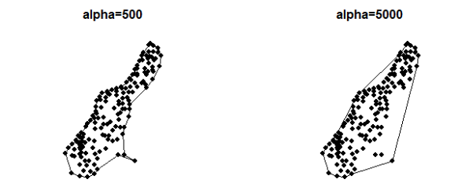
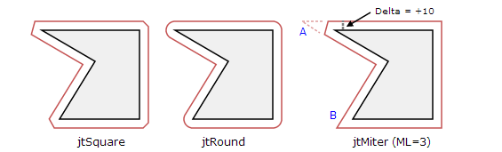

#  Geometry Algorithm
---
<p style="text-align: right; font-size:12px;">
<b>Create date</b>: 2023.10.04 by <a href="#">thuong.nv</a>
</p>

## Mục lục

<div style="padding:20px; margin-bottom:20px; background-color: #f3f3f587;border-radius: 10px;">

* [Đường thẳng, đoạn thẳng](#đường-thẳng-đoạn-thẳng)
    * [Điểm nằm trên đoạn thẳng](#IsPointInLineSegment)
    * [Điểm nằm trên đường thẳng](#IsPointInLine)
    * [Giao điểm hai đường thẳng](#Intersect2Line)
    * [Giao điểm hai đoạn thẳng](#Intersect2Segment)
    * [Giao điểm đường thẳng và đoạn thẳng](#IntersectLine2Segment)
    * [Hình chiếu của một điểm xuống đường thẳng](#PerpPoint2Line)
    * [Hình chiếu của một điểm xuống đoạn thẳng](#PerpPoint2Segment)

    </br>
* [Tia](#tia)
    * [Giao điểm tia với đường thẳng](#IntersectRay2Line)
    * [Kiểm tra điểm thuộc tia](#IsPointInRay)

    </br>
* [Polygon](#đường-thẳng-đoạn-thẳng)
    * [Tìm max polygon bounding](#MaxBounding)
        * [Sử dụng thuật toán Gift_wrap](#Gift_wrap)
        * [Sử dụng thuật toán Graham_scan](#Graham_scan)
        * [Sử dụng thuật toán Alpha-Shapes](#Alpha_shapes)
    * [Thổi phồng polygon (Inflat)](#Inflat)
    * [Giao điểm đường thẳng giao polygon](#IntersectLine2Polygon)
    * [Giao điểm đoạn thẳng giao polygon](#IntersectSegment2Polygon)
    * [Quan hệ điểm và polygon](#PerpPoint2Segment)
    * [Quan hệ polygon và polygon](#PerpPoint2Segment)
    * [Quan hệ đoạn thẳng và polygon](#PerpPoint2Segment)
    * [Kiểm tra chiều polygon (CW, CCW)](#PerpPoint2Segment)
    * [Đảo ngược](#PerpPoint2Segment)
    * [Clip polygon](#Intersect2Line)
    * [Tâm đường tròn ngoại tiếp tam giác](#Intersect2Line)
    * [Trọng tâm polygon](#Intersect2Line)

</div>

## Giới thiệu 

Sau khi giới thiệu xong về vector2D cơ bản. Bài viết sẽ trình bày các thuật toán liên quan.

Mọi kiến thức liên quan đến Vector2D có thể tham khảo [Vector2D cơ bản](/post/GeometryVector/vector-2d.html)

## Yêu cầu

Cần nắm vũng kiến thức 2D cơ bản. Ngoài ra còn các tính chất và thuật toán tính toán vector thông thường

## Nội dung

##### <b> Định nghĩa </b>
___


Ta sẽ sử dụng định nghĩa này xuyên xuốt 

```C++
struct Vec2D 
{
    float x;
    float y;

    Vec2D(const float _x, const float _y):
        x(_x), y(_y) { }
};
```

> Dưới đây sẽ trình bày theo phong cách C, Ngoài ra có thể định nghĩa lại thành lớn phù hợp cho C++

##### <b>Đường thẳng, đoạn thẳng</b>
___

1. Kiểm tra điểm nằm trên đoạn thẳng <a id="IsPointInLineSegment"></a> 


    ```C++
    bool IsPointInLineSegment(const Point2D& pt1, const Point2D& pt2, 
                            const Point2D& pt)
    {
        Vec2D vp1p = pt - pt1; // Vector vp1p ;
        Vec2D vp2p = pt - pt2; // Vector vp2p ;

        float fCrs = Cross(vp1p, vp2p);

        // Point in straight line + Độ chính xác có thể sử dụng sai số ở đây
        if (IsEqual(fCrs, 0.f, 0.01f))
        {
            // Point in side line Segment
            float fp1pDis  = GetMagnitude(vp1p);
            float fp2pDis  = GetMagnitude(vp2p);
            float fp1p2Dis = GetMagnitude(pt1 - pt2);

            if (fp1pDis <= fp1p2Dis && fp2pDis <= fp1p2Dis)
            {
                return TRUE;
            }
        }
        return FALSE;
    }
    ```

1. Kiểm tra điểm nằm trên đường thẳng <a id="IsPointInLine"></a> 

    Dưới đây sẽ trình bày điểm thuộc đường thẳng cho bởi 2 điểm hoặc 1 điểm và một vector đơn vị

    ```C++
    // Line created by point and normalize vector
    bool IsPointInLine2(const Point2D& pt, const Vec2D& vn, const Point2D& ptc)
    {
        Point2D ptpc = ptc - pt;

        float fCross = Cross(vn, ptpc);

        // 3 collinear point if cross product isqual 0
        if (true == IsEqual(fCross, 0.f, 0.01f))
        {
            return true;
        }

        return false;
    }

    // Line created by two by
    bool IsPointInLine(const Point2D& pt1, const Point2D& pt2, const Point2D& ptc)
    {
        Vec2D vuint_line = Normalize(pt1 - pt2);

        return IsPointInLine2(pt1, vuint_line, ptc);
    }
    ```

2. Giao điểm hai đường thẳng <a id="Intersect2Line"></a> 

    [Thuật toán]
    - Viết phương trình 2 đường thẳng đi qua 4 điểm (ax + by + c = 0)
    - Tồn tại giao điểm khi phương trình 2 ẩn x, y có định thức khác không (không song song)
    - Tìm (xi, yi) bằng cách giải phương trình 

    </br>

    <p align="center">
        
    </p>

    Hàm dưới tìm giao điểm giữa 2 đường thẳng cho bởi 4 điểm

    - Tọa độ điểm giao sẽ trả về tham số ```pInter``` nếu có
    - Return : True (giao nhau) | False (không giao)

    </br>

    ```C++
    bool Intersect2Line(const Point2D& pt1,		// L1
	                    const Point2D& pt2,		// L1
	                    const Point2D& pt3,		// L2
	                    const Point2D& pt4,		// L2
	                          Point2D* pInter	/*= NULL*/)
    {
        // Equation of the first straight line Segment  : ax +by = c
        float fA = pt2.y - pt1.y;
        float fB = pt1.x - pt2.x;
        float fC = fA * (pt1.x) + fB * (pt1.y);

        // Equation of the second straight line Segment : a1x +b1y = c1
        float fA1 = pt4.y - pt3.y;
        float fB1 = pt3.x - pt4.x;
        float fC1 = fA1 * (pt3.x) + fB1 * (pt3.y);

        float fDet = fA * fB1 - fB * fA1;

        Vec2D ptInter = Point2D(0.f, 0.f);
        bool bInter = false;

        // Check not parallel line Segment
        if (IsEqual(fDet, 0.f, 0.01f) == false)
        {
            ptInter.x = (fB1 * fC  - fB  * fC1) / fDet;
            ptInter.y = (fA  * fC1 - fA1 * fC ) / fDet;

            bInter = true;
        }

        if (pInter)
        {
            *pInter = ptInter;
        }

        return bInter;
    }
    ```

    Trong trường hợp 2 đường thẳng cho bởi một điểm và một vector đơn vị thì có thể sử dụng hàm bên dưới.

    ```C++
    bool Intersect2Line2(const Point2D& ptLine1,   // Point on the line 1
	                     const Vec2D&   vnLine1,   // Unit vector line
	                     const Point2D& ptLine2,   // Point on the line 2
	                     const Vec2D&   vnLine2,   // Unit vector line
	                           Point2D* pInter     /*= NULL*/)
    {
        Point2D ptInter;

        Point2D ptLine12 = ptLine1 + vnLine1;
        Point2D ptLine22 = ptLine2 + vnLine2;

        if (true == Intersect2Line(ptLine1, ptLine12, ptLine2, ptLine22, &ptInter))
        {
            if (pInter)
            {
                *pInter = ptInter;
            }
            return true;
        }

        return false;
    }
    ```

3. Giao điểm hai đoạn thẳng giao nhau <a id="Intersect2Segment"></a> 

    Tương tự với giao điểm giữa 2 đường thẳng chỉ thêm kiểm tra giao điểm nằm trong khoảng của 2 đoạn thẳng là được.

    Hàm dưới xử dụng hàm [PointInLineSegment](#PointInLineSegment) đã được trình bày ở trên.

    - Tọa độ điểm giao sẽ trả về tham số ```pInter``` nếu có
    - Return : True (giao nhau) | False (không giao)

    </br>

    ```C++
    bool Intersect2Segment( const Point2D& pt1,     // Seg1
                            const Point2D& pt2,     // Seg1
                            const Point2D& pt3,     // Seg2
                            const Point2D& pt4,     // Seg2
                                  Point2D* pInter   /*= NULL*/)
    {
        // Equation of the first straight line Segment  : ax +by = c
        float fA = pt2.y - pt1.y;
        float fB = pt1.x - pt2.x;
        float fC = fA * (pt1.x) + fB * (pt1.y);

        // Equation of the second straight line Segment : a1x +b1y = c1
        float fA1 = pt4.y - pt3.y;
        float fB1 = pt3.x - pt4.x;
        float fC1 = fA1 * (pt3.x) + fB1 * (pt3.y);

        float fDet = fA * fB1 - fB * fA1;

        Vec2D ptInter = Point2D(0.f, 0.f);
        bool bInter = false;

        // Check not parallel line Segment
        if (IsEqual(fDet, 0.f, 0.01f) == false)
        {
            ptInter.X = (fb1 * fc - fb * fc1) / fDet;
            ptInter.Y = (fa * fc1 - fa1 * fc) / fDet;

            // Inside intersection 
            if (PointInLineSegment(pt1, pt2, ptInter) &&
                PointInLineSegment(pt3, pt4, ptInter))
            {
                bInter = true;
            }
            else // Outside intersection
            {
                bInter = false;
            }
        }

        if (pInter)
        {
            *pInter = ptIntersect;
        }

        return bInter;
    }
    ```
3. Giao điểm hai đường thẳng và đoạn thẳng <a id="IntersectLine2Segment"></a> 

    Hàm dưới xử dụng hàm [Intersect2Line](#Intersect2Line) đã được trình bày ở trên.

    - Tọa độ điểm giao sẽ trả về tham số ```pInter``` nếu có
    - Return : True (giao nhau) | False (không giao)

    </br>

    ```C++
    bool IntersectLine2Segment( const Point2D& ptLine1,	// Point on the line
                                const Point2D& ptLine2,	// Point on the line
                                const Point2D& ptSeg1,	// Point start on line segment
                                const Point2D& ptSeg2,	// Point end on line segment
                                      Point2D* pInter	/*= NULL*/)
    {
        Point2D ptInter;

        if (true == Intersect2Line(ptLine1, ptLine2, ptSeg1, ptSeg2, &ptInter))
        {
            // Check point inside line segment
            float fp1pDistance  = Mag(ptSeg1 - ptInter);
            float fp2pDistance  = Mag(ptSeg2 - ptInter);
            float fp1p2Distance = Mag(ptSeg1 - ptSeg2);

            if (fp1pDistance <= fp1p2Distance &&
                fp2pDistance <= fp1p2Distance)
            {
                if (pInter)
                {
                    *pInter = ptInter;
                }
                return true;
            }
        }
        return false;
    }
    ```


4. Hình chiếu của một điểm xuống đường thẳng <a id="PerpPoint2Line"></a>

    ```C++
    Point2D PerpPoint2Line(const Point2D& ptLine1, const Point2D& ptLine2,
                           const Point2D& pt)
    {
        Vec2D ptPer;
        Vec2D vp1p2 = ptLine2 - ptLine1;  // p1p2
        Vec2D vp1p = pt - ptLine1;  // p1p
        Vec2D vp2p = pt - ptLine2;  // p2p

        FLOAT fDis = vp1p2.X * vp1p2.X + vp1p2.Y * vp1p2.Y;

        if (FALSE == IsEqual(fDis, 0.f, 0.01f))
        {
            FLOAT fDet = Dot(vp1p, vp1p2);

            FLOAT t = fDet / fDis;
            ptPer.X = ptLine1.X + t * (ptLine2.X - ptLine1.X);
            ptPer.Y = ptLine1.Y + t * (ptLine2.Y - ptLine1.Y);
        }
        else
        {
            ptPer = ptLine1; // case 3 points coincide
        }

        return ptPer;
    }
    ```

5. Hình chiếu của một điểm xuống đoạn thẳng <a id="PerpPoint2Segment"></a> 


    </br>

    <p align="center">
        
    </p>

    Giống như hình chiếu một điểm xuống đường thẳng chỉ cần xét thêm 2 đầu mút.
    Với vị trí vượt qua đầu mút thì đầu mút gầm hơn sẽ được lấy làm hình chiếu.

    Hàm [PerpPoint2Line](#PerpPoint2Line) được định nghĩa ở trên

    ```C++

    Point2D PerpPoint2Segment(const Point2D& ptSeg1, const Point2D& ptSeg2,
                              const Point2D& pt)
    {
        Vec2D ab = ptSeg2 - ptSeg1;
        Vec2D ae = pt     - ptSeg1;
        Vec2D be = pt     - ptSeg2;

        float fDot_ab_be = Dot(ab, be);
        float fDot_ab_ae = Dot(ab, ae);

        if(fDot_ab_be > 0)
        {
            return ptSeg2;
        }
        else if(fDot_ab_ae < 0)
        {
            return ptSeg1;
        }
        else
        {
            return PerpPoint2Line(ptSeg1, ptSeg2, pt);
        }
    }
    ```


</br>

##### <b>Tia</b>
___

1. Giao điểm tia với đường thẳng <a id="IntersectRay2Line"></a> 

    Tương tự giao điểm giữa 2 đường thẳng chỉ khác biệt giới hạn của tia về một hướng cố định.

    Hàm [IsPointInLine2](#Intersect2Line) được định nghĩa ở trên

    ```C++
    bool IntersectRay2Line( const Point2D& ptRay  , const Vec2D& vnRay,
                            const Point2D& ptLine1, const Point2D& ptLine2,
                                  Point2D* pInter/* = NULL*/)
    {
        Vec2D vnLine = Normalize(ptLine2 - ptLine1);

        Point2D ptInter;

        if (true == Intersect2Line2(ptRay, vnRay, ptLine1, vnLine, &ptInter))
        {
            Vec2D vnRayI = ptInter - ptRay;

            if (pInter)
            {
                *pInter = ptInter;
            }

            return	(vnRayI.X * vnRay.X >= 0) &&
                    (vnRayI.Y * vnRay.Y >= 0);

        }

        return false;
    }
    ```
2. Kiểm tra điểm nằm trên tia <a id="IsPointInRay"></a>

    Kiểm tra điểm nằm trên một tia tương tự kiểm tra điểm nằm trên đường thẳng bị giới hạn một đầu.

    Hàm [IsPointInLine2](#Intersect2Line) được định nghĩa ở trên

    ```C++
    bool IsPointInRay(const Point2D& pt, const Vec2D& vn, const Point2D& ptc)
    {
        // Line created by point and normalize vector
        if (IsPointInLine2(pt, vn, ptc))
        {
            // unit vector ptpc
            Vec2D vptpc = Normalize(ptc - pt);

            return  (vptpc.X * vn.X) >= 0 &&
                    (vptpc.Y * vn.Y) >= 0;
        }

        return false;
    }
    ```

</br>

##### <b>Polygon</b>
---

1. Tìm max bounding <a id="MaxBounding"></a>

    a. Sử dụng thuật toán Gift Wrapping  <a id="Gift_wrap"></a>

    [Điều kiện]
    > Chú ý đến chiều chiều của hệ trục tọa độ Oxy (hướng xuống, hướng lên)

    [Thuật toán]
    - Mỗi lần lặp ta sẽ tìm được một điểm ở bên phải cùng của nó (Trường hợp polygon ngược chiều kim đồng hồ - CCW). 
    Đánh dấu nó là đỉnh đã đi qua
    - Lặp tương tự đến khi ta tìm được điểm đã duyệt qua

    </br>

    Tham khảo: [https://en.wikipedia.org/wiki/Gift_wrapping_algorithm](https://en.wikipedia.org/wiki/Gift_wrapping_algorithm)

    </br>

    ```C++
    VecPoint2D ConvexHullListPoints_GiftWrap(const VecPoint2D& vecPoints)
    {
        if (vecPoints.size() < 3)
        {
            ASSERT(0);
            return vecPoints;
        }

        int nPointCnt = static_cast<int>(vecPoints.size());

        // Find the leftmost point
        int nIdxLeftMost = 0;
        for (int i = 1; i < nPointCnt; i++)
        {
            if (vecPoints[i].X < vecPoints[nIdxLeftMost].X)
                nIdxLeftMost = i;
        }

        VecPoint2D vecHull; vecHull.reserve(nPointCnt);
        bool* arrMarkCheck = new bool[nPointCnt]{ false };

        int p = nIdxLeftMost, q;
        do
        {
            // Add current point to result
            vecHull.push_back(vecPoints[p]);
            arrMarkCheck[p] = true;

            // Search for a point 'q' such that orientation(p, q,
            // x) is counterclockwise for all points 'x'. The idea
            // is to keep track of last visited most counterclock-
            // wise point in q. If any point 'i' is more counterclock-
            // wise than q, then update q.
            q = (p + 1) % nPointCnt;
            for (int i = 0; i < nPointCnt; i++)
            {
                // If i is more counterclockwise than current q, then
                // update q

                // Note: Side base on the axis direction
                if (OrientationPoint2Vector(vecPoints[i], vecPoints[p], vecPoints[q]) == EnumOrien::RIGHT)
                    q = i;
            }

            // Now q is the most counterclockwise with respect to p
            // Set p as q for next iteration, so that q is added to
            // result 'hull'
            p = q;

            // Close or over
            if (arrMarkCheck[p] == true || vecHull.size() > nPointCnt)
            {
                break;
            }

        } while (p != nIdxLeftMost);  // While we don't come to first point

        delete[] arrMarkCheck;

        return vecHull;
    }
    ```

    b. Sử dụng thuật toán Graham_scan  <a id="Graham_scan"></a>

    [Điều kiện]
    > Chú ý đến chiều chiều của hệ trục tọa độ Oxy (hướng xuống, hướng lên)

    [Thuật toán]
    - Tìm điểm dưới cùng bên phải.
    - Sắp xếp các điểm theo chỉ số góc với điểm dưới cùng (góc tạo bởi đỉnh + điểm min và trục Ox).
    - Nó tìm đoạn ngoài nhất giữa 3 điểm liên tiếp.
    - Tiếp tục lặp đến hết điểm của polygon.

    </br>

    <p align="center">
        
    </p>

    Tham khảo: [https://en.wikipedia.org/wiki/Graham_scan](https://en.wikipedia.org/wiki/Graham_scan)


    **PS:** Đoạn code dưới là một đoạn code cũ chưa chuyển đổi tương ứng
    ```C++
    
    Ap2D DllExport ConvexHullListPoints_GrahamScan(const Ap2D& xap)
    {
        using namespace structsp;

        Ap2D boOut; 
        // 1. Tìm điểm min trong danh sách các điểm                 
        INT indMin = V2get_minpoint_poly(xap, NULL);
        if(indMin <= -1) return boOut;

        // 2. Sắp xếp theo tứ tự góc từ các điểm còn lại đến điểm min
        CompareEx<FLT,const Vec2D* >* arcmp = new CompareEx<FLT,const Vec2D* >[xap.np];
        for (INT i = 0; i < xap.np; i++)
        {
            //↓ N.V.Thuong [Comment out] Sai thuật toán
            //if (i != indMin)
            //{
                arcmp[i].m_cp   = V2angOx(V2sub(xap[i], xap[indMin]));
                arcmp[i].m_data = &xap[i];
            //}
            //↑ N.V.Thuong [Comment out] Sai thuật toán
        }
        structsp::fox_qsort<FLT, const Vec2D* >(arcmp, xap.np);

        boOut.Add(xap[indMin]);     // giá trị đầu luôn là điểm min;
        // 3. Thực hiện thuật toán  Graham scan
        for (INT i = 0; i < xap.np; i++)
        {
            if (arcmp[i].m_data != &xap[indMin]) // Không push điểm min
            {
                if (boOut.np > 1)
                {
                    Orien ori=  V2oriex_point2line(boOut[boOut.np-2], boOut[boOut.np-1], *arcmp[i].m_data);

                    if (ori == Orien::COLLINEAR || ori == Orien::RIGHT_SIDE)
                    {
                        boOut.RemoveBack();
                    }
                }
                boOut.Add(*((const Vec2D*)arcmp[i].m_data));
            }
        }
        delete[] arcmp;

        return boOut;
    }

    ```

    C. Sử dụng thuật toán Alpha-Shapes <a id="Alpha_shapes"></a>

    <p align="center">
        
    </p>

2. Thổi phồng polygon (Inflat) <a id="Inflat"></a>

    [Điều kiện]
    > Đầu vào polygon theo chiều CCW

    [Thuật toán]
    - Lặp mỗi cạnh chạy theo ngược chiều kim đồng hồ sẽ move ra một đoạn offset
    - Tìm giao điểm các đoạn mới đó chính là tọa độ polygon mới

    [Hạn chế]
    - Thuật toán này chưa xử lý trường hợp nó nhỏ hơn làm biến dạng polygon
    - Không hỗ trợ các loại bo đầu như (squared, round and mitered)

    </br>
    <p align="center">
        
    </p>

    ```C++

    VecPoint2D InflatPolygon(IN const VecPoint2D& poly, IN float fOffset)
    {
        int nPolyCnt = static_cast<int>(poly.size());
        int nNext = 0, nPre = 0;

        Line2D lnTemp;
        VecLine2D vecLineInflat; vecLineInflat.reserve(nPolyCnt);

        for (int i = 0; i < nPolyCnt; i++)
        {
            nNext = (i + 1) % nPolyCnt;

            Vec2D vNorInflat = NormalizeVector(poly[nNext] - poly[i]);

            // Note: axis direction
            vNorInflat = Rotate(vNorInflat, 90.f); 

            lnTemp.ptStart = Move(poly[i]    , vNorInflat, fOffset);
            lnTemp.ptEnd   = Move(poly[nNext], vNorInflat, fOffset);

            vecLineInflat.push_back(lnTemp);
        }

        VecPoint2D vecInflatPoly; vecInflatPoly.reserve(nPolyCnt);
        Point2D ptInter;
        int nLineCnt = static_cast<int>(vecLineInflat.size());

        for (int i = 0; i < nLineCnt; i++)
        {
            nPre = (nLineCnt + i - 1) % nLineCnt;

            if (Intersect2Line(vecLineInflat[nPre].ptStart, vecLineInflat[nPre].ptEnd,
                vecLineInflat[i].ptStart, vecLineInflat[i].ptEnd, &ptInter) == TRUE)
            {
                vecInflatPoly.push_back(ptInter);
            }
            else
            {
                vecInflatPoly.push_back(vecLineInflat[nPre].ptEnd);
            }
        }

        return vecInflatPoly;
    }

    ```

3. Giao điểm đường thẳng với polygon <a id="IntersectLine2Polygon"></a>

    Hàm [IntersectLine2Segment](#IntersectLine2Segment) đã được trình bày bên trên

    [Giá trị trả về]
    > int       : số lượng giao điểm tìm thấy
    > vecInter  : Danh sách giao điểm

    ```C++
    int IntersectLine2Polygon(const Point2D&    ptLine1,	 //[in] Point on the line
	                          const Point2D&    ptLine2,	 //[in] Point on the line
                              const VecPoint2D& poly,	 //[in] polygon
                                    VecPoint2D* vecInter,  /*= NULL */   //[out] point list of intersections
                                    bool	    bOnlyCheck /*= FALSE*/) //[in]  only check if intersect or not
    {
        if (poly.size() < 3)
        {
            return 0;
        }

        int nNext, nInter = 0;
        int nPolyCount = static_cast<int>(poly.size());

        Point2D ptInter;
        for (int i = 0; i < nPolyCount; i++)
        {
            nNext = (i + 1) % nPolyCount; // next point index

            if (IntersectLine2Segment(ptLine1, ptLine2, poly[i], poly[nNext], &ptInter) == true)
            {
                nInter++;

                if (vecInter)
                {
                    vecInter->push_back(ptInter);
                }

                // Just intersect will return always.
                if (true == bOnlyCheck)
                {
                    break;
                }
            }
        }

        return nInter;
    }
    ```

3. Giao điểm đoạn thẳng với polygon <a id="IntersectSegment2Polygon"></a>


    Hàm [IntersectLine2Segment](#IntersectLine2Segment) đã được trình bày bên trên

    [Giá trị trả về]
    > int       : số lượng giao điểm tìm thấy
    > vecInter  : Danh sách giao điểm

    ```C++
    int IntersectSegment2Polygon(const Point2D&     pt1,	 //[in] Point on the line
                                 const Point2D&     pt2,	 //[in] Point on the line
                                 const VecPoint2D&  poly, //[in] polygon
                                       VecPoint2D*  vecInter,  /*= NULL*/    //[out] point list of intersections
                                       bool		bOnlyCheck /*= FALSE*/) //[in]  only check if intersect or not
    {
        if (poly.size() < 3)
        {
            return 0;
        }

        int nNext, nInter = 0;
        int nPolyCount = static_cast<int>(poly.size());

        Point2D ptInter;
        for (int i = 0; i < nPolyCount; i++)
        {
            nNext = (i + 1) % nPolyCount; // next point index

            if (Intersect2Segment(pt1, pt2, poly[i], poly[nNext], &ptInter) == true)
            {
                nInter++;

                if (vecInter)
                {
                    vecInter->push_back(ptInter);
                }

                // Just intersect will return always.
                if (true == bOnlyCheck)
                {
                    break;
                }
            }
        }

        return nInter;
    }
    ```

## Tham khảo


