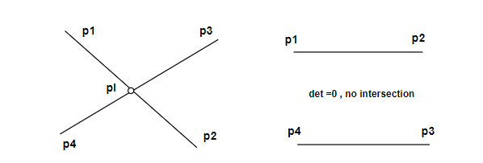
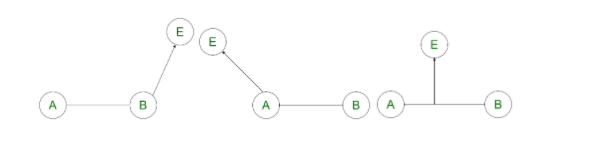

#  Geometry Algorithm
---
<p style="text-align: right; font-size:12px;">
<b>Create date</b>: 2023.10.04 by <a href="#">thuong.nv</a>
</p>

## Mục lục

<div style="padding:20px; margin-bottom:20px; background-color: #f3f3f587;border-radius: 10px;">

* [Đường thẳng, đoạn thẳng](#đường-thẳng-đoạn-thẳng)
    * [Điểm nằm trên đoạn thẳng](#PointInLineSegment)
    * [Giao điểm hai đường thẳng](#Intersect2Line)
    * [Giao điểm hai đoạn thẳng](#Intersect2Segment)
    * [Hình chiếu của một điểm xuống đường thẳng](#PerpPoint2Line)
    * [Hình chiếu của một điểm xuống đoạn thẳng](#PerpPoint2Segment)

    </br>
* [Tia](#đường-thẳng-đoạn-thẳng)
    * [Giao điểm tia với đường thẳng](#PointInLineSegment)

    </br>
* [Polygon](#đường-thẳng-đoạn-thẳng)
    * [Tìm max polygon bounding](#PointInLineSegment)
    * [Đường thẳng giao polygon](#Intersect2Segment)
    * [Đoạn thẳng giao polygon](#PerpPoint2Line)
    * [Quan hệ điểm và polygon](#PerpPoint2Segment)
    * [Quan hệ polygon và polygon](#PerpPoint2Segment)
    * [Quan hệ đoạn thẳng và polygon](#PerpPoint2Segment)
    * [Kiểm tra chiều polygon (CW, CCW)](#PerpPoint2Segment)
    * [Đảo ngược](#PerpPoint2Segment)
    * [Clip polygon](#Intersect2Line)
    * [Tâm đường tròn ngoại tiếp tam giác](#Intersect2Line)
    * [Trọng tâm polygon](#Intersect2Line)

</div>

## Giới thiệu 

Sau khi giới thiệu xong về vector2D cơ bản. Bài viết sẽ trình bày các thuật toán liên quan.

Mọi kiến thức liên quan đến Vector2D có thể tham khảo [Vector2D cơ bản](/post/GeometryVector/vector-2d.html)

## Yêu cầu

Cần nắm vũng kiến thức 2D cơ bản. Ngoài ra còn các tính chất và thuật toán tính toán vector thông thường

## Nội dung

##### <b> Định nghĩa </b>

Ta sẽ sử dụng định nghĩa này xuyên xuốt 

```C++
struct Vec2D 
{
    float x;
    float y;

    Vec2D(const float _x, const float _y):
        x(_x), y(_y) { }
};
```

> Dưới đây sẽ trình bày theo phong cách C, Ngoài ra có thể định nghĩa lại thành lớn phù hợp cho C++

##### <b>Đường thẳng, đoạn thẳng</b>

1. Kiểm tra điểm nằm trên đoạn thẳng <a id="PointInLineSegment"></a> 


    ```C++
    bool PointInLineSegment(const Point2D& pt1, const Point2D& pt2, 
                            const Point2D& pt)
    {
        Vec2D vp1p = pt - pt1; // Vector vp1p ;
        Vec2D vp2p = pt - pt2; // Vector vp2p ;

        float fCrs = Cross(vp1p, vp2p);

        // Point in straight line + Độ chính xác có thể sử dụng sai số ở đây
        if (IsEqual(fCrs, 0.f, 0.01f))
        {
            // Point in side line Segment
            float fp1pDis  = GetMagnitude(vp1p);
            float fp2pDis  = GetMagnitude(vp2p);
            float fp1p2Dis = GetMagnitude(pt1 - pt2);

            if (fp1pDis <= fp1p2Dis && fp2pDis <= fp1p2Dis)
            {
                return TRUE;
            }
        }
        return FALSE;
    }
    ```

2. Giao điểm hai đường thẳng <a id="Intersect2Line"></a> 

    Thuật toán tìm giao điểm:

    - Viết phương trình 2 đường thẳng đi qua 4 điểm (ax + by + c = 0)
    - Tồn tại giao điểm khi phương trình 2 ẩn x, y có định thức khác không (không song song)
    - Tìm (xi, yi) bằng cách giải phương trình 

    </br>

    <p align="center">
        
    </p>

    Hàm dưới tìm giao điểm giữa 2 đường thẳng cho bởi 4 điểm

    - Tọa độ điểm giao sẽ trả về tham số ```pInter``` nếu có
    - Return : True (giao nhau) | False (không giao)

    </br>

    ```C++
    bool Intersect2Line(const Point2D& pt1,		// L1
	                    const Point2D& pt2,		// L1
	                    const Point2D& pt3,		// L2
	                    const Point2D& pt4,		// L2
	                          Point2D* pInter	/*= NULL*/)
    {
        // Equation of the first straight line Segment  : ax +by = c
        float fA = pt2.y - pt1.y;
        float fB = pt1.x - pt2.x;
        float fC = fA * (pt1.x) + fB * (pt1.y);

        // Equation of the second straight line Segment : a1x +b1y = c1
        float fA1 = pt4.y - pt3.y;
        float fB1 = pt3.x - pt4.x;
        float fC1 = fA1 * (pt3.x) + fB1 * (pt3.y);

        float fDet = fA * fB1 - fB * fA1;

        Vec2D ptInter = Point2D(0.f, 0.f);
        bool bInter = false;

        // Check not parallel line Segment
        if (IsEqual(fDet, 0.f, 0.01f) == false)
        {
            ptInter.x = (fB1 * fC  - fB  * fC1) / fDet;
            ptInter.y = (fA  * fC1 - fA1 * fC ) / fDet;

            bInter = true;
        }

        if (pInter)
        {
            *pInter = ptInter;
        }

        return bInter;
    }
    ```

3. Giao điểm hai đoạn thẳng giao nhau <a id="Intersect2Segment"></a> 

    Tương tự với giao điểm giữa 2 đường thẳng chỉ thêm kiểm tra giao điểm nằm trong khoảng của 2 đoạn thẳng là được.

    Hàm dưới xử dụng hàm [PointInLineSegment](#PointInLineSegment) đã được trình bày ở trên.

    - Tọa độ điểm giao sẽ trả về tham số ```pInter``` nếu có
    - Return : True (giao nhau) | False (không giao)

    </br>

    ```C++
    bool Intersect2Segment( const Point2D& pt1,     // Seg1
                            const Point2D& pt2,     // Seg1
                            const Point2D& pt3,     // Seg2
                            const Point2D& pt4,     // Seg2
                                  Point2D* pInter   /*= NULL*/)
    {
        // Equation of the first straight line Segment  : ax +by = c
        float fA = pt2.y - pt1.y;
        float fB = pt1.x - pt2.x;
        float fC = fA * (pt1.x) + fB * (pt1.y);

        // Equation of the second straight line Segment : a1x +b1y = c1
        float fA1 = pt4.y - pt3.y;
        float fB1 = pt3.x - pt4.x;
        float fC1 = fA1 * (pt3.x) + fB1 * (pt3.y);

        float fDet = fA * fB1 - fB * fA1;

        Vec2D ptInter = Point2D(0.f, 0.f);
        bool bInter = false;

        // Check not parallel line Segment
        if (IsEqual(fDet, 0.f, 0.01f) == false)
        {
            ptInter.X = (fb1 * fc - fb * fc1) / fDet;
            ptInter.Y = (fa * fc1 - fa1 * fc) / fDet;

            // Inside intersection 
            if (PointInLineSegment(pt1, pt2, ptInter) &&
                PointInLineSegment(pt3, pt4, ptInter))
            {
                bInter = true;
            }
            else // Outside intersection
            {
                bInter = false;
            }
        }

        if (pInter)
        {
            *pInter = ptIntersect;
        }

        return bInter;
    }
    ```

4. Hình chiếu của một điểm xuống đường thẳng <a id="PerpPoint2Line"></a>

    ```C++
    Point2D PerpPoint2Line(const Point2D& ptLine1, const Point2D& ptLine2,
                              const Point2D& pt)
    {
        Vec2D ptPer;
        Vec2D vp1p2 = ptLine2 - ptLine1;  // p1p2
        Vec2D vp1p = pt - ptLine1;  // p1p
        Vec2D vp2p = pt - ptLine2;  // p2p

        FLOAT fDis = vp1p2.X * vp1p2.X + vp1p2.Y * vp1p2.Y;

        if (FALSE == IsEqual(fDis, 0.f, 0.01f))
        {
            FLOAT fDet = Dot(vp1p, vp1p2);

            FLOAT t = fDet / fDis;
            ptPer.X = ptLine1.X + t * (ptLine2.X - ptLine1.X);
            ptPer.Y = ptLine1.Y + t * (ptLine2.Y - ptLine1.Y);
        }
        else
        {
            ptPer = ptLine1; // case 3 points coincide
        }

        return ptPer;
    }
    ```

5. Hình chiếu của một điểm xuống đoạn thẳng <a id="PerpPoint2Segment"></a> 


    </br>

    <p align="center">
        
    </p>

    Giống như hình chiếu một điểm xuống đường thẳng chỉ cần xét thêm 2 đầu mút.
    Với vị trí vượt qua đầu mút thì đầu mút gầm hơn sẽ được lấy làm hình chiếu.

    Hàm [PerpPoint2Line](#PerpPoint2Line) được định nghĩa ở trên

    ```C++

    Point2D PerpPoint2Segment(const Point2D& ptSeg1, const Point2D& ptSeg2,
                              const Point2D& pt)
    {
        Vec2D ab = ptSeg2 - ptSeg1;
        Vec2D ae = pt     - ptSeg1;
        Vec2D be = pt     - ptSeg2;

        float fDot_ab_be = Dot(ab, be);
        float fDot_ab_ae = Dot(ab, ae);

        if(fDot_ab_be > 0)
        {
            return ptSeg2;
        }
        else if(fDot_ab_ae < 0)
        {
            return ptSeg1;
        }
        else
        {
            return PerpPoint2Line(ptSeg1, ptSeg2, pt);
        }
    }
    ```

##### <b>Polygon</b>

## Tham khảo


