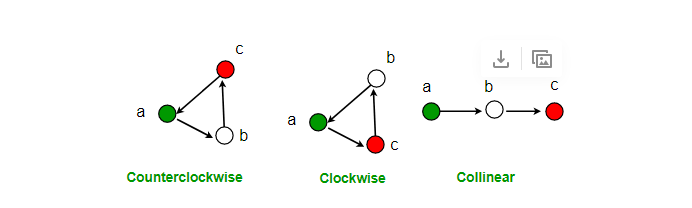

#  Vector 2D
---
<p style="text-align: right; font-size:12px;">
<b>Create date</b>: 2023.10.03 by <a href="#">thuong.nv</a>
</p>

## Mục lục

<div style="padding:20px; margin-bottom:20px; background-color: #f3f3f587;border-radius: 10px;">

* [Định nghĩa](#định-nghĩa)
* [Phép toán trên vector](#phép-toán-trên-vector)
    * [Cộng](#Add)
    * [Trừ](#Sub)
    * [Nhân](#Mul)
    * [Chia](#Div)
    * [Tích vô hướng (dot product)](#Dot)
    * [Tích có hương (cross product)](#Cross)
* [Tính chất vector](#toán-tử-vector)
    * [Độ lớn](#Mag)
    * [Vector đơn vị](#Normalize)
* [Biến đổi vector](#biến-đổi-vector)
    * [Di chuyển](#Move)
    * [Quay](#Rotate)
* [Bài toán điển hình trên vector](#biến-đổi-vector)
    * [Góc giữa 2 vector](#Angle2Vector)
    * [Hướng của điểm và vector](#OrientationPoint2Vector)
    * [Hai vector cùng phương, chiều](#SameDirection)

</div>

## Giới thiệu 

Dưới đây sẽ trình bày về các xử lý cơ bản vector 2D. Nó là cơ sở để thực hiện các thuật toán liên quan đến hình học trong ứng dụng thực tế.

Nó sẽ bao gồm các giải thích và triển khai code sử dụng C++.

## Yêu cầu

Cấn có các kiến thức cơ bản về Vector, Điểm, Độ lớn. Ngoài ra cần biết các tính toán liên quan đến vector các khái niệm cơ bản như: độ lớn, tích vô hướng, tính có hướng


## Nội dung

##### <b>Định nghĩa</b>

Ta sẽ sử dụng định nghĩa này xuyên xuốt 

```C++
struct Vec2D 
{
    float x;
    float y;

    Vec2D(const float _x, const float _y):
        x(_x), y(_y) { }
};
```

> Dưới đây sẽ trình bày theo phong cách C, Ngoài ra có thể định nghĩa lại thành lớn phù hợp cho C++

##### <b>Phép toán trên vector</b>

1. Cộng (Add) <a id="Add"></a>

    ```C++
    Vec2D Add(const Vec2D& v1, const Vec2D& v2)
    {
        return Vector(v1.x + v2.x, v1.y + v2.y);
    }
    ```
    Link tham khảo: 

2. Trừ (Sub) <a id="Sub"></a>

    ```C++
    Vec2D Sub(const Vec2D& v1, const Vec2D& v2)
    {
        return Vector(v1.x - v2.x, v1.y - v2.y);
    }
    ```

    Link tham khảo: 

3. Nhân (Mul) <a id="Mul"></a>

    ```C++
    template<typename T>
    Vec2D Mul(const Vec2D& v, const T& factor)
    {
        return  Vec2D(v.x * static_cast<float>(factor),
            v.y * static_cast<float>(factor));
    }
    ```

    Link tham khảo: 

4. Chia (Div) <a id="Div"></a>

    > Phép chia ở đây là chia vector với một nhân tố. Không phải giữa 2 vector

    ```C++
    template<typename T>
    Vec2D Div(const Vec2D& v, const T& factor)
    {
        if(std::abs(factor) <= 0.01)
            return Vec2D(0, 0);

        return Vec2D(v.x / static_cast<float>(factor),
                    v.y / static_cast<float>(factor));
    }
    ```

    Link tham khảo: 

5. Tích vô hướng (dot product) <a id="Dot"></a>

    Tích vô hướng của hai vector là một số có thể sử dụng cho việc xác định vị   trí của một điểm với một đoạn thẳng

    Ứng dụng:
    - Finding the orthogonal component of a vector to another vector
    - Finding the shortest distance from a point to a segment.

    <br>
    Công thức:

    

    ```C++

    float Dot(const Vec2D& vec1, const Vec2D& vec2)
    {
        return vec1.x * vec2.x + vec1.y + vec2.y;
    }
    ```

6. Tích có hướng (cross product) <a id="Cross"></a>

    Tích có hướng của hai vector là một số có thể sử dụng cho việc xác định vị trí của một điểm với một đoạn thẳng

    Cross product là một vector vuông góc với lần lượt các vector thành phần
    Cross product 2D sẽ là một giá trị (bởi vì 2D thì cross product x, y = (0, 0) chỉ còn z ).

    Công thức:
    
    

    ```C++

    float Cross(Vec2D& v1, Vec2D& v2)
    {
        return (v1.x * v2.y) - (v1.y * v2.x);
    }
    ```

    Link tham khảo: https://www.mathsisfun.com/algebra/vectors-cross-product.html

##### <b>Tính chất vector</b>

1. Độ lớn (Magnitude) <a id="Mag"></a>

    ```C++
    float Mag(const Vec2D& v)
    {
        return std::sqrtf(v.x * v.x + v.y * v.y);
    }
    ```

    Link tham khảo: 

2. Vector đơn vị (Normalize)<a id="Normalize"></a>

    Tiêu chuẩn vector về vector có độ dài bằng 1 đơn vị

    Trong hàm ```Normalize``` có sử dụng hàm ```Mag``` định nghĩa trước đó

    ```C++
    Vec2D Normalize(const Vec2D& v)
    {
        float fMagnitude = Mag(v);

        if (fMagnitude <= 0)
        {
            return Vec2D(0.f, 0.f);
        }
        return Vec2D(v.X / fMagnitude, v.Y / fMagnitude);
    }
    ```

    Link tham khảo: 

##### <b>Biến đổi vector</b>

1. Di chuyển (Move)<a id="Move"></a>
 
    Di chuyển một điểm hoặc một vector sử dụng vector đơn vị và độ lớn.

    ```C++

    Point2D Move(const Point2D& pt, const Vec2D& vn, const float fDistance)
    {
        Point2D ptMove;

        ptMove.X = pt.X + vn.X * fDistance;
        ptMove.Y = pt.Y + vn.Y * fDistance;

        return ptMove;
    }
    ```

2. Quay (rotate)<a id="Rotate"></a>

    2.1 Quay tại gốc tọa độ 

    ```C++

    Vec2D Rotate(const Vec2D& v, const float fDegree)
    {
        float fRadAngle = ConvertDegToRad(fDegree);

        Vec2D vRoate;
        vRoate.X = std::cos(fRadAngle) * v.X - sin(fRadAngle) * v.Y;
        vRoate.Y = std::sin(fRadAngle) * v.X + cos(fRadAngle) * v.Y;
        return vRoate;
    }
    ```

    2.2 Quay một điểm xung quanh điểm
  
    ```C++

    Point2D	RotatePoint(const Point2D& ptPivot, const Point2D& ptRotate,
                        const float fDegree)
    {
        Vec2D vpipr = ptRotate - ptPivot;
        FLOAT fDistance = Mag(vpipr);

        Vec2D vuint_pipr = Normalize(vpipr);
        Vec2D vuint_rotate = Rotate(vuint_pipr, fDegree);

        Point2D ptMove = Move(ptPivot, vuint_rotate, fDistance);

        return ptMove;
    }
    ```

##### Bài toán điển hình trên vector

1. Góc giữa 2 vector (Angle bettwen two vector)<a id="Angle2Vector"></a>

    Góc giữa 2 Vector là góc giữa 2 vector đơn bị của nó. Góc này có giá trị trong khoảng $([-\pi : \pi>])$

    ```C++
    float Angle2Vector(const Vec2D& v1, const Vec2D& v2)
    {
        FLOAT fDot = Dot(v1, v2);
        FLOAT fDet = v1.x * v2.y - v1.y * v2.x;

        FLOAT fAngle = std::atan2f(fDet, fDot);

        return ConvertRadToDeg(fAngle);
    }
    ```

2. Hướng của một điểm với một vector (Orientation)<a id="OrientationPoint2Vector"></a>
    
    Theo chiều tiến của vector ta có thể xác định được điểm đó nằm ở phí nào theo hướng vector

    

    ```C++
    // Enum orientation
	enum EnumOrien
	{
		LEFT      =-1,	// left
		COLLINEAR = 0,	// collinear
		RIGHT     = 1,	// right
	};
    
    EnumOrien OrientationPoint2Vector(IN Point2D& ptC, IN Point2D& pt1,
                                      IN Point2D& pt2)
    {
        const float fOrin = (pt2.X - pt1.X) * (ptC.Y - pt1.Y) - (ptC.X - pt1.X) * (pt2.Y - pt1.Y);

        if (IsEqual(fOrin, 0.f, 0.01f)) return EnumOrien::COLLINEAR; /* ptc and p1p2 collinear */
        else if (fOrin < 0.f) return EnumOrien::LEFT; /* ptc on the left p1p2 */
        else	          return EnumOrien::RIGHT; /* ptc on the right p1p2 */
    }
    ```

    Chú ý :
    > Cần để ý tới chiều của trục tọa độ biểu diễn, với hàm trên sẽ tương ứng với trục Y hướng xuống

    Link tham khảo : 
    - https://www.geeksforgeeks.org/direction-point-line-segment/
    - https://www.geeksforgeeks.org/orientation-3-ordered-points/
    
    <br>

3. Hai vector cùng phương, cùng hướng<a id="SameDirection"></a>

    Hai vector được cho là cùng phương nếu nó cùng vector đơn vị

    ```C++
    bool SameDirection(const Vec2D& v1, const Vec2D& v2)
    {
        Vec2D vNv1 = Normalize(v1);
        Vec2D vNv2 = Normalize(v2);
        return (std::abs(vNv1.x / vNv2.x) - std::abs(vNv1.y / vNv2.y)) <= Ztol;
    }
    ```

    Trường hợp cùng hướng thì dấu của vector đơn vị phải giống nhau

## Tham khảo


