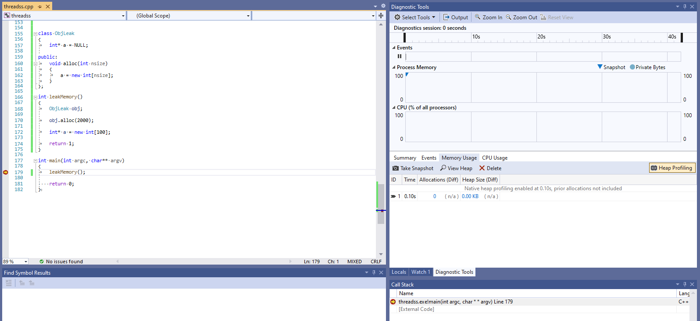
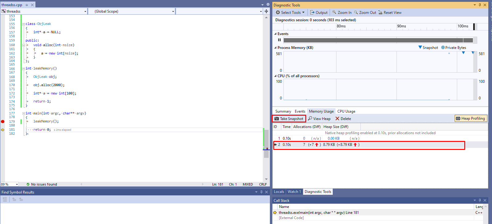
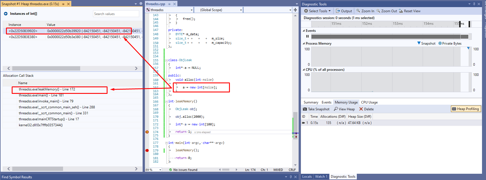
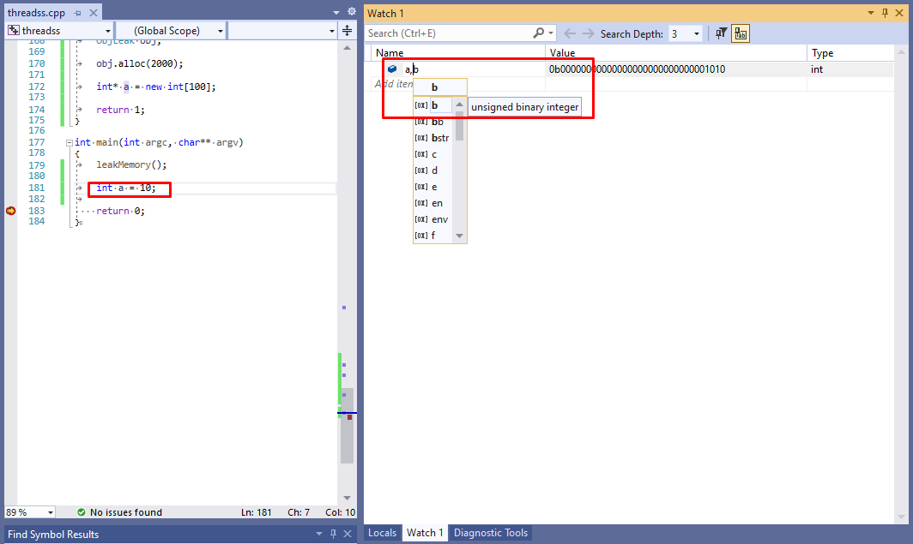
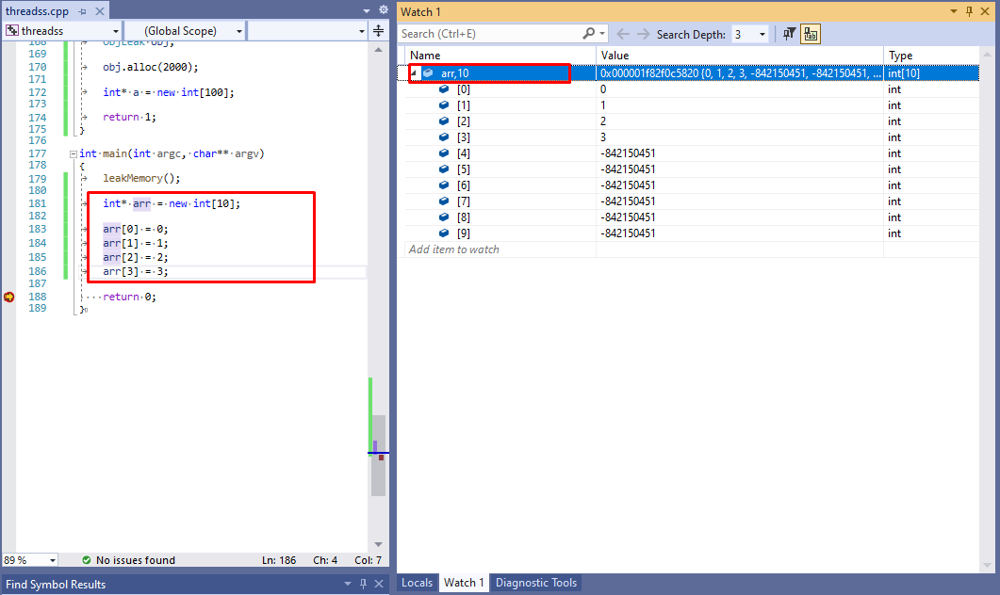
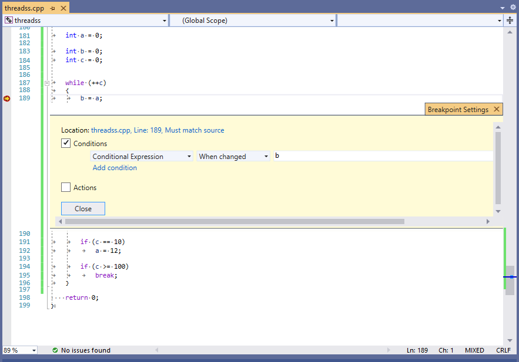
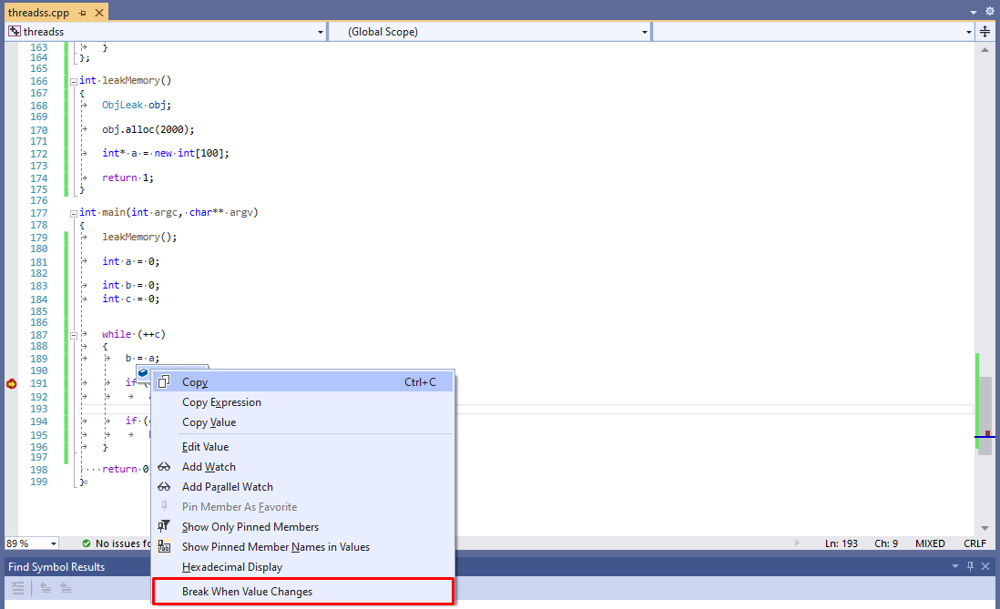

#  Memory Usage
---
<p style="text-align: right; font-size:12px;">
<b>Create date</b>: 2023.12.01 by <a href="#">thuong.nv</a>
</p>


## Tổng quan

Các kỹ thuật kiểm tra bộ nhớ trong quá trình debug trong Visual studio

</br><!--Section-->

## Tham khảo

+ [https://stackoverflow.com/questions/4790564/finding-memory-leaks-in-a-c-application-with-visual-studio](https://stackoverflow.com/questions/4790564/finding-memory-leaks-in-a-c-application-with-visual-studio)
+ [https://learn.microsoft.com/en-us/visualstudio/debugger/format-specifiers-in-cpp?view=vs-2022](https://learn.microsoft.com/en-us/visualstudio/debugger/format-specifiers-in-cpp?view=vs-2022)

</br><!--Section-->

## Nội dung

##### </br><b>Kiểm tra bộ nhớ đã được cấp phát và sử dụng</b>

Quá trình sử dụng và cấp phát vùng nhớ ta không thể biết đã cấp phát bao nhiều và liệu có có vùng nhớ nào ta đã cấp phát mà quên chưa giải phóng chưa.

Dưới đây sẽ trình bầy một cách sử dụng VS để kiểm ta điều đó. Từ đó giúp ta có thể kiểm soát việc cấp phát và giải phóng bộ nhớ một cách tốt hơn.

Dưới đây là đoạn code minh họa :

```cpp
class ObjLeak
{
	int* a = NULL;
public:
	void alloc(int nsize)
	{
		a = new int[nsize];
	}
};

int leakMemory()
{
	ObjLeak obj;
	obj.alloc(2000);
	int* a = new int[100];
}

int main(int argc, char** argv)
{
	leakMemory();
    return 0;
}
```

Ví dụ trên bao gồm một Class ```ObjLeak``` là nơi rò rỉ bộ nhớ, function  ```leakMemory``` là nơi gọi cũng làm rò rỉ bộ nhớ.

Như ta có thể nhận thấy bên trên có 2 đoạn chương trình làm rò rỉ bộ nhớ.

```cpp
void alloc(int nsize)
{
    a = new int[nsize];
}
```

và 

```cpp
int* a = new int[100];

```

Sử dụng công cụ **Memory Usage** của VS ta tiến hành track như sau:

Trước khi chạy hàm  ```leakMemory``` ta tiến hành ```Task Snapshot``` và kiểm tra. Nhận thấy không cấp phát gì cả và giá trị vẫn là 0.

<p align="center">
    
</p>

Sau khi chạy hàm  ```leakMemory``` ta tiến hành ```Task Snapshot``` để kiểm tra vùng nhớ sau khi chạy và so sánh với trước.

Ta mong muốn là vùng nhớ sẽ trở về trạng thái trước khi chạy hàm. Nếu trường hợp vùng nhớ không được giải phóng hết sẽ lớn một lượng bộ nhớ so với ban đầu.

<p align="center">
    
</p>

Trong ví dụ ta thấy vùng nhớ đã tăng lên so với ban đầu. Điều này chứng tỏ nó đã có sự rò rỉ.

Ngoài ra ta cũng có thể biết được lượng bộ nhớ đã được cấp phát bao nhiêu nếu ta ```Task Snapshot``` bên trong hàm.

Hơn nữa chức năng này có thể giúp ta biết chính xác đoạn code nào đã cấp được cấp phát như hình ảnh bên dưới.

<p align="center">
    
</p>

<b>Chú ý</b> : Không phải bộ nhớ tăng là rò rỉ. Ta cần kiểm tra chức năng của hàm và các đoạn code sử dụng chúng.

##### </br><b>Kiểm tra giá trị biến và giá trị hiển thị</b>

1. Hiển thị giá trị nhị phân của biến <a id="showbinaryvalue"></a>

    - Sử dụng **Add Watch** cho biến cần xem Ví dụ : biến a = 10
    - Thêm dấu, và hậu tố để hiển bị ở đây là ```b```.
    - Ngoài ra nó có thể hiển thị ở nhiều mode khác nhau.
    - Kết quả sẽ hiển thị ở cột bên cạnh.

    </br><!--Section-->
    <p align="center">
        
    </p>

1. Hiển thị giá trị của mảng <a id="showarrayelement"></a>

    Ta muốn xem giá trị của toàn bộ mảng sử dụng **AddWatch**

    Các bước tương tự như trên nhưng, hậu tố được thêm vào là số lượng phần từ ta cần hiển thị.

    Trong ví dụ dưới ta đã hiển thị 10 giá trị của con trỏ ```arr```.

    <p align="center">
        
    </p>

1. Break khi giá trị thay đổi <a id="breakwhenvaluechanged"></a>

    Thiết lập điều kiện cho break khi giá trị của biến b thay đổi nó sẽ dừng lại.

    Ở ví dụ dưới nếu giá trị của ```a = 12``` thì break mới dùng.

    <p align="center">
        
    </p>

    Hoặc có thể sử dụng cách bên dưới :

    <p align="center">
        
    </p>

</br><!--Section-->

## Chú ý


