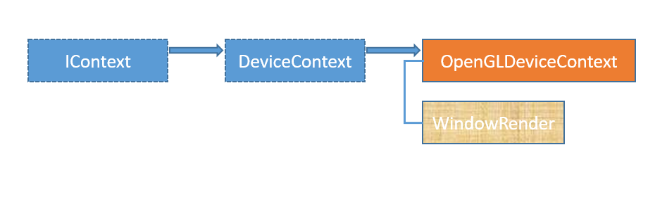

#  OpenGL Context
---
<p style="text-align: right; font-size:12px;">
<b>Create date</b>: 2024.08.18 by <a href="#">thuong.nv</a>
</p>

## Giới thiệu 

OpenGL context là một khái niệm quan trọng trong lập trình đồ họa với OpenGL. Đây là một vùng dữ liệu chứa tất cả trạng thái và thông tin cần thiết để OpenGL có thể thực hiện các lệnh đồ họa, như vẽ các hình khối 3D, ánh sáng, kết cấu (textures), và các phép biến đổi (transformations).


> An OpenGL context represents many things. A context stores all of the state associated with this instance of OpenGL. It represents the (potentially visible) default framebuffer that rendering commands will draw to when not drawing to a framebuffer object. Think of a context as an object that holds all of OpenGL; when a context is destroyed, OpenGL is destroyed.

**Đặc điểm**

- Một OpenGL context thường liên kết với một cửa sổ hiển thị (window) hoặc một buffer mà nó sẽ vẽ lên. Trong nhiều hệ điều hành và thư viện, bạn cần tạo ra một cửa sổ trước khi có thể tạo và sử dụng OpenGL context.

-  Tại mỗi thời điểm, chỉ có một OpenGL context có thể là "hiện tại" cho một thread, nghĩa là chỉ có context đó mới có thể thực thi các lệnh OpenGL. Bạn có thể thay đổi context hiện tại hoặc chia sẻ tài nguyên giữa các context trong một số trường hợp

- Tất cả các tài nguyên như bộ đệm (buffers), kết cấu (textures), và shaders mà bạn tạo trong OpenGL đều liên kết với một context cụ thể. Khi một context bị hủy, tất cả các tài nguyên liên quan cũng sẽ bị giải phóng

Vậy làm sao để tạo OpenGL context trên window sử dụng C++. Bài viết sẽ trình bày và ví dụ về việc tạo OpenGL context.


## Nội dung

##### 1. Tạo OpenGL context trên Window sử dụng C++
---

**Ý tưởng**

- Vậy muốn tạo ra OpenGL context chúng ta cần có những thứ gì?
> Window Handle và các option liên quan đến việc tạo context.

- Các option của OpenGL context cung cấp gồm những gì ?
> Ta sẽ tạo ra một lớp chứa các thông tin cài đặt context.

- Làm sao để nó có thể tạo được trên nhiều môi trường.
> Thiết kế interface

**Thiết kế**
<p align="center">
	
</p>

1. Lớp cấu hình `DeviceContextConfig`. <a id="section1"></a>

	Lớp này chứa các cấu hình cài đặt tạo context. Các option bao gồm :
	- Sửa dụng OpenGL extension (USE_OPENGL_EXT)
	- Thiết lập Anti-aliasing level (USE_ANTIALIAS) [1~8]

	```cpp
	class DeviceContextConfig
	{
	public:
		enum Flags {
			USE_ANTIALIAS  = 0x00001,
			USE_OPENGL_EXT = 0x00002,
		};

	public:
		void SetAntiliasingLevel(int nLevel) noexcept {
			m_nFlag |= USE_ANTIALIAS;
			m_nAntialiasingLevel = nLevel;
		}

		void UseOpenGLExtension(bool bUse) noexcept {
			m_nFlag |= USE_OPENGL_EXT;
		}

		void ClearFlag(unsigned int _nFlag) {
			m_nFlag &= ~_nFlag;
		}

		bool ValidFlag(int _nFlag) const noexcept { return m_nFlag & _nFlag; }
		int  GetAntiliasingLevel() const noexcept { return m_nAntialiasingLevel; }

	protected:
		int m_nFlag{ 0 };
		int m_nAntialiasingLevel{ 0 }; // 0~8
	};
	```

1. Lớp cơ sở `IContext` (có thể gọi là interface).  <a id="section2"></a>

	Tạo ra sự linh hoạt của context class. Từ đó có thể tạo các loại OpenGL context trên nhiều môi trường khác nhau, framework (Window, Linux,..). Không những thế nó còn phụ hợp nếu ta sử dụng `Directx` thay thế.

	```cpp
	interface IContext
	{
		virtual bool CreateContext(void* hHandle) = 0;
		virtual void DeleteContext() noexcept = 0;
		virtual bool MakeCurrentContext() const noexcept = 0;
		virtual void SwapBuffer() const noexcept = 0;
	};
	```

	Hàm `virtual bool CreateContext(void* hHandle) = 0;` có tác dụng tạo ra context. đầu vào là con trỏ `void*`.
	Có thể tương thích trên nhiều môi trường ví dụ : Window(HWND), GLFW(GLFWwindow)

1. Lớp cơ sở `DeviceContext`. <a id="section3"></a>
	
	Lớp này kế thừa từ `IContext` và có thể lấy device context và kiểm tra sự hợp lệ của nó. Đây cũng là một lớp trừu tượng 

	```cpp
	interface DeviceContext : public IContext
	{
		virtual void* Render() const noexcept = 0;
		virtual bool  IsValid() const noexcept = 0;

	public:
		const DeviceContextConfig* GetConfig() const noexcept
		{
			return &Config;
		}

		void SetConfig(DeviceContextConfig& _Config) noexcept
		{
			Config = _Config;
		}

	protected:
		DeviceContextConfig Config;
	};
	```

1. Lớp triển khai `OpenGLDeviceContext`. <a id="section4"></a>

	Lớp này là lớp triển khai khởi tạo OpenGL context trên window.
	Trước tiên ta tạo ra struct `WindowRender` chứa thông tin context tương ứng trên Window.

	```cpp
	typedef struct _WindowRender
	{
		HWND	m_hWnd  = NULL;
		HDC		m_hDc   = NULL;
		HGLRC	m_hGLRC = NULL;

	} WindowRender;

	typedef std::shared_ptr<WindowRender> WindowRenderPtr;
	```

	Khi tạo context trên window cần thực hiện:
	- Đăng ký window class tạo dummy handle.
	- Load OpenGL extention (sử dụng glew)

	Sẽ có một vài thắc mắc như : tại sao phải tạo ra dumy handle ? Không sử dụng glew có được không ?

	```cpp
	class OpenGLDeviceContext : public DeviceContext , public std::exception
	{
	public:
		OpenGLDeviceContext(DeviceContextConfig& config)
			: DeviceContext()
		{
			m_pRender = std::make_shared<WindowRender>();

			SetConfig(config);
		}

		virtual ~OpenGLDeviceContext()
		{
			DeleteContext();
		}

	protected:
		/********************************************************************************
		*! @brief  : Dummy handler function to create opengl
		*! @param  : [In] hwnd		: Name class
		*! @param  : [In] message	: default
		*! @param  : [In] wParam	: default
		*! @param  : [In] lParam	: default
		*! @return : 1 : OK , 0 : False
		*! @author : thuong.nv          - [Date] : 2024.08.15
		********************************************************************************/
		static LRESULT CALLBACK win_dummy_main_proc(HWND hWnd, UINT message, WPARAM wParam, LPARAM lParam)
		{
			return ::DefWindowProc(hWnd, message, wParam, lParam);; // No TODO
		}

		/********************************************************************************
		*! @brief  : register window class use window context
		*! @param  : [In] strClassName : Name class
		*! @param  : [In] Proc		   : function hanle event
		*! @param  : [In] hInst		   : default GetModuleHandle(NULL)
		*! @return : true : OK ,  false : failed
		*! @author : thuong.nv          - [Date] : 2024.08.15
		********************************************************************************/
		static bool register_window_class(const wchar_t* strClassName, WNDPROC Proc, HINSTANCE hInst)
		{
			WNDCLASSEX  wClass;
			ZeroMemory(&wClass, sizeof(WNDCLASSEX));
			wClass.cbClsExtra		= NULL;
			wClass.cbSize			= sizeof(WNDCLASSEX);
			wClass.cbWndExtra		= NULL;
			wClass.hbrBackground	= (HBRUSH)(COLOR_MENU);
			wClass.hCursor			= LoadCursor(NULL, IDC_ARROW);
			wClass.hIcon			= LoadIcon(NULL, IDI_APPLICATION);
			wClass.hIconSm			= NULL;
			wClass.hInstance		= hInst;
			wClass.lpfnWndProc		= (WNDPROC)Proc;
			wClass.lpszClassName	= strClassName;
			wClass.lpszMenuName		= NULL;
			wClass.style			= CS_HREDRAW | CS_VREDRAW | CS_OWNDC;

			return !!RegisterClassEx(&wClass);
		}

	protected:

		/*******************************************************************************
		*! @brief  : load extension opengl library glew
		*! @param  : [In] strClassName : Name class
		*! @param  : [In] Proc		   : function hanle event
		*! @param  : [In] hInst		   : default GetModuleHandle(NULL)
		*! @return : true : OK | false: failed
		*! @author : thuong.nv          - [Date] : 2024.08.15
		********************************************************************************/
		static bool load_opengl_extension()
		{
			static bool s_load_opengl_extension = false;

			if (s_load_opengl_extension)
				return s_load_opengl_extension;

			int bInitOk = FALSE;

			if (register_window_class(L"DummyClass", win_dummy_main_proc, GetModuleHandle(NULL)))
			{
				HWND hWnd_dummy = CreateWindowEx(
					0, L"DummyClass", L"Dummy OpenGL Window", 0,
					CW_USEDEFAULT, CW_USEDEFAULT,
					CW_USEDEFAULT, CW_USEDEFAULT,
					0, 0, NULL, 0);

				PIXELFORMATDESCRIPTOR pixelFormat = {
					sizeof(PIXELFORMATDESCRIPTOR),
					1,
					PFD_DRAW_TO_WINDOW | PFD_SUPPORT_OPENGL | PFD_DOUBLEBUFFER,
					PFD_TYPE_RGBA,        // The kind of framebuffer. RGBA or palette.
					32,                   // Colordepth of the framebuffer.
					0, 0, 0, 0, 0, 0,
					0,
					0,
					0,
					0, 0, 0, 0,
					24,                   // Number of bits for the depthbuffer
					8,                    // Number of bits for the stencilbuffer
					0,                    // Number of Aux buffers in the framebuffer.
					PFD_MAIN_PLANE,
					0,
					0, 0, 0
				};

				HDC hDC_dummy = GetDC(hWnd_dummy);
				int iPixelFormat = ChoosePixelFormat(hDC_dummy, &pixelFormat);
				SetPixelFormat(hDC_dummy, iPixelFormat, &pixelFormat);

				HGLRC hglrc_dummy = wglCreateContext(hDC_dummy);
				if (wglMakeCurrent(hDC_dummy, hglrc_dummy)) {

					if (glewInit() != GLEW_OK)  // Load library OpenGL extension
						bInitOk = FALSE;
					else
						bInitOk = TRUE;
				}

				::wglMakeCurrent(hDC_dummy, 0);
				::wglDeleteContext(hglrc_dummy);
				::ReleaseDC(hWnd_dummy, hDC_dummy);
				::DestroyWindow(hWnd_dummy);
			}

			s_load_opengl_extension = bInitOk;

			return s_load_opengl_extension;
		}

	public:

		/********************************************************************************
		*! @brief  : Get render engine
		*! @return : void *
		*! @author : thuong.nv          - [Date] : 2024.08.15
		********************************************************************************/
		virtual void* Render() const noexcept override
		{
			if (!m_pRender)
				return nullptr;

			return &m_pRender->m_hDc;
		}

		/********************************************************************************
		*! @brief  : Validate content
		*! @return : bool : true / false
		*! @author : thuong.nv          - [Date] : 2024.08.15
		********************************************************************************/
		virtual bool IsValid() const noexcept override
		{
			if (!m_pRender)
				return false;

			return (m_pRender->m_hWnd && m_pRender->m_hDc && m_pRender->m_hGLRC);
		}

	public:

		/********************************************************************************
		*! @brief  : Create OpenGL context
		*! @param  : [In] void : Handle
		*! @return : true : OK | false : Failed
		*! @author : thuong.nv          - [Date] : 2024.08.15
		*! @note   : use openGL extension previously established
		********************************************************************************/
		virtual bool CreateContext(void* hHandle) override
		{
			if (!m_pRender || hHandle == NULL)
				return false;

			if (IsValid())
				DeleteContext();

			m_pRender->m_hWnd = reinterpret_cast<HWND>(hHandle);

			HDC hDC = ::GetDC(m_pRender->m_hWnd);
			HGLRC hglrc = NULL;

			int iPixelFormat; unsigned int num_formats = 0;

			auto funGetFixelFormatAttribute = [this](int* attribs, int attribsize)
			{
				int attribCount = 0;

				ADD_ATRIBUTE(attribs, WGL_DRAW_TO_WINDOW_ARB, GL_TRUE);
				ADD_ATRIBUTE(attribs, WGL_SUPPORT_OPENGL_ARB, GL_TRUE);
				ADD_ATRIBUTE(attribs, WGL_DOUBLE_BUFFER_ARB, GL_TRUE);
				ADD_ATRIBUTE(attribs, WGL_ACCELERATION_ARB, WGL_FULL_ACCELERATION_ARB);
				ADD_ATRIBUTE(attribs, WGL_PIXEL_TYPE_ARB, WGL_TYPE_RGBA_ARB);
				ADD_ATRIBUTE(attribs, WGL_COLOR_BITS_ARB, 32);
				ADD_ATRIBUTE(attribs, WGL_DEPTH_BITS_ARB, 24);
				ADD_ATRIBUTE(attribs, WGL_STENCIL_BITS_ARB, 8);

				if (Config.ValidFlag(DeviceContextConfig::Flags::USE_ANTIALIAS))
				{
					ADD_ATRIBUTE(attribs, WGL_SAMPLE_BUFFERS_ARB, GL_TRUE); // Enable multisampling
					ADD_ATRIBUTE(attribs, WGL_SAMPLES_ARB, Config.GetAntiliasingLevel());  // Number of samples
				}

				END_ATRIBUTE(attribs);
			};

			bool bUseOpenGLExtension = Config.ValidFlag(DeviceContextConfig::Flags::USE_OPENGL_EXT);
			if (bUseOpenGLExtension && !load_opengl_extension())
			{
				assert("OPENGL_EXT actived but can't load openGL extension. Try simple");
				bUseOpenGLExtension = false;
			}

			// Get pixel format attributes through "modern" extension
			if (bUseOpenGLExtension)
			{
				int pixelAttribs[47];
				funGetFixelFormatAttribute(pixelAttribs, sizeof(pixelAttribs) / sizeof(pixelAttribs[0]));

				wglChoosePixelFormatARB(hDC, pixelAttribs, 0, 1, &iPixelFormat, &num_formats);

				PIXELFORMATDESCRIPTOR pfd;
				DescribePixelFormat(hDC, iPixelFormat, sizeof(pfd), &pfd);
				SetPixelFormat(hDC, iPixelFormat, &pfd);

				// Specify that we want to create an OpenGL x.x core profile context
				int gl_attribs[] = {
					WGL_CONTEXT_MAJOR_VERSION_ARB, 1,
					WGL_CONTEXT_MINOR_VERSION_ARB, 5,
					WGL_CONTEXT_PROFILE_MASK_ARB,  WGL_CONTEXT_CORE_PROFILE_BIT_ARB,
					0,
				};
				hglrc = wglCreateContextAttribsARB(hDC, 0, gl_attribs);
			}
			// Get pixel format attributes through legacy PFDs
			else
			{
				PIXELFORMATDESCRIPTOR pfd = {
					sizeof(PIXELFORMATDESCRIPTOR),
					1,
					PFD_DRAW_TO_WINDOW | PFD_SUPPORT_OPENGL | PFD_DOUBLEBUFFER,
					PFD_TYPE_RGBA,        // The kind of framebuffer. RGBA or palette.
					32,                   // Colordepth of the framebuffer.
					0, 0, 0, 0, 0, 0,
					0,
					0,
					0,
					0, 0, 0, 0,
					24,                   // Number of bits for the depthbuffer
					8,                    // Number of bits for the stencilbuffer
					0,                    // Number of Aux buffers in the framebuffer.
					PFD_MAIN_PLANE,
					0,
					0, 0, 0
				};
				iPixelFormat = ChoosePixelFormat(hDC, &pfd);
				SetPixelFormat(hDC, iPixelFormat, &pfd);

				hglrc = wglCreateContext(hDC);
			}

			m_pRender->m_hDc = hDC;
			m_pRender->m_hGLRC = hglrc;

			if (!MakeCurrentContext())
			{
				DeleteContext();
				return false;
			}

			return true;
		}

		/********************************************************************************
		*! @brief  : Delete OpenGL context
		*! @return : void
		*! @author : thuong.nv          - [Date] : 2024.08.15
		********************************************************************************/
		virtual void DeleteContext() noexcept override
		{
			if (m_pRender == nullptr)
				return;

			::ReleaseDC(m_pRender->m_hWnd, m_pRender->m_hDc);	// release device context
			::wglDeleteContext(m_pRender->m_hGLRC);				// delete the rendering context
			m_pRender->m_hDc = NULL;
			m_pRender->m_hGLRC = NULL;
		}

		/********************************************************************************
		*! @brief  : Active OpenGL context
		*! @return : void
		*! @author : thuong.nv          - [Date] : 2024.08.15
		********************************************************************************/
		virtual bool MakeCurrentContext() const noexcept override
		{
			if (IsValid())
			{
				return !!wglMakeCurrent(m_pRender->m_hDc, m_pRender->m_hGLRC);
			}
			return false;
		}

		/*******************************************************************************
		*! @brief  : Swap buffer
		*! @return : void
		*! @author : thuong.nv          - [Date] : 2024.08.15
		********************************************************************************/
		virtual void SwapBuffer() const noexcept
		{
			::SwapBuffers(m_pRender->m_hDc);
		}

	public:

		WindowRenderPtr m_pRender{ nullptr };
	};

	```


## Tham khảo
* [https://www.khronos.org/opengl/wiki/OpenGL_Context](https://www.khronos.org/opengl/wiki/OpenGL_Context)
* [https://www.khronos.org/opengl/wiki/Creating_an_OpenGL_Context_(WGL)](https://www.khronos.org/opengl/wiki/Creating_an_OpenGL_Context_(WGL))

##### Cập nhật

- 2024.08.18 : Create
