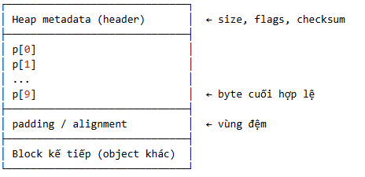
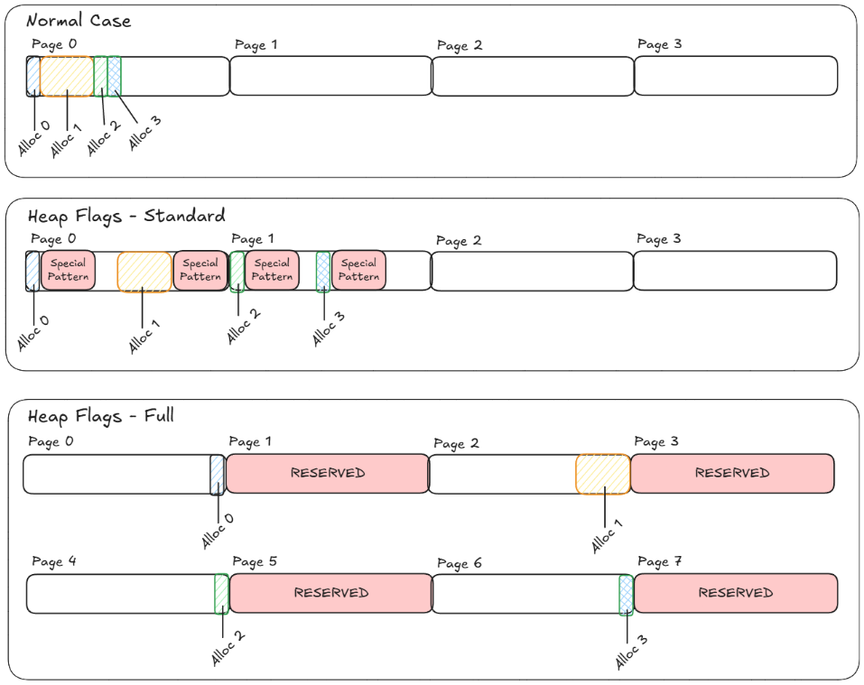

#  Page Heap
---
<p style="text-align: right; font-size:12px;">
<b>Create date</b>: 2026.01.11 by <a href="#">thuong.nv</a>
</p>

Trong bài viết này sẽ trình bày các vấn đề sau :
- Giới thiệu
- Tính năng PageHeap trên Window

</br>

#### Giới thiệu
---

Cấu trúc của heap block thông thường:

<p class="img-post">
    
</p>

Trong một vài trường hợp phân tích dump, những lỗi này liên quan đến truy cập hoặc giải phóng vùng nhớ Heap,
ví trị xảy ra expection có thể không phải là vị trí truy cập trái phép lần đầu.

Lỗi truy cập trái phép heap đã xảy ra từ trước đó, nhưng hệ điều hành cho nó là không vấn đề (ví dụ như ghi vào vùng nhớ đệm)
Nhưng điều này làm Heap metadata (header) đã bị thay đổi -> khi bạn giải phóng nó -> Crash

Nhằm mục đích chỉ ra chính xác vị trí truy cập trái phép Heap, ta cần bật tính năng PageHeap của ứng dụng.

Mục đích của nó là gì ? 

> Nó sẽ giúp chúng ta đảm bảo rằng khi truy cập sai vị trí vụ nhớ Heap chương trình sẽ dừng ngay lập tức. 

Sau khi bật cấu trúc heap block sẽ thay đổi, với mỗi cờ khác nhau cấu trúc cùng sẽ khác nhau:

<p class="img-post">
    
</p>

Nó thường được dùng cho các lỗi sau:
- Heap corruption
- Use-after-free
- Buffer overflow
- Deadlock

</br>

#### Bật PageHeap
---

Ta sử dụng công cụ `gflags` để bật tính năng PageHeap của ứng dụng 

Link tải xuống : [https://learn.microsoft.com/en-us/windows-hardware/drivers/debugger/gflags](https://learn.microsoft.com/en-us/windows-hardware/drivers/debugger/gflags)


Có thể tham khảo thêm phần command nó hỗ trợ :

[https://learn.microsoft.com/en-us/windows-hardware/drivers/debugger/gflags-commands](https://learn.microsoft.com/en-us/windows-hardware/drivers/debugger/gflags-commands)

Khi bạn bật PageHeap cho một ứng dụng nó sẽ ghi cờ này vào `registry` và những này sau đó khi khởi động ứng dụng nó sẽ giữ nguyên các cờ đã bật. Đây cũng là mộ lưu ý khi ta bật cờ của ứng dụng.

Một điều cần lưu ý là khi bật PageHeap, ứng dụng sẽ ăn nhiều bộ nhớ hơn làm chập đáng kể ứng dụng, đặc biệt với những ứng dụng cấp phát phân mảnh vùng nhớ.

Dưới đây là một vài ví dụ :

```sh
gflags.exe /p /enable app.exe /full
```

Lệnh này cho phép bật tính năng PageHeap của ứng dụng app.exe với tham số `/enable`

`/full` = Full PageHeap


Tắt tính năng PageHeap cho ứng dụng.
```sh
gflags.exe /p /disable app.exe
```

Hoặc kiểm tra xem PageHeap đã được bật chưa.

```sh
gflags.exe /p /query app.exe
```

</br>

#### Tham khảo

#### Cập nhật
- 2026.01.11 : Create
