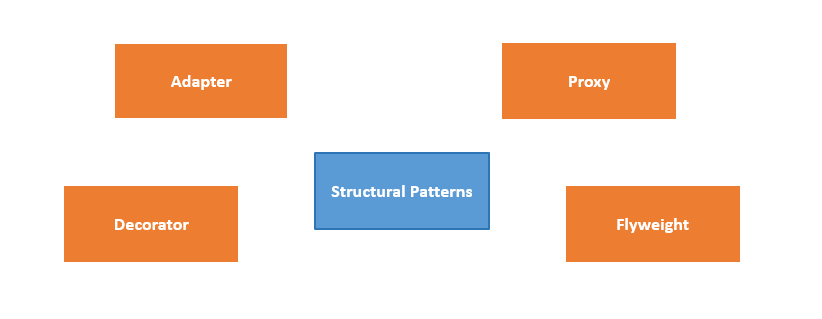
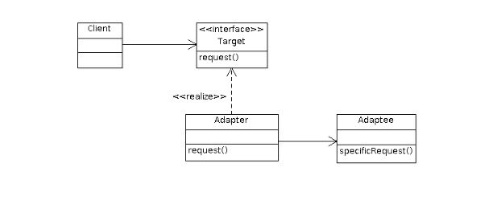

#  Structural Design Patterns
---
<p style="text-align: right; font-size:12px;">
<b>Create date</b>: 2025.06.08 by <a href="#">thuong.nv</a>
</p>

## Giới thiệu
---

Trình bày khái niệm và một số các design pattern tiêu biểu trong nhóm Structural Patterns.

Các Structural Design Patterns tập trung vào cách các lớp và đối tượng được tổ chức để tạo thành các cấu trúc lớn hơn, linh hoạt và dễ mở rộng, mà không thay đổi mã nguồn hiện tại.

_Tại sao nó được sinh ra ?_ 

Trong các ứng dụng lớn, hệ thống thường có rất nhiều lớp và đối tượng tương tác với nhau. Việc quản lý và tổ chức những mối quan hệ này một cách hợp lý là điều quan trọng.
Hơn nữa, nếu bạn viết một class phụ thuộc vào nhiều class khác, nó sẽ khó tái sử dụng ở nơi khác.

Dưới đây là một vài mẫu design pattern thuộc nhóm này sẽ được trình bày:
* [Adapter](#Adapter)
* [Proxy](#Proxy)

<p class="img-post">
    
</p>

Việc trình bày sẽ dự trên việc đọc tài liệu và kiến thức cá nhân thu thập được, miêu tả theo hướng dễ hiểu nhất.

Ta sẽ đi vào từng lại design pattern cụ thể cùng ví dụ liên quan. Thứ tự sẽ được trình bày theo độ phổ biến giảm dần.

## Nội dung
---

1. <b>Adapter</b><a id="Adapter"></a>

    > The Adapter pattern is pretty common in C++ code. It’s very often used in systems based on some legacy code. In such cases, Adapters make legacy code work with modern classes.


    Nó cho phép hai lớp có giao diện không tương thích làm việc với nhau bằng cách chuyển đổi (adapt) một giao diện này sang giao diện kia.
    Điều này ra tốt đối với việc tái sử dụng code cũ và cũng đảm bảo hoạt động trên modern class mới.

    Khi nào ta sử dụng : 
    * Khi bạn muốn sử dụng một class cũ (legacy) nhưng nó không phù hợp với giao diện bạn đang dùng.
    * Khi bạn cần kết nối hệ thống mới với hệ thống cũ mà không muốn/chưa thể sửa mã cũ.
    * Khi bạn muốn giữ nguyên interface hiện tại, nhưng vẫn tận dụng được mã sẵn có.

    <br/>

    Dưới đây là một ví dụ sử dụng C++. 

    Link tham khảo :
    * https://refactoring.guru/design-patterns/adapter/cpp/example#example-0

    <br/>
    <p class="img-post">
        
    </p>

    ```cpp
    class ITarget {
    public:
        virtual void Request() = 0;
        virtual ~ITarget() = default;
    };

    class Adaptee {
    public:
        void SpecificRequest() {
            std::cout << "Adaptee::SpecificRequest called.\n";
        }
    };

    class Adapter : public ITarget {
    private:
        Adaptee* adaptee;

    public:
        Adapter(Adaptee* a) : adaptee(a) {}

        void Request() override {
            adaptee->SpecificRequest();
        }
    };

    int main() {
        Adaptee* legacy = new Adaptee();
        ITarget* adapter = new Adapter(legacy);

        adapter->Request();  // Result: Adaptee::SpecificRequest called.

        delete adapter;
        delete legacy;
        return 0;
    }
    ```


## Tham khảo
+ [https://refactoring.guru/design-patterns](https://refactoring.guru/design-patterns)

##### Cập nhật

- 2024.01.13 : Add Observer Design pattern
