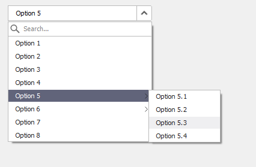

#  Window UI - ComBobox
---
<p style="text-align: right; font-size:12px;">
<b>Create date</b>: 2024.01.18 by <a href="#">thuong.nv</a>
</p>

## Giới thiệu

Cải tiến ComBobox trong MFC trên Window

**Tính năng**:
* Tìm kiếm item
* Hỗ trợ 2 level
* Tự động lựa chọn item khi input ký tự đầu tiên.

Download source code : <a href="./src/ComBobox.rar" download>ComBobox C++</a>

**Note**: ComBobox này là sự kết hợp của nhiều control khác nhau đã được custom vì thế code trên sẽ không sử dụng được ngay. Điều này nên được người dùng xử lý.

## Nội dung

##### Giới thiệu
---

ComBobox là sự kết hợp của TextBox và một popup menu.

Vì thế trước khi triển khai cần triển khai 2 control cơ bản là TextBox và Popup riêng biệt.

<p align="center">
    
</p>

##### Triển khai
---

1. <b>Code triển khai</b><a id="Code"></a>

    Các thành phần trong ComBobox Level:

    * ```DropDown``` sẽ được triển khai là một PopupLevel.
    * Sub menu cũng là một PopupLevel.
    * Textbox là TextBoxUI đã được cải tiến.
    * Button dropdown (giả)

    </br>

    Nó được triển khai dưới dạng một class thông thường, đồng thời khởi tạo nó thông qua hàm ```Create``` để khởi tạo. Có thể khởi tạo nó ở trong ```OnInitDialog```.

    **Chú ý**: 
    > Không thể đính kèm nó như một control thông thường. Các sự kiện của TextBox sẽ được xử lý riêng thông qua các Event đính kèm.

    Một giải pháp cho bất tiện này là :

    - Tạo ra một ComBobox control thông thường trong Dialog.
    - Trong hàm ```OnInitDialog``` khởi tạo ComBobox dựa trên ComBobox control tương ứng.
    - Ẩn control cũ đi.

    </br>

    Xem xét ví dụ bên dưới:

    ``` cpp
    pCbbOption= new CComBoboxLevel();
	CRect rcCbbOption;
	GetDlgItem(IDC_CBB_OPTION)->GetWindowRect(&rcCbbOption);
	ScreenToClient(&rcCbbOption);

    // Add Menu
    pCbbOption->AddMenu(_T("Option 1"));
	pCbbOption->AddMenu(_T("Option 2"));
	pCbbOption->AddMenu(_T("Option 3"));
	pCbbOption->AddMenu(_T("Option 4"));

	MenuItem* pOption5 = new MenuItem();
	pOption5->SetLabel(_T("Option 5"));

	pOption5->Add(_T("Option 5.1"));
	pOption5->Add(_T("Option 5.2"));
	pOption5->Add(_T("Option 5.3"));
	pOption5->Add(_T("Option 5.4"));
	pCbbOption->AddMenu(pOption5);

	MenuItem* pOption6 = new MenuItem();
	pOption6->SetLabel(_T("Option 6"));

	pOption6->Add(_T("Option 6.1"));
	pOption6->Add(_T("Option 6.2"));
	pCbbOption->AddMenu(pOption6);

	pCbbOption->AddMenu(_T("Option 7"));
	pCbbOption->AddMenu(_T("Option 8"));

    // Create
	if (pCbbOption->Create(WS_CHILD | WS_VISIBLE, rcCbbOption, this, WM_USER + 0x01))
	{
		GetDlgItem(IDC_CBB_OPTION)->ShowWindow(SW_HIDE);
		pCbbOption->ShowWindow(SW_SHOW);
	}
    ```

</br>

1. <b>Vấn đề nảy sinh và giải pháp</b><a id="proandsol"></a>

    1. Thiết kế popup

        Chi ra làm 2 phần một phần:
        * Dữ liệu
        * Popup UI

        </br>

        **Dữ liệu**: Chứa dữ liệu về item. Nó được thiết kế để có thể truy xuất và quản lý item dưới dạng dữ liệu độc lập. Bao gồm các thuộc tính như ```Visible``` , ```Select```, ```Text```.

        Ta cũng có thể select level luôn trên dữ liệu này.

        **Popup UI**: Đây là nơi biểu diễn ```Dữa liệu``` bên trên. Các thuộc tính của item sẽ được ánh xạ lên UI. Thuộc tính item sẽ không được chỉnh sửa trực tiếp mà phải thông qua phần ```Dữ liệu``` xử lý. Các tính năng của Popup liên quan đến Item đều phải qua đây và đều được phần.


    1. Hiển thị popup

        Vấn đề : popup hiển thị quá nhanh khi ta hover qua item hoặc lăn chuột qua.

        Giải quyết bằng việc sử dụng ```SetTimer```, tức là khi ta hover hay scoll ta sẽ set timer cho chúng thì việc hiển thị đều có độ trễ nó được đặt là 500 ms.
        

    1. Ẩn popup

        Vấn đề: Vậy khi nào ta sẽ ẩn popup đi.

        Ta ẩn popup đi khi nó lick ra ngoài popup bao gồm cả sub menu, hoặc người dùng lựa chọn item.

        Đề giải quyết việc click ra ngoài, việc sử dụng ```KillFocus``` không hợp lý và xử lý rất phức tạp hợp nữa không hết được trường hợp. Vì thế đã thay thế nó bằng ```WindowsHook``` với sự kiện là ```WH_MOUSE_LL```. Nhược điểm của nó là nếu ta Debug chương trình sẽ bị chậm và chỉ có một popup được quản lý.

    1. Set Select

        Vấn đề: Set select như thế nào.

        Đầu vào người dùng là một mảng index cho từng cấp độ. 

    1. Tìm kiếm Item

        Người dùng chỉ có thể search được level đầu tiên của popup. Khi search các sublevel sẽ bị ẩn đi.

        Ta chia ra làm 3 lại data item :
        * Data item gốc.
        * Data item hiển thị.

        </br>

        Khi người dùng searh thì```DataItem gốc``` sẽ được duyệt, nhưng item nào phù hợp sẽ được đưa sang ```DataItem hiển thị``` nó là các tham chiếu vì thế khi có thay đổi trong ```DataItem hiển thị``` thì đã gốc sẽ thay đổi theo, thuận tiện cho việc xử lý select.

        Ta chỉ cần switch qua lại giữa các ```DataItem``` cho việc search.


## Tham khảo


</br><!--Section-->

##### Cập nhật

- 2024.01.17 : Create
