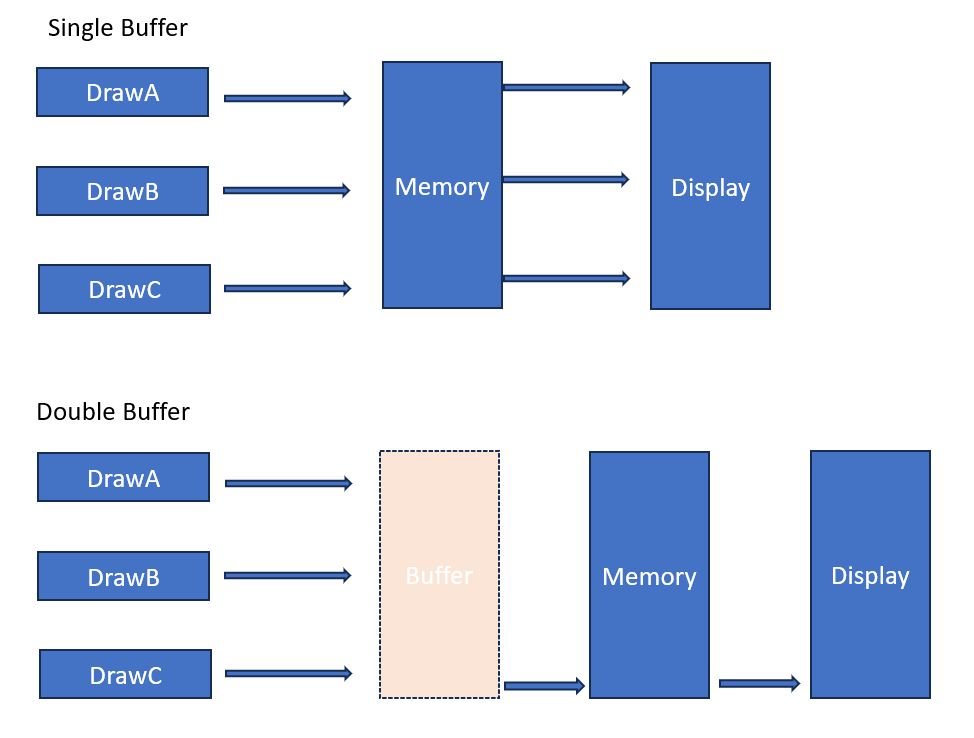

#  Window UI - Double buffer
---
<p style="text-align: right; font-size:12px;">
<b>Create date</b>: 2024.01.16 by <a href="#">thuong.nv</a>
</p>

## Giới thiệu

Trình bày về double buffer trên window UI. Khái niệm, ứng dụng và triển khai chúng.

## Nội dung

##### Khái niệm
---

Khi sử dụng MFC hoặc WinAPI ta hay sử dụng GDI hoặc GDIplus cho việc vẽ lên các control, thông qua hàm ```OnPaint```. Nó giúp ta có thể custom được giao diện một cách tùy thích. Nhưng có một vấn đề là khi vẽ nhiều đối tượng một lúc (đường thẳng, hình vuông, hình ảnh,...) nó thường gây ra hiện tượng giật rất khó chịu, hiện tượng này được gọi là ```flickers```. 

_Vậy nguyên nhân là gì ?_ 

> Mỗi khi ta vẽ đối tượng, đồng thời hình ảnh sẽ được kết xuất trực tiếp vào bộ nhớ xuất lên màn hình, khi có thay đổi GDI hoặc GdiPlus sẽ tự động cập nhật lại màn hình. Đó là cơ chế trong GDI hoặc Gdiplus hỗ trợ. Khi đó ta càng vẽ nhiều lần trong paint thì tương đương từng đấy lần hình ảnh được thay đổi tạo độ trễ cho một lần vẽ -> vì thế xuất hiện tượng trên

_Khắc phục nó như thế nào ?_

> Thay vì vẽ trực tiếp vào bộ nhớ trên màn hình, người ta tạo ra một vùng nhớ tạm (buffer) và vẽ lên đó trước. Sau khi vẽ hoàn tất thì sẽ swap nó với vùng nhớ màn hình từ đó chỉ cần một lần swap giảm độ trễ.

Cơ chế vừa miêu tả người ta gọi nó double buffer.
Trong hàm ```Paint``` người ta tạo ra một cấu trúc giúp giải quyết điều này.

Tham khảo cơ chế ```single buffer``` và ```double buffer``` bên dưới.
<p align="center">
    
</p>

##### Một số cấu trúc Double buffer
---

1. <b>Double buffer class</b><a id="DoubleBufferClass"></a>

    Giả sử ta muốn vẽ tất cả mọi thứ trong hàm ```OnPaint``` trong mfc.
    Class ```GdiplusDoubleBuffer``` trả về vùng con trỏ đến vùng nhớ buffer đồng thời giúp tự động quá trình swap vùng nhớ khi việc vẽ hoàn thành. Khi vẽ ta chỉ cần lấy các engine thích hợp ```Gdi``` hoặc ```Gdiplus``` là được.

    Ví dụ bên dưới sử dụng C++ hỗ trợ trong MFC.

    ```cpp
    /* GdiplusDoubleBuffer.h */

    class GdiplusDoubleBuffer
    {
        using GDIP = Gdiplus::Graphics;

    public:
        GdiplusDoubleBuffer(CDC* pdc, CWnd* pWnd, const COLORREF& clrBk = (RGB(255, 255, 255)));
        virtual ~GdiplusDoubleBuffer();
        GDIP* GetGdiplusGraphics() {  return m_pGraphic; }
        CDC*  GetMemDC(){ return m_memDC;}

    protected:
        CDC*		m_pDC;
        CBitmap*	m_pOldBitmap;
        CDC			m_memDC;
        CBitmap		m_memBitmap;
        GDIP*		m_pGraphic;
        CRect		m_rcClient;
    };
    ```

    Triên khai trong file ```GdiplusDoubleBuffer.cpp```.

    ```cpp
    /* GdiplusDoubleBuffer.cpp*/
    GdiplusDoubleBuffer::GdiplusDoubleBuffer(CDC* pdc, CWnd* pWnd, const COLORREF& clrBk)
    {
        m_pDC = NULL;
        m_pGraphic = NULL;
        m_pOldBitmap = NULL;

        if (!pdc || !pWnd)
            return;

        m_pDC = pdc;
        CRect rlClientRect;
        pWnd->GetClientRect(&rlClientRect);
        m_rcClient = rlClientRect;

        m_memDC.CreateCompatibleDC(pdc);
        m_memBitmap.CreateCompatibleBitmap(pdc, rlClientRect.Width(), rlClientRect.Height());
        m_pOldBitmap = m_memDC.SelectObject(&m_memBitmap);
        m_pGraphic = new Gdiplus::Graphics(m_memDC.m_hDC);

        Gdiplus::Color gdiplusClrBk;
        gdiplusClrBk.SetFromCOLORREF(clrBk);
        Gdiplus::SolidBrush br(gdiplusClrBk);
        m_pGraphic->FillRectangle(&br, Gdiplus::RectF(0.0f, 0.0f, (float)rlClientRect.Width(), (float)rlClientRect.Height()));
    }

    GdiplusDoubleBuffer::~GdiplusDoubleBuffer()
    {
        if (m_pDC && m_pGraphic)
        {
            m_pDC->BitBlt(0, 0, m_rcClient.right, m_rcClient.bottom, &m_memDC, 0, 0, SRCCOPY);
            m_memDC.SelectObject(m_pOldBitmap);
            m_pGraphic->ReleaseHDC(m_pDC->m_hDC);
            m_memBitmap.DeleteObject();
            delete m_pGraphic;
            m_pGraphic = NULL;
        }
    }
    ```

    Giải thích :

    * **Khởi tạo**

    </br>

    Ta sẽ tạo ra một vùng nhớ tương thích với CDC hiện tại. ```CreateCompatibleDC``` và chỉ định nó là một vùng nhớ bitmap thông qua ```CreateCompatibleBitmap```.

    Tiếp đó sẽ active vùng này bằng cách hàm ```SelectObject```.

    Cuối cùng là tạo ra ```Gdiplus``` engine tương ứng từ context tương ứng. Khi ta sử dụng engine này để vẽ, nó sẽ vẽ vào vùng nhớ đệm thay vì vùng nhớ trực tiếp.


    * **Kết thúc**

    </br>

    Ta chỉ cần copy vùng nhớ đệm (bitmap) sang vùng nhớ trực tiếp là hoàn thành thông quan hàm ```BitBlt```.

    Ngoài ra ta cần giải phóng các tài nguyên đã cấp phát hoặc không sử dụng nữa.


## Tham khảo

+ [https://www.geeksforgeeks.org/double-buffering/](https://www.geeksforgeeks.org/double-buffering/)

</br><!--Section-->

##### Cập nhật

- 2024.01.16 : Create
