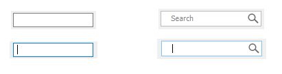

#  Window UI - TextBox
---
<p style="text-align: right; font-size:12px;">
<b>Create date</b>: 2024.01.17 by <a href="#">thuong.nv</a>
</p>

## Tổng quan

Cải tiến UI và tính năng cho Edit MFC trên Window

**Tính năng**:
* Các tính năng mặc định của Edit
* Placeholder
* Clear button
* Icon và căn chỉnh icon
* Thiết lập Font TextBox

Download source code : <a href="./src/TextBoxCS.rar" download>TextBoxCS C++</a>

**Note**: TextBox này là sự kết hợp của nhiều control khác nhau đã được custom vì thế code trên sẽ không sử dụng được ngay. Điều này nên được người dùng xử lý.

## Nội dung

##### <b>Giới thiệu</b>

Sau một thời gian sử dụng MFC ta thấy edit của MFC hỗ trợ khá đơn điệu, nó cũng không thể hỗ trợ những tính năng mà ta muốn như : hình ảnh, màu sắc, hoặc các icon.

Từ đó nhu cầu muốn cải thiện edit được nảy sinh.

Bài viết này trình bày một cách triển khai cải thiện UI dựa trên Edit của MFC. Ta không thay thế chúng thay vào đó ta tạo ra một wapper bên ngoài. Điều này có ưu điểm là giúp giảm thời gian triển khai, giảm thiểu vấn đề phát sinh khi cải tiến.

_Vậy ta sẽ cần triển khai thêm những gì ?_

> - Cải thiện placeholder
> - Thêm Icon, và có thể căn chỉnh nó.
> - Thêm button hiển thị clear all.
> - Thêm option custom UI tùy ý.

<p align="center">
    
</p>

Hình ảnh Edit search thông thường và sau khi cải tiến.

##### </br><b>Triển khai</b>

1. <b>Code triển khai</b><a id="Code"></a>


    Ta triển khai nó dưới dạng một class thông thường, đồng thời khởi tạo nó thông qua hàm ```Create``` để khởi tạo textbox. Có thể khởi tạo nó ở trong ```OnInitDialog```.

    **Chú ý**: 
    > Không thể đính kèm nó như một control thông thường. Các sự kiện của TextBox sẽ được xử lý riêng thông qua các Event đính kèm.

    Một giải pháp cho bất tiện này là :

    - Tạo ra một edit control thông thường trong Dialog.
    - Trong hàm ```OnInitDialog``` khởi tạo TextBox dựa trên edit control tương ứng.
    - Ẩn control cũ đi.

    </br>

    Xem xét ví dụ bên dưới:
    ``` cpp
    pTextBoxSearch = new CTextBoxCS();
	CRect rcTextBoxSearch;
	GetDlgItem(IDC_EDIT_SEARCH)->GetWindowRect(&rcTextBoxSearch);
	ScreenToClient(&rcTextBoxSearch);

    // Set option for textbox here.

	if (pTextBoxSearch->Create(WS_CHILD, ES_AUTOHSCROLL, rcTextBoxSearch, this, IDC_EDIT_SEARCH, _T(""), 85))
	{
		GetDlgItem(IDC_EDIT_SEARCH)->ShowWindow(SW_HIDE);
		pTextBoxSearch->ShowWindow(SW_SHOW);
	}
    ```

</br>

1. <b>Vấn đề nảy sinh và giải pháp</b><a id="proandsol"></a>

    1. Custom Placeholder

        Ta không sử dụng place holder mặc định của edit. Thay vào đó ta sẽ vẽ text placeholder.
        
        Vấn đề nảy sinh là khi edit sẽ over lên text. Giải pháp cho vấn đề này là nếu text của edit là trống, edit sẽ bị ẩn đi và placeholder sẽ được hiển thị thông qua việc vẽ của ```GdiPlus```.

    1. Phân chia bố layout

        Trong quá trình khởi tạo TextBox. layout các thành phần sẽ được lưu trữ lại bao gồm các phần như : rect icon, rect edit, padding. Điều này sẽ giúp quá trình vẽ trở lên dễ dàng hơn.

    1. Ví trí của Edit

        Vị trí của edit sẽ bị ảnh hưởng bởi font vì thế nếu vị trí edit không được tính toán dựa vào font thì dẫn đến edit sẽ bị lệch. Vị trí sẽ là ở giữa trừ đi một nửa chiều cao của font.


## Tham khảo


</br><!--Section-->

##### Cập nhật

- 2024.01.17 : Create
