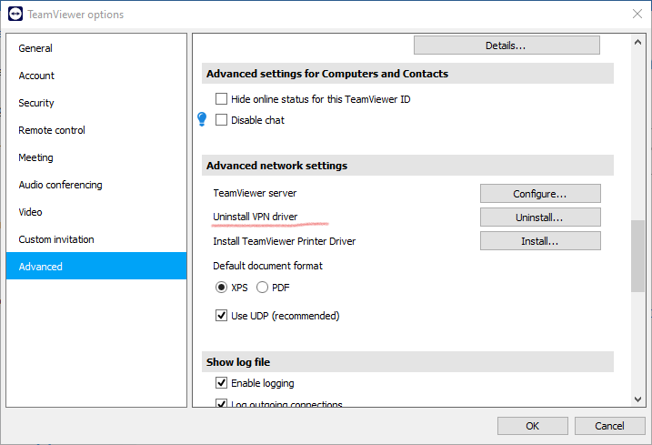
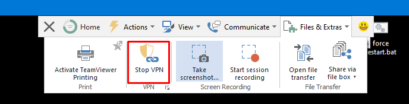
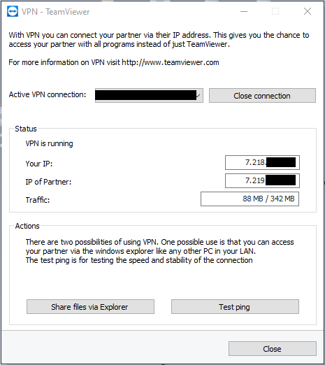
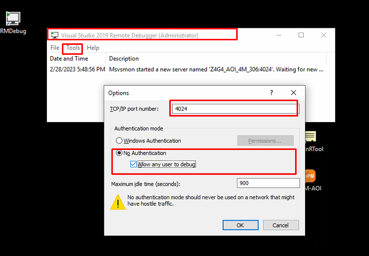
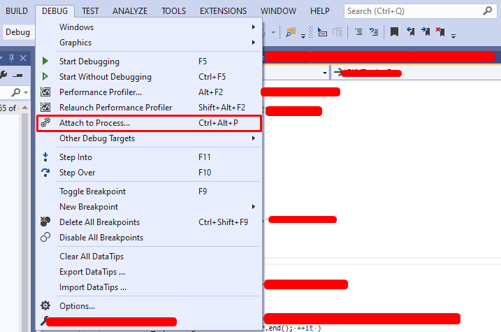
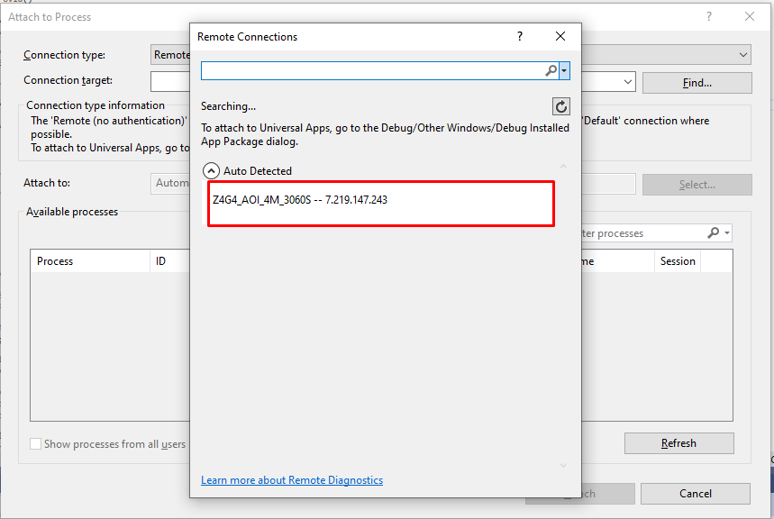
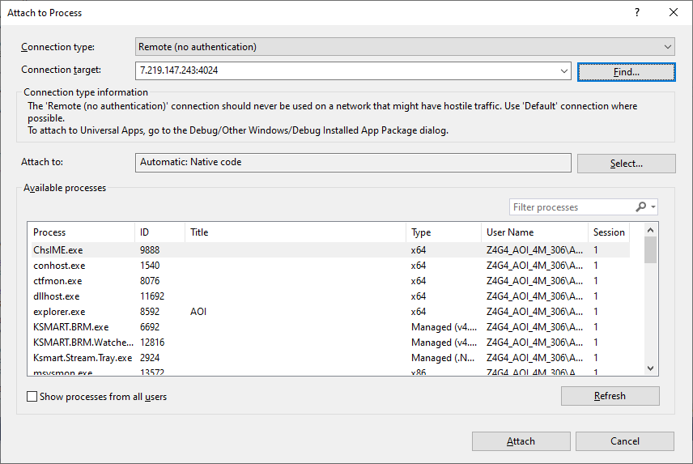
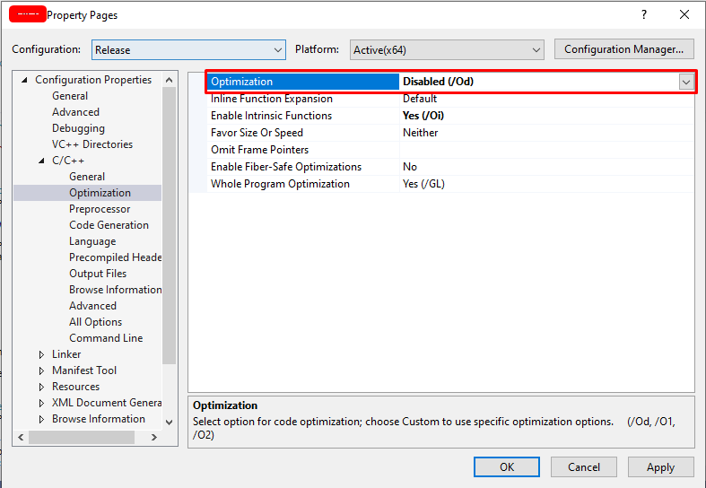

#  Remote debugging Visual Studio over TeamViewer
---
<p style="text-align: right; font-size:12px;">
<b>Create date</b>: 2023.09.26 by <a href="#">thuong.nv</a>
</p>

## Mục lục

<div style="padding:20px; margin-bottom:20px; background-color: #f3f3f587;border-radius: 10px;">

[Giới thiệu](#giới-thiệu) 

[Yêu cầu](#yêu-cầu) 

[Chuẩn bị](#chuẩn-bị) 

[Thao tác](#thao-tác) 
</div>

## Giới thiệu 

Quá trình fix bug không phải lúc nào ta cũng có thể chạy code trực tiếp trên máy. Nguyên nhân có thể do: Dung lượng project hoặc cùng môi trường phức tạp,
không thể tiếp cận các máy ở xa, máy khách hàng

Visual Studio cung cấp một tính năng gọi là **Attach Process**. 
Dựa vào tính năng này kết hợp với VPN trên TeamViewer ta có thể vừa điều khiển vừa tiến hành debug.


## Yêu cầu

- Window 10 (x64)

- Visual Studio 2019 : [Download Remote Debug 2019 ](https://learn.microsoft.com/en-us/visualstudio/debugger/remote-debugging)

- TeamViewer : [Download TeamViewer](https://www.teamviewer.com/)

Chú ý :
> Đây là môi trường của ví dụ bên dưới, ngoài ra ta có thể cài các tool với môi trường tương ứng


## Chuẩn bị
1. Cài đặt TeamViewer trên hai máy Remote và Debug 

> TeamViewer.exe

2. Cài đặt RemoteDebug tool trên máy Remote và Debug

> VS_RemoteTools.exe

**Chú ý**: Khi tải và cài đặt RemoteDebug Tool cần dùng chung một phiên bản và tương ứng với phiên bản Visual Studio đang sử dụng.


3. Cài đặt VPN TeamViewer trên máy Remote

> Settting > Advanced > Install VPN driver



## Thao tác

##### <b>B1. Kết nối TeamView thông thường và tiến hành bật kết nối VPN </b> <br>
Tiến hành kết nối TeamViewer thông qua ID/PW. Sau đó kết nối VPN như dưới


Một cửa sổ hiện ra: Hiển thị thông tin về địa chỉ VPN kết nối của 2 máy



##### <b>B2. Chạy RemoteDebug Tool trên máy Remote </b> <br>

Chạy file : msvsmon.exe 

Bản cài RemoteDebug VS 2019
```ruby
C:\Program Files\Microsoft Visual Studio 16.0\Common7\IDE\Remote Debugger\x64\msvsmon.exe
```


**Chú ý**: Cần chạy Tool bằng quyền Administrator



PS : Trong mỗi phiên bản Tool sẽ mở các công khác nhau VD: VS2019(4024)

##### <b>B3. Tiến hành Attach Debug trên máy Debug </b> <br>



Có thể sử dụng tổ hợp phím : `Ctrl + Alt + P` hoặc Attach trên thanh toolbar




## Chú ý:

- Nếu cần debug file nào thì build *.dll của project đó và đặt nó vào thư mục cài đặt bên máy Remote và chạy lại chương trình.

- Disable optimization của project đó và build lại



## Tham khảo


